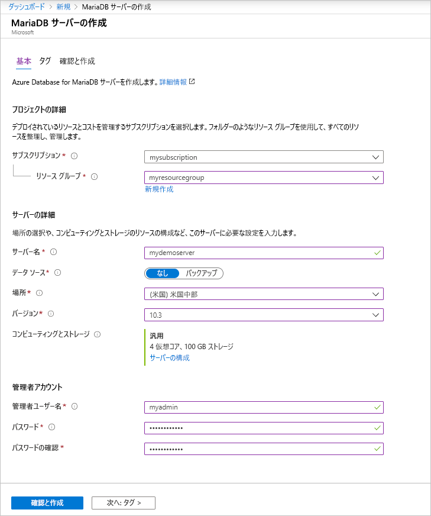

# <a name="create-an-azure-database-for-mariadb-server-by-using-the-azure-portal"></a>Azure portal を使用した Azure Database for MariaDB サーバーの作成

Azure Database for MariaDB は、高可用性 MariaDB データベースをクラウドで実行、管理、スケーリングするためのマネージド サービスです。 このクイック スタートでは、Azure portal を使用して 5 分程度で Azure Database for MariaDB サーバーを作成する方法について説明します。  

Azure サブスクリプションをお持ちでない場合は、開始する前に[無料の Azure アカウント](https://azure.microsoft.com/free/)を作成してください。

## <a name="sign-in-to-the-azure-portal"></a>Azure portal にサインインする

Web ブラウザーで、[Azure portal](https://portal.azure.com/) に移動します。 資格情報を入力してポータルにサインインします。 既定のビューはサービス ダッシュボードです。

## <a name="create-an-azure-database-for-mariadb-server"></a>Azure Database for MariaDB サーバーを作成する

Azure Database for MariaDB サーバーは、定義済みの一連の[コンピューティング リソースとストレージ リソース](concepts-pricing-tiers.md)を使って作成します。 サーバーは、[Azure リソース グループ](../azure-resource-manager/management/overview.md)内に作成します。

Azure Database for MariaDB サーバーを作成するには、次の手順に従います。

1. ポータルの左上隅にある **[リソースの作成]** ボタン (+) を選択します。

2. **[データベース]**  >  **[Azure Database for MariaDB]** の順に選択します。 検索ボックスに「**MariaDB**」と入力してサービスを検索することもできます。

   

3. サーバーについての次の情報を入力または選択します。
   
   

    設定 | 推奨値 | [説明]
    ---|---|---
    サーバー名 | *一意のサーバー名* | Azure Database for MariaDB サーバーを識別する一意の名前を選択します。 たとえば **mydemoserver** を選択します。 入力したサーバー名にドメイン名 *.mariadb.database.azure.com* が追加されます。 サーバー名に含めることができるのは、英小文字、数字、およびハイフン (-) のみであり、 3 から 63 文字にする必要があります。
    サブスクリプション | *該当するサブスクリプション* | サーバーに使用する Azure サブスクリプションを選択します。 複数のサブスクリプションをお持ちの場合は、リソースの課金対象となるサブスクリプションを選択してください。
    Resource group | **myresourcegroup** | 新しいリソース グループ名を入力するか、既存のリソース グループを選択します。 
    ソースの選択 | "**空白**" | **[空白]** を選択し、最初から新しいサーバーを作成します (既存の Azure Database for MariaDB サーバーの geo バックアップからサーバーを作成する場合は、 **[バックアップ]** を選択します)。
    サーバー管理者のログイン | **myadmin** | サーバーに接続するときに使用するサインイン アカウント。 管理者のサインイン名に **azure_superuser**、**admin**、**administrator**、**root**、**guest**、**public** は使用できません。
    Password | *任意* | サーバー管理者アカウントの新しいパスワードを入力します。 8 ～ 128 文字にする必要があります。 パスワードには、英大文字、英小文字、数字 (0 から 9)、英数字以外の文字 (!、$、#、% など) のうち、3 つのカテゴリの文字が含まれている必要があります。
    [パスワードの確認入力] | *任意*| 管理者アカウントのパスワードを確認します。
    Location | *ユーザーに最も近いリージョン*| ユーザーや他の Azure アプリケーションに最も近い場所を選択します。
    Version | *最新バージョン*| 最新バージョン (別のバージョンを使用する特別な要件がある場合を除く)。
    Pricing tier | 説明を参照してください。 | 新しいサーバーのコンピューティング、ストレージ、およびバックアップ構成。 **[価格レベル]**  >  **[General Purpose]** を選択します。 次の設定は既定値のままにしてください。<br><ul><li>**[コンピューティング世代]** (Gen 5)</li><li>**[仮想コア]** (4 仮想コア)</li><li>**ストレージ** (100 GB)</li><li>**[バックアップの保有期間]** (7 日間)</li></ul><br>サーバー バックアップを geo 冗長ストレージで有効にするには、 **[バックアップ冗長オプション]** で **[地理冗長]** を選択します。 <br><br>この価格レベルの選択を保存するには、 **[OK]** を選択します。 次のスクリーンショットは、これらの選択を示しています。
  
   > [!NOTE]
   > 低負荷なコンピューティングと I/O がワークロードに適している場合は、Basic 価格レベルの使用を検討してください。 Basic 価格レベルで作成されたサーバーは後で General Purpose またはメモリ最適化にスケーリングできないことに注意してください。 詳細については、[価格に関するページ](https://azure.microsoft.com/pricing/details/mariadb/)を参照してください。
   > 

   ![サーバーの作成 - [価格レベル] ウィンドウ](./media/quickstart-create-mariadb-server-database-using-azure-portal/3-pricing-tier.png)

4.  **[作成]** を選択して、サーバーをプロビジョニングします。 プロビジョニングには、最大 20 分かかる場合があります。
   
5.  デプロイ プロセスを監視するには、ツール バーの **[通知]** (ベル アイコン) を選択します。
   
既定では、データベース **information_schema**、**mysql**、**performance_schema**、および **sys** は、ご利用のサーバーに作成されます。


## <a name="configure-firewall-rule"></a>サーバーレベルのファイアウォール規則の構成

Azure Database for MariaDB サービスでは、サーバー レベルでファイアウォールが作成されます。 このファイアウォールにより、外部のアプリケーションやツールから、サーバーまたはサーバー上のすべてのデータベースへの接続が禁止されます。接続を許可するためには、特定の IP アドレスに対して、ファイアウォールを開放するファイアウォール規則を作成する必要があります。 

サーバーレベルのファイアウォール規則を作成するには、次の手順に従います。

1. デプロイが完了したら、目的のサーバーを探します。 必要に応じて、検索することができます。 たとえば左側のメニューで、 **[すべてのリソース]** を選びます。 次に、サーバー名を入力します。 たとえば、「**mydemoserver**」と入力して、新しく作成されたサーバーを検索します。 検索結果の一覧からサーバー名を選択します。 サーバーの **[概要]** ページが開きます。 追加の設定は、このページで変更できます。

2. サーバーの概要ページで、 **[接続のセキュリティ]** を選択します。

3. **[ファイアウォール規則]** で、 **[規則名]** 列の空白のテキスト ボックスを選択し、ファイアウォール規則の作成を開始します。 このサーバーに接続するクライアントの正確な IP 範囲を指定します。
   
   ![[接続のセキュリティ] - [ファイアウォール規則]](./media/quickstart-create-mariadb-server-database-using-azure-portal/5-firewall-2.png)

4. **[接続のセキュリティ]** ページの上部のツール バーで、 **[保存]** を選択します。 更新が正常に完了したことを示す通知が表示されるまで待ってから次に進んでください。 

   > [!NOTE]
   > Azure Database for MariaDB との接続では、ポート 3306 が通信に使用されます。 企業ネットワーク内から接続しようとしても、ポート 3306 でのアウトバウンド トラフィックが許可されていない場合があります。 その場合、サーバーに接続するためには、IT 部門がポート 3306 を開放する必要があります。
   > 

## <a name="get-connection-information"></a>接続情報の取得

データベース サーバーに接続するには、サーバーの完全な名前と管理者サインイン資格情報が必要となります。 これらの値は、この記事の前の手順でメモしてあるはずです。 メモしていなかった場合、Azure portal で、サーバーの **[概要]** ページまたは **[プロパティ]** ページでサーバー名とサインイン情報を簡単に確認できます。

1. サーバーの **[概要]** ページに移動します。 **[サーバー名]** と **[サーバー管理者ログイン名]** の値を書き留めておきます。 

2. これらの値をコピーするには、コピーしたいフィールドにカーソルを合わせます。 テキストの右側にコピー アイコンが表示されます。 必要に応じてコピー アイコンを選択して値をコピーします。

この例では、サーバー名は **mydemoserver.mariadb.database.azure.com**、サーバー管理者ログイン名は **myadmin\@mydemoserver** です。

## <a name="connect-to-azure-database-for-mariadb-by-using-the-mysql-command-line"></a>mysql コマンド ラインを使用して Azure Database for MariaDB に接続する

Azure Database for MariaDB サーバーには、さまざまなアプリケーションを使用して接続できます。

サーバーに接続する方法を示すために、まずは [mysql](https://dev.mysql.com/doc/refman/5.7/en/mysql.html) コマンドライン ツールを使用してみましょう。 ソフトウェアをインストールせずに、Web ブラウザーと Azure Cloud Shell を使用する方法もあります。 mysql ユーティリティがローカルにインストールしてある場合は、そこからも接続できます。

1. Azure portal の右上のツール バーにあるターミナル アイコン ( **>_** ) で Azure Cloud Shell を起動します。
   

2. ブラウザーで Azure Cloud Shell が開きます。 Cloud Shell から Bash シェル コマンドを使用することができます。

   

3. Cloud Shell プロンプトで、mysql コマンド ラインを入力して Azure Database for MariaDB サーバーに接続します。

    mysql ユーティリティを使用して Azure Database for MariaDB サーバーに接続するには、次の形式を使用します。

    ```bash
    mysql --host <fully qualified server name> --user <server admin login name>@<server name> -p
    ```

    たとえば、次のコマンドは、サンプル サーバーに接続します。

    ```azurecli-interactive
    mysql --host mydemoserver.mariadb.database.azure.com --user myadmin@mydemoserver -p
    ```

    mysql パラメーター |推奨値|[説明]
    ---|---|---
    --host | *サーバー名* | Azure Database for MariaDB サーバーを作成するときに使用したサーバー名の値。 この例におけるサーバーは、**mydemoserver.mariadb.database.azure.com** です。 例で示されているように、完全修飾ドメイン名 ( **\*.mariadb.database.azure.com**) を使用します。 サーバー名を覚えていない場合は、前のセクションの手順に従って接続情報を取得してください。
    --user | *サーバー管理者ログイン名* |Azure Database for MariaDB サーバーを作成するときに使用したサーバー管理者のログイン ユーザー名。 このユーザー名を覚えていない場合は、前のセクションの手順に従って接続情報を取得してください。 形式は *username\@servername* です。
    -p | *<お使いのパスワード>*<br>(プロンプトが表示されるまで待つ) |メッセージが表示されたら、サーバーの作成に使用したパスワードを入力します。 入力したパスワードの文字は bash プロンプトには表示されません。 パスワードを入力したら、Enter キーを押します。

   mysql ユーティリティが接続されると、`mysql>` プロンプトが表示されます。 このプロンプトでコマンドを入力することができます。 

   mysql の出力例を次に示します。

    ```bash
    Welcome to the MySQL monitor.  Commands end with ; or \g.
    Your MySQL connection id is 65505
    Server version: 5.6.39.0 MariaDB Server
    
    Copyright (c) 2000, 2017, Oracle and/or its affiliates. All rights reserved.
    
    Oracle is a registered trademark of Oracle Corporation and/or its
    affiliates. Other names may be trademarks of their respective
    owners.

    Type 'help;' or '\h' for help. Type '\c' to clear the current input statement.
    
    mysql>
    ```
    
    > [!TIP]
    > Azure Cloud Shell の IP アドレスを許可するようにファイアウォールが構成されていない場合、次のエラーが発生します。
    >
    >   エラー 2003 (28000): IP アドレス 123.456.789.0 のクライアントはこのサーバーへのアクセスが許可されていません。
    >
    > エラーを解決するには、サーバーの構成が、「[サーバーレベルのファイアウォール規則の構成](#configure-firewall-rule)」に説明されている手順と一致していることを確認してください。

4. 接続を確認するには、`mysql>` プロンプトで「**status**」と入力して、サーバーの状態を確認します。

    ```sql
    status
    ```

   > [!TIP]
   > その他のコマンドについては、「[MySQL 5.7 リファレンス マニュアル - 4.5.1 章](https://dev.mysql.com/doc/refman/5.7/en/mysql.html)」を参照してください。

5. `mysql>` プロンプトに次のコマンドを入力して空のデータベースを作成します。

   ```sql
   CREATE DATABASE quickstartdb;
   ```
   このコマンドが完了するまで数分かかることがあります。 

   Azure Database for MariaDB サーバーには 1 つまたは複数のデータベースを作成できます。 サーバーごとに 1 つのデータベースを作成してすべてのリソースを利用するか、複数のデータベースを作成してリソースを共有することができます。 作成できるデータベース数に制限はありませんが、複数のデータベースは同一のサーバー リソースを共有します。 

6. データベースを一覧表示するには、`mysql>` プロンプトに次のコマンドを入力します。

    ```sql
    SHOW DATABASES;
    ```

7. 「 **\q**」と入力し、Enter キーを押して mysql ツールを閉じます。 これで、Azure Cloud Shell を閉じることができます。

Azure Database for MariaDB サーバーに接続し、空のユーザー データベースを作成しました。 次のセクションでは、広く使われているもう 1 つのツール、MySQL Workbench を使って同じサーバーに接続します。

## <a name="connect-to-the-server-by-using-mysql-workbench"></a>MySQL Workbench を使用したサーバーへの接続

MySQL Workbench を使用してサーバーに接続するには、次の手順に従います。

1. お使いのクライアント コンピューターで MySQL Workbench を開きます。 MySQL Workbench をダウンロードしてインストールするために、「[Download MySQL Workbench (MySQL Workbench のダウンロード)](https://dev.mysql.com/downloads/workbench/)」にアクセスします。

2. 新しい接続を作成するには、 **[MySQL Connections]\(MySQL 接続\)** という見出しの横に表示されるプラス アイコン ( **+** ) を選択します。

3. **[Setup New Connection]\(新しい接続の設定\)** ダイアログ ボックスの **[Parameters]\(パラメーター\)** タブに、実際のサーバーの接続情報を入力します。 以下に示した値は、あくまで例です。 **ホスト名**、**ユーザー名**、**パスワード**は、実際の値に置き換えてください。

   

    |設定 |推奨値|フィールドの説明|
    |---|---|---|
     [接続名] | **Demo connection** | この接続のラベル。 |
    接続方法 | **Standard (TCP/IP)** | Standard (TCP/IP) で十分です。 |
    hostname | *サーバー名* | Azure Database for MariaDB サーバーを作成するときに使用したサーバー名の値。 この例におけるサーバーは、**mydemoserver.mariadb.database.azure.com** です。 例で示されているように、完全修飾ドメイン名 ( **\*.mariadb.database.azure.com**) を使用します。 サーバー名を覚えていない場合は、この記事で説明した手順に従って接続情報を取得してください。|
     Port | 3306 | Azure Database for MariaDB サーバーに接続するときに使用するポート。 |
    ユーザー名 |  *サーバー管理者ログイン名* | Azure Database for MariaDB サーバーを作成するときに使用したサーバー管理者のサインイン情報。 この例のユーザー名は **myadmin\@mydemoserver** です。 ユーザー名を覚えていない場合は、この記事で説明した手順に従って接続情報を取得してください。 形式は *username\@servername* です。
    Password | *<お使いのパスワード>* | パスワードを保存するには、 **[Store in Vault]\(コンテナーに保存\)** を選択します。 |

4. すべてのパラメーターが正しく構成されていることを確認するために、 **[Test Connection]\(接続のテスト\)** を選択します。 その後、 **[OK]** を選択して接続を保存します。 

    > [!NOTE]
    > ご使用のサーバーには SSL が既定で適用されます。 正常に接続するためには追加の構成が必要です。 詳細については、「[Azure Database for MariaDB に安全に接続するためにご利用のアプリケーション内で SSL 接続を構成する](./howto-configure-ssl.md)」を参照してください。 このクイック スタートに関して SSL を無効にするのであれば、Azure portal で、サーバーの概要ページにあるメニューから **[接続のセキュリティ]** を選択してください。 **[SSL 接続を強制する]** で **[無効]** を選択します。
    >

## <a name="clean-up-resources"></a>リソースをクリーンアップする

このクイック スタートで作成したリソースは、2 とおりの方法でクリーンアップすることができます。 [Azure リソース グループ](../azure-resource-manager/management/overview.md)を削除することができます。 この方法では、リソース グループ内にあるすべてのリソースが削除されます。 他のリソースをそのまま維持する場合は、1 つのサーバー リソースだけを削除してください。

> [!TIP]
> このコレクションの他のクイック スタートは、このクイック スタートに基づいています。 引き続き Azure Database for MariaDB のクイック スタートの作業を行う場合は、このクイック スタートで作成したリソースをクリーンアップしないでください。 これ以上作業を行わない場合は、以下の手順に従い、このクイック スタートで作成したすべてのリソースを削除してください。
>

新しく作成したサーバーを含むリソース グループ全体を削除する手順は次のとおりです。

1.  Azure portal で目的のリソース グループを探します。 左側のメニューで **[リソース グループ]** を選択し、目的のリソース グループの名前 (この例では **myresourcegroup**) を選択します。

2.  リソース グループ ページで **[削除]** を選択します。 次に、リソース グループの名前 (この例では **myresourcegroup**) を入力して、削除の確認を行います。 **[削除]** を選択します。

新しく作成したサーバーを削除するには、次の手順に従います。

1. Azure portal で目的のサーバーを探します (まだ開いていない場合)。 左側のメニューで、 **[すべてのリソース]** を選びます。 次に、作成したサーバーを検索します。

2. **[概要]** ページで **[削除]** を選択します。 

   

3. 削除するサーバーの名前を確認します。 削除によって影響を受けるデータベースをその下に表示します。 削除の確認を行うために、目的のサーバー名 (この例では **mydemoserver**) を入力します。 **[削除]** を選択します。

## <a name="next-steps"></a>次のステップ

- [最初の Azure Database for MariaDB データベースを設計する](./tutorial-design-database-using-portal.md)
