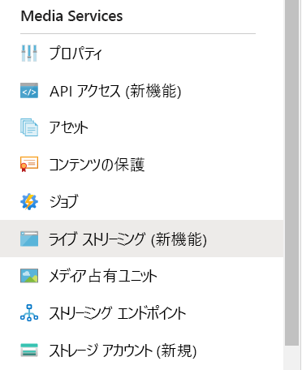

# OBS を使用して Azure Media Services のライブ ストリームを作成する

このクイックスタートでは、Azure portal と Open Broadcasting Studio (OBS) を使用して Azure Media Services のライブ ストリームを作成する方法について説明します。 ここでは、Azure サブスクリプションを所有し、かつ Azure Media Services アカウントを作成済みであることを前提としています。

このクイックスタートで取り上げる内容は次のとおりです。

- OBS でオンプレミス エンコーダーを設定する。
- ライブ ストリームを設定する。
- ライブ ストリームの出力を設定する。
- 既定のストリーミング エンドポイントを実行する。
- Azure Media Player を使用してライブ ストリームとオンデマンド出力を表示する。

## 前提条件

Azure サブスクリプションをお持ちでない場合は、開始する前に [無料アカウント](https://azure.microsoft.com/free/) を作成してください。

## Azure portal にサインインする

Web ブラウザーを開き、[Microsoft Azure portal](https://portal.azure.com/) にアクセスします。 資格情報を入力してポータルにサインインします。 既定のビューはサービス ダッシュボードです。

## OBS を使用してオンプレミス エンコーダーを設定する

1. [Open Broadcaster Software の Web サイト](https://obsproject.com/)で、お使いのオペレーティング システム向けの OBS をダウンロードしてインストールします。
1. アプリケーションを起動し、開いたままにします。

## 既定のストリーミング エンドポイントを実行する

1. Media Services リストで **[ストリーミング エンドポイント]** を選択します。

   ![[ストリーミング エンドポイント] メニュー項目](media/live-events-obs-quickstart/streaming-endpoints.png)
1. 既定のストリーミング エンドポイントの状態が "停止" であれば、それを選択します。 そのエンドポイントのページが表示されます。
1. **[スタート]** を選択します。

   ![ストリーミング エンドポイントの [開始] ボタン](media/live-events-obs-quickstart/start.png)

## Azure Media Services のライブ ストリームを設定する

1. ポータル内の Azure Media Services アカウントに移動し、 **[Media Services]** リストから **[ライブ ストリーミング (新機能)]** を選択します。

   
1. **[ライブ イベントの追加]** を選択して新しいライブ ストリーミング イベントを作成します。

   ![[ライブ イベントの追加] アイコン](media/live-events-obs-quickstart/add-live-event.png)
1. **[ライブ イベント名]** ボックスに新しいイベントの名前を入力します (例: *TestLiveEvent*)。

   ![[ライブ イベント名] ボックス](media/live-events-obs-quickstart/live-event-name.png)
1. **[説明]** ボックスにイベントの説明 (省略可) を入力します。
1. **[パススルー - クラウド エンコードなし]** を選択します。

   ![[クラウド エンコード] オプション](media/live-events-obs-quickstart/cloud-encoding.png)
1. **[RTMP]** オプションを選択します。
1. ライブ イベントの準備が完了する前に課金されないように、 **[ライブ イベントの開始]** で **[いいえ]** オプションが選択されていることを確認します (課金はライブ イベントが開始されたときに開始されます)。

   ![[ライブ イベントの開始] オプション](media/live-events-obs-quickstart/start-live-event-no.png)
1. **[確認と作成]** ボタンを選択して設定を確認します。
1. **[作成]** ボタンを選択してライブ イベントを作成します。 その後、元のライブ イベント リストが表示されます。
1. 先ほど作成したライブ イベントへのリンクを選択します。 イベントが停止していることに注目します。
1. このページをブラウザーで開いたままにします。 これは後で使用します。

## OBS Studio を使用してライブ ストリームを設定する

OBS は既定のシーンで開始しますが、入力は選択されていません。

   

### ビデオ ソースを追加する

1. **[ソース]** パネルで**追加**アイコンをクリックして、新しいソース デバイスを選択します。 **[ソース]** メニューが開きます。

1. ソース デバイスのメニューから **[映像キャプチャ デバイス]** を選択します。 **[ソースを作成/選択]** メニューが開きます。

   ![ビデオ デバイスが選択された状態の OBS の [ソース] メニュー](media/live-events-obs-quickstart/live-event-obs-video-device-menu.png)

1. **[既存を追加]** を選択し、 **[OK]** をクリックします。 **[映像キャプチャ デバイスのプロパティ]** メニューが開きます。

   ![[既存を追加] が選択された状態の OBS の新しいビデオ ソース メニュー](media/live-events-obs-quickstart/live-event-obs-new-video-source.png)

1. **[デバイス]** ドロップダウン リストから、自分のブロードキャストに使用するビデオ入力を選択します。 ここでは残りの設定をそのままにして、 **[OK]** をクリックします。 入力ソースが **[ソース]** パネルに追加され、ビデオ入力が **[プレビュー]** 領域に表示されます。

   

### オーディオ ソースを追加する

1. **[ソース]** パネルで**追加**アイコンをクリックして、新しいソース デバイスを選択します。 ソース デバイスのメニューが開きます。

1. ソース デバイスのメニューから **[音声入力キャプチャ]** を選択します。 **[ソースを作成/選択]** メニューが開きます。

   ![オーディオ デバイスが選択された状態の OBS の [ソース] メニュー](media/live-events-obs-quickstart/live-event-obs-audio-device-menu.png)

1. **[既存を追加]** を選択し、 **[OK]** をクリックします。 **[音声入力キャプチャのプロパティ]** メニューが開きます。

   ![[既存を追加] が選択された状態の OBS のオーディオ ソース ](media/live-events-obs-quickstart/live-event-obs-new-audio-source.png)

1. **[デバイス]** ドロップダウン リストから、自分のブロードキャストに使用するオーディオ キャプチャ デバイスを選択します。 ここでは残りの設定をそのままにして、[OK] をクリックします。 オーディオ キャプチャ デバイスが [音声ミキサー] パネルに追加されます。

   

### OBS でストリーミングを設定する

次の手順では、ブラウザーで Azure Media Services に戻り、入力 URL をコピーして出力設定に入力します。

1. ポータルの Azure Media Services ページで、 **[開始]** を選択してライブ ストリーム イベントを開始します (この時点で課金が開始されます)。

   ![[開始] アイコン](media/live-events-obs-quickstart/start.png)
1. **[RTMP]** トグルを **[RTMPS]** に設定します。
1. **[入力 URL]** ボックスの URL をクリップボードにコピーします。

   

1. OBS アプリケーションに切り替えます。

1. **[コントロール]** パネルの **[設定]** ボタンをクリックします。 [設定] オプションが開きます。

   ![[設定] が選択された状態の OBS の [コントロール] パネル](media/live-events-obs-quickstart/live-event-obs-settings.png)

1. **[設定]** メニューで **[配信]** を選択します。

1. **[サービス]** ドロップダウン リストで [すべてのサービスを表示] を選択し、 **[カスタム]** を選択します。

1. クリップボードにコピーした RTMPS URL を **[サーバー]** フィールドに貼り付けます。

1. **[ストリーム キー]** フィールドに何かを入力します。  何でもかまいませんが、値を入力する必要があります。

    

1. **[設定]** メニューで **[出力]** を選択します。

1. **[キーフレーム間隔]** フィールドに「*2*」と入力します。 これにより、フラグメントの長さが 2 秒に設定されます。 待ち時間を短くしてライブ配信するには、この値を 1 秒にします。

1. 省略可能:処理能力が低いコンピューターを使用している場合は、 **[CPU 使用のプリセット]** を *[veryfast]* に設定します。 ネットワークの状態が望ましくない場合は、必要に応じて kbps を低く設定できます。

   

1. 残りの設定をそのままにして、 **[OK]** をクリックします。

### ストリーミングを開始する

1. **[コントロール]** パネルで **[配信開始]** をクリックします。

    ![OBS の [配信開始] ボタン](media/live-events-obs-quickstart/live-event-obs-start-streaming.png)

2. ブラウザーで Azure Media Services のライブ イベント画面に切り替えて、 **[Reload Player]\(プレーヤーを再度読み込む\)** リンクをクリックします。 これで、プレビュー プレーヤーにストリームが表示されます。

## 出力を設定する

ここでは出力を設定し、ライブ ストリームのレコーディングを保存できるようにします。  

> [!NOTE]
> この出力をストリーム配信するには、ストリーミング エンドポイントが実行されている必要があります。 この後の「[既定のストリーミング エンドポイントを実行する](#run-the-default-streaming-endpoint)」セクションを参照してください。

1. **出力**ビデオ ビューアーの下にある **[Create outputs]\(出力の作成\)** リンクを選択します。
1. 必要に応じて、 **[名前]** ボックスで出力の名前を編集して、後で見つけやすいよう、わかりやすい名前に変更します。

   ![[出力名] ボックス](media/live-events-wirecast-quickstart/output-name.png)
1. この時点では、その他のボックスはすべてそのままにします。
1. **[次へ]** を選択してストリーミング ロケーターを追加します。
1. 必要に応じて、ロケーターの名前をわかりやすい名前に変更します。

   
1. この画面上の他の内容はすべて、そのままにしておきます。
1. **［作成］** を選択します

## Azure Media Player を使用して出力配信を再生する

1. **出力**ビデオ プレーヤーの下にあるストリーミング URL をコピーします。
1. Web ブラウザーで、[Azure Media Player のデモ](https://ampdemo.azureedge.net/azuremediaplayer.html)を開きます。
1. Azure Media Player の **[URL]** ボックスにストリーミング URL を貼り付けます。
1. **[Update Player]\(プレーヤーの更新\)** ボタンを選択します。
1. ビデオの**再生**アイコンを選択すると、ライブ ストリームが表示されます。

## 配信を停止する

十分な量のコンテンツをストリーム配信したと思ったら、配信を停止します。

1. ポータルで **[停止]** を選択します。

1. OBS で、 **[コントロール]** パネルの **[配信停止]** ボタンを選択します。 これで OBS からの配信が停止します。

## Azure Media Player を使用してオンデマンド出力を再生する

ストリーミング エンドポイントが実行されている間は、作成した出力をオンデマンド ストリーミングに使用できます。

1. Media Services リストに移動し、 **[資産]** を選択します。
1. 先ほど作成したイベント出力を探し、その資産へのリンクを選択します。 資産の出力ページが表示されます。
1. 資産のビデオ プレーヤーの下にあるストリーミング URL をコピーします。
1. ブラウザーで Azure Media Player に戻り、ストリーミング URL を [URL] ボックスに貼り付けます。
1. **[Update Player]\(プレーヤーの更新\)** を選択します。
1. ビデオの**再生**アイコンを選択すると、オンデマンド資産が表示されます。

## リソースをクリーンアップする

> [!IMPORTANT]
> サービスを停止してください。 このクイックスタートの手順が完了したら、ライブ イベントとストリーミング エンドポイントを必ず停止してください。そうしないと、実行したままの時間分について課金されることになります。 ライブ イベントを停止するには、「[配信を停止する](#stop-the-broadcast)」の手順 2 と 3 を参照してください。

ストリーミング エンドポイントを停止するには、次の手順を実行します。

1. Media Services リストから **[ストリーミング エンドポイント]** を選択します。
2. 先ほど開始した既定のストリーミング エンドポイントを選択します。 エンドポイントのページが表示されます。
3. **[停止]** を選択します。

> [!TIP]
> このイベントの資産を保持する必要がない場合は、ストレージに対する課金が発生しないように必ず資産を削除してください。

## 次のステップ

> [!div class="nextstepaction"]
> [Media Services のライブ イベントとライブ出力](./live-events-outputs-concept.md)
