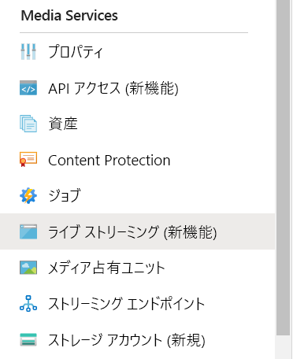
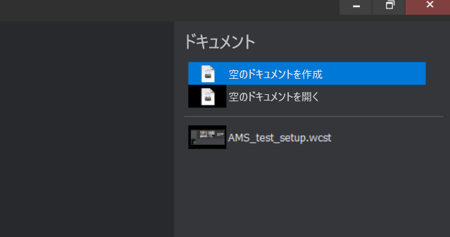
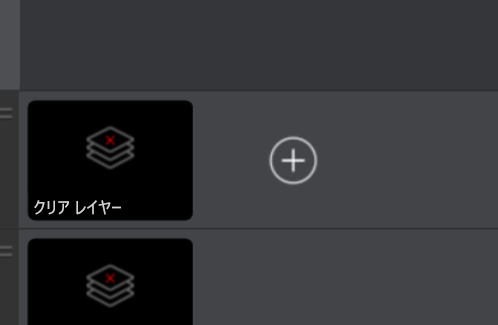
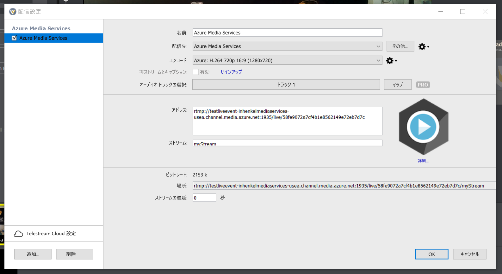
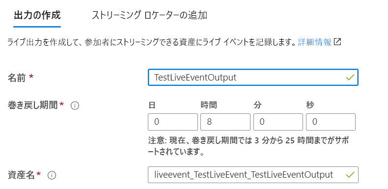
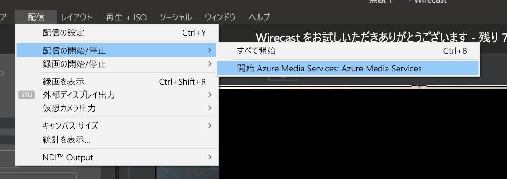

# ポータルと Wirecast で Azure Media Services のライブ ストリームを作成する

このファースト ステップ ガイドは、Azure サブスクリプションを所有しており、Azure Media Services アカウントを作成済みであることを前提としています。

Azure サブスクリプションをお持ちでない場合は、開始する前に[無料](https://azure.microsoft.com/free/)アカウントを作成してください。

## Azure Portal にログインする

Web ブラウザーを開いて、[Microsoft Azure Portal](https://portal.azure.com/) にアクセスします。 資格情報を入力してポータルにサインインします。 既定のビューはサービス ダッシュボードです。

このクイックスタートで取り上げる内容は次のとおりです。

- 無料試用版の Telestream Wirecast でオンプレミスのエンコーダーを設定する
- ライブ ストリームを設定する
- ライブ ストリームの出力を設定する
- 既定のストリーミング エンドポイントを実行する
- Azure Media Player を使用してライブ ストリームとオンデマンド出力を表示する

わかりやすくするために、Wirecast、パススルー クラウド エンコーディング、RTMP では Azure Media Services のエンコーディング プリセットを使用します。

## Wirecast でオンプレミスのエンコーダーを設定する

1. ご利用のオペレーティング システム対応の Wirecast を https://www.telestream.net からダウンロードしてインストールします。
1. アプリケーションを起動し、任意のメール アドレスを使用して製品登録を行います。  アプリケーションは開いたままにします。
1. メール アドレスの確認を求めるメールが届いた後、アプリケーションの無料試用版が起動します。
1. 推奨:開いているアプリケーション画面でビデオ チュートリアルを参照してください。

## Azure Media Services のライブ ストリームを設定する

1. ポータル内の Azure Media Services アカウントに移動したら、Media Services リストから **[ライブ ストリーミング]** を選択します。 
 
1. **[ライブ イベントの追加]** をクリックして新しいライブ ストリーミング イベントを作成します。 
![[ライブ イベントの追加] アイコン](media/live-events-wirecast-quickstart/add-live-event.png) 
1. ライブ イベントの **[名前]** フィールドに新しいイベントの名前を入力します (例: *TestLiveEvent*)。 
 
1. **[説明]** フィールドにイベントの説明 (省略可) を入力します。
1. **[パススルー - クラウド エンコードなし]** をクリックします。 

1. **[RTMP]** をクリックします。
1. ライブ イベントの準備が完了する前に課金されないように、[ライブ イベントの開始] で **[いいえ]** が選択されていることを確認します  (課金はライブ イベントが開始された後に開始されます)。![[ライブ イベントの開始] オプション ボタン](media/live-events-wirecast-quickstart/start-live-event-no.png) 
1. **[確認と作成]** をクリックして設定を確認します。
1. **[作成]** ボタンをクリックしてライブ イベントを作成します。 その後、元のライブ イベント リスト ビューが表示されます。
1. 先ほど作成した**ライブ イベントへのリンク**をクリックします。 イベントが停止していることに注目します。
1. このページをブラウザーで開いたままにします。  これは後で使用します。

## Wirecast Studio でライブ ストリームを設定する

1. Wirecast アプリケーションを開いたままにしていることを前提に、メイン メニューから **[Create Empty Document]\(空のドキュメントの作成\)** を選択し、 **[Continue]\(続行\)** をクリックします。

1. Wirecast のレイヤー領域で、最初のレイヤーにマウス ポインターを合わせます。  表示された **[Add]\(追加\)** アイコンをクリックし、ストリーム配信するビデオ入力を選択します。  [Master Layer 1]\(マスター レイヤー 1\) ダイアログ ボックスが表示されます。 

1. メニューから **[Video capture]\(ビデオ キャプチャ\)** を選択し、使用したいカメラを選択します。 カメラを選択すると、カメラからのビューが [Preview]\(プレビュー\) 領域に表示されます。

1. Wirecast のレイヤー領域で、2 つ目のレイヤーにマウス ポインターを合わせます。 表示された **[Add]\(追加\)** アイコンをクリックし、ストリーム配信するオーディオ入力を選択します。  [Master Layer 2]\(マスター レイヤー 2\) ダイアログ ボックスが表示されます。
1. メニューから **[Audio capture]\(オーディオ キャプチャ\)** を選択し、使用したいオーディオ入力を選択します。

1. メイン メニューから **[Output settings]\(出力設定\)** を選択します。  [Output]\(出力\) ダイアログ ボックスが表示されます。
1. 出力のボックスの一覧から **[Azure Media Services]** を選択します。  Azure Media Services の出力設定は、その "*ほとんど*" が自動入力されます。 

1. 次のセクションでは、ブラウザーで Azure Media Services に戻り、"*入力 URL*" をコピーして出力設定に入力します。

### 入力 URL をコピーして貼り付ける

1. ポータルの Azure Media Services ページに戻り、 **[開始]** をクリックしてライブ ストリーム イベントを開始します (この時点で課金が開始されます)。 
![[開始] アイコン](media/live-events-wirecast-quickstart/start.png)
2. **セキュリティ保護またはセキュリティ保護なし**のトグルをクリックして、 **[セキュリティ保護なし]** に設定します。  これで、プロトコルが RTMPS ではなく RTMP に設定されます。
3. **入力 URL** をクリップボードにコピーします。

4. Wirecast アプリケーションに切り替え、出力設定の **[Address]\(アドレス\)** フィールドにその**入力 URL** を貼り付けます。 

5. **[OK]** をクリックします。

## 出力を設定する

ここでは出力を設定し、ライブ ストリームのレコーディングを保存できるようにします。  

> [!NOTE]
> この出力をストリーム配信するには、ストリーミング エンドポイントが実行されている必要があります。  後続の「既定のストリーミング エンドポイントを実行する」セクションを参照してください。

1. 出力ビデオ ビューアーの下にある **[Create outputs]\(出力の作成\)** リンクをクリックします。
1. 必要に応じて、 **[Name]\(名前\)** フィールドで出力の名前を編集し、後で見つけやすいよう、わかりやすい名前に変更します。

1. この時点では、その他のフィールドはすべてそのままにしておきます。
1. **[Next]\(次へ\)** をクリックして、ストリーミング ロケーターを追加します。
1. 必要に応じて、ロケーターの名前をわかりやすい名前に変更します。

1. この画面上の他の内容はすべて、そのままにしておきます。
1. **Create** をクリックしてください。

## 配信を開始する

1. Wirecast のメイン メニューから、 **[出力] > [Start / Stop broadcasting]\(配信の開始/停止\) > [Start Azure Media Services: Azure Media Services]\(Azure Media Services の開始: Azure Media Services\)** の順に選択します。  ストリームがライブ イベントに送信されると、Azure Media Services のライブ イベント ページにあるライブ イベント ビデオ プレーヤーに Wirecast のライブ ウィンドウが表示されます。

   

1. プレビュー ウィンドウの **[Go]\(開始\)** ボタンをクリックして、Wirecast のレイヤー用に選択したビデオとオーディオの配信を開始します。

   ![Wirecast の [Go]\(開始\) ボタン](media/live-events-wirecast-quickstart/go-button.png)

   > [!TIP]
   > エラーが発生した場合は、プレーヤーの上にある [Reload player]\(プレーヤーを再度読み込む\) リンクをクリックして、プレーヤーを再度読み込んでみてください。

## 既定のストリーミング エンドポイントを実行する

1. Media Services リストで **[ストリーミング エンドポイント]** を選択して、ストリーミング エンドポイントが実行されていることを確認します。 ストリーミング エンドポイント ページが表示されます。 
![[ストリーミング エンドポイント] メニュー項目](media/live-events-wirecast-quickstart/streaming-endpoints.png)
1. 既定のストリーミング エンドポイントの状態が停止中である場合、**既定**のストリーミング エンドポイントをクリックします。 そのエンドポイントのページが表示されます。
1. **[開始]** をクリックします。  これでストリーミング エンドポイントが開始されます。 
![[ストリーミング エンドポイント] メニュー項目](media/live-events-wirecast-quickstart/start.png)

## Azure Media Player で出力配信を再生する

1. 出力ビデオ プレーヤーの下にある**ストリーミング URL** をコピーします。
1. Web ブラウザーで、デモの Azure Media Player を開きます (https://ampdemo.azureedge.net/azuremediaplayer.html )。
1. Azure Media Player の URL フィールドに**ストリーミング URL** を貼り付けます。
1. **[Update Player]\(プレーヤーの更新\)** ボタンをクリックします。
1. ビデオの**再生**アイコンをクリックすると、ライブ ストリームが表示されます。

## 配信を停止する

十分な量のコンテンツをストリーム配信したと思ったら、配信を停止します。

1. Wirecast の **[broadcast]\(配信\)** ボタンをクリックします。  これで Wirecast からの配信が停止します。
1. ポータルで **[停止]** をクリックします。 ライブ ストリームが停止されるという警告メッセージが表示されますが、この時点で出力はオンデマンド資産になります。
1. 警告メッセージで **[停止]** をクリックします。 ライブ ストリームが利用できなくなったため、Azure Media Player にもエラーが表示されます。

## Azure Media Player でオンデマンド出力を再生する

ストリーミング エンドポイントが実行されている間は、作成した出力をオンデマンド ストリーミングに使用できます。

1. Media Services リストに移動し、 **[資産]** を選択します。
1. 先ほど作成したイベント出力を探し、**その資産へのリンク**をクリックします。 資産の出力ページが表示されます。
1. 資産のビデオ プレーヤーの下にある**ストリーミング URL** をコピーします。
1. ブラウザーで Azure Media Player に戻り、その**ストリーミング URL** を Azure Media Player の URL フィールドに貼り付けます。
1. **[Update Player]\(プレーヤーの更新\)** をクリックします。
1. ビデオの**再生**アイコンをクリックすると、オンデマンド資産が表示されます。

## リソースをクリーンアップする

> [!IMPORTANT]
> サービスを停止してください。 このクイックスタートの手順が完了したら、ライブ イベントとストリーミング エンドポイントを必ず停止してください。そうしないと、実行されている間は引き続き課金されることになります。 ライブ イベントを停止するには、前述の「配信を停止する」の手順 2 と 3 を参照してください。

### ストリーミング エンドポイントを停止する

1. Media Services リストから **[ストリーミング エンドポイント]** を選択します。
2. 先ほど開始した**既定**のストリーミング エンドポイントをクリックします。 そのエンドポイントのページが表示されます。
3. **[停止]** をクリックします。  これでストリーミング エンドポイントが停止されます。

> [!TIP]
> このイベントの資産を保持する必要がない場合は、ストレージに対する課金が発生しないように必ず資産を削除してください。

## 次のステップ
> [!div class="nextstepaction"]
> [後続記事](./live-events-outputs-concept.md)
