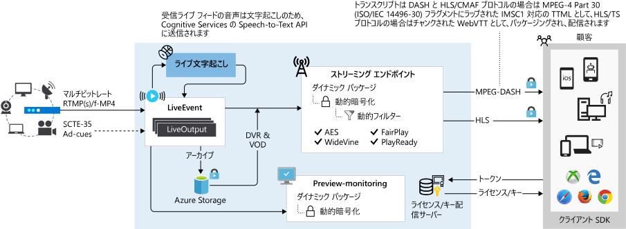

# Azure Media Services v3 を使用したライブ ストリーミング

Azure Media Services では、Azure クラウドで顧客にライブ イベントを配信することができます。 Media Services でライブ イベントをストリーミングするには、以下が必要です。  

- ライブ イベントをキャプチャするために使用するカメラ。 設定のアイデアについては、「[Simple and portable event video gear setup (シンプルでポータブルなイベント ビデオ機器の設定)]( https://link.medium.com/KNTtiN6IeT)」を参照してください。

    カメラにアクセスできない場合は、[Telestream Wirecast](https://www.telestream.net/wirecast/overview.htm) などのツールを使用して、ビデオ ファイルからライブ フィードを生成できます。
- カメラ (またはノート PC などのデバイス) からの信号を Media Services に送信される投稿フィードに変換するライブ ビデオ エンコーダー。 投稿フィードでは、SCTE-35 マーカーなどの広告に関連する信号を含めることができます。 推奨されるライブ ストリーミング エンコーダーの一覧については、[ライブ ストリーミング エンコーダー](recommended-on-premises-live-encoders.md)に関するページを参照してください。 また、ブログ「[Live streaming production with OBS (OBS を使用したライブ ストリーミングの製作)](https://link.medium.com/ttuwHpaJeT)」も参照してください。
- コンテンツの取り込み、プレビュー、パッケージ、録画、暗号化、ライブ イベントのブロードキャスト (顧客のほか、CDN に配信して広域配信することもできる) を可能にする、Media Services のコンポーネント。

この記事では、Media Services を使用したライブ ストリーミングの概要とガイダンスを説明し、他の関連記事のリンクを提供します。
 
> [!NOTE]
> 現時点では、Azure portal を使用して v3 リソースを管理することはできません。 [REST API](https://aka.ms/ams-v3-rest-ref)、[CLI](https://aka.ms/ams-v3-cli-ref)、サポートされている [SDK](media-services-apis-overview.md#sdks) のいずれかを使用します。

## ダイナミック パッケージ

Media Services では、[ダイナミック パッケージ](dynamic-packaging-overview.md)を利用して、サービスに送信される投稿フィードからのライブ ストリームを [MPEG DASH、HLS、および Smooth Streaming 形式](https://en.wikipedia.org/wiki/Adaptive_bitrate_streaming)でプレビューしてブロードキャストできます。 視聴者は、HLS、DASH、またはスムーズ ストリーミングと互換性のある任意のプレーヤーを使用して、ライブ ストリームを再生できます。 これらいずれかのプロトコルでストリームを配信するために、Web またはモバイル アプリケーションの [Azure Media Player](https://amp.azure.net/libs/amp/latest/docs/index.html) を使用することができます。

## 動的暗号化

動的暗号化では、AES-128 または 3 つの主要なデジタル著作権管理 (DRM) システムのいずれかを用いて、ライブまたはオンデマンドのコンテンツを動的に暗号化できます。コンテンツを配信できます。 Media Services では、承認されたクライアントに AES キーと DRM (PlayReady、Widevine、FairPlay) ライセンスを配信するためのサービスも提供しています。 詳細については、[動的暗号化](content-protection-overview.md)に関するページを参照してください。

## 動的マニフェスト

動的フィルターを使用することで、プレーヤーに送信されるトラック数、形式、ビットレート、プレゼンテーションの時間枠を制御できます。 詳細については、[フィルターと動的マニフェスト](filters-dynamic-manifest-overview.md)に関するページを参照してください。

## ライブ イベントの種類

[ライブ イベント](https://docs.microsoft.com/rest/api/media/liveevents)は、ライブ ビデオ フィードの取り込みと処理を担当します。 ライブ イベントには、パススルーとライブ エンコードの 2 種類があります。 Media Services v3 のライブ ストリームに関する詳細については、「[ライブ イベントとライブ出力](live-events-outputs-concept.md)」を参照してください。

### パススルー

パススルー **ライブ イベント**を使用する場合は、オンプレミス ライブ エンコーダーを活用して、マルチ ビットレート ビデオ ストリームを生成し、(RTMP または Fragmented MP4 入力プロトコルを使用して) ライブ イベントへの投稿フィードとして送信します。 その後、ライブ イベントは、追加のコード変換なしでダイナミック パッケージャー (ストリーミング エンドポイント) への受信ビデオ ストリームを通過します。 このようなパススルー ライブ イベントは、長時間実行されるライブ ストリームや 24 時間 365 日のリニア ライブ エンコード向けに最適化されています。 

### ライブ エンコード  

Media Services によるクラウド エンコードを使用する場合は、オンプレミス ライブ エンコーダーを、(RTMP または Fragmented MP4 入力プロトコルを使用して) ライブ イベントへの投稿フィードとしてシングル ビットレート ビデオ (最大合計 32 Mbps) を送信するように構成します。 ライブ イベントは、配信を向上させるためにさまざまな解像度で受信シングル ビットレート ストリームを[マルチ ビットレート ビデオ ストリーム](https://en.wikipedia.org/wiki/Adaptive_bitrate_streaming)にコード変換し、そのストリームを、MPEG-DASH、Apple HTTP ライブ ストリーミング プロトコル (HLS)、Microsoft Smooth Streaming などの業界標準プロトコルを介して再生デバイスに配信できるようにします。 

### ライブ文字起こし

ライブ文字起こしは、パススルーまたはライブ エンコードのいずれかであるライブ イベントで使用できる機能です。 詳細については、[ライブ文字起こし](live-transcription.md)に関するページを参照してください。 この機能が有効になっている場合、このサービスでは Cognitive Services の[音声テキスト変換](../../cognitive-services/speech-service/speech-to-text.md)機能を使用して、受信したオーディオの音声を文字起こししてテキストにします。 その後、このテキストは、MPEG-DASH および HLS プロトコルのビデオとオーディオで配信できるようになります。

> [!NOTE]
> 現在、ライブ文字起こしは、米国西部 2 のプレビュー機能として提供されています。

## ライブ ストリーミング ワークフロー

Media Services v3 のライブ ストリーミング ワークフローを理解するには、まず次の概念を確認して理解する必要があります。 

- [ストリーミング エンドポイント](streaming-endpoint-concept.md)
- [ライブ イベントとライブ出力](live-events-outputs-concept.md)
- [ストリーミング ロケーター](streaming-locators-concept.md)

### 一般的な手順

1. Media Services アカウントで、**ストリーミング エンドポイント** (配信元) が実行されていることを確認します。 
2. [ライブ イベント](live-events-outputs-concept.md)を作成します。  イベントの作成時に、そのイベントを自動開始するように設定できます。 または、ストリーミングを開始する準備ができたら、イベントを開始できます。  自動開始が true に設定されている場合、ライブ イベントは作成の直後に開始されます。 ライブ イベントの実行が開始されるとすぐに課金が開始されます。 それ以上の課金を停止するには、ライブ イベント リソースの Stop を明示的に呼び出す必要があります。 詳細については、[ライブ イベントの状態と課金](live-event-states-billing.md)に関するページを参照してください。
3. 取り込み URL を取得し、その URL を使用して投稿フィードを送信するようにオンプレミス エンコーダーを構成します。 「[おすすめのライブ エンコーダー](recommended-on-premises-live-encoders.md)」を参照してください。
4. プレビュー URL を取得し、それを使用して、エンコーダーからの入力が実際に受信されていることを確認します。
5. 新しい**アセット**オブジェクトを作成します。 

    各ライブ出力はアセットに関連付けられており、ビデオを関連する Azure BLOB ストレージ コンテナーに記録するために使用されます。 
6. ストリームをアセットにアーカイブできるように、**ライブ出力**を作成し、作成したアセット名を使用します。

    ライブ出力は作成すると開始され、削除されると停止します。 ライブ出力を削除しても、基になるアセットとアセット内のコンテンツは削除されません。
7. [組み込みのストリーミング ポリシーの種類](streaming-policy-concept.md)で**ストリーミング ロケーター**を作成します。

    ライブ出力を公開するには、関連付けられたアセット用にストリーミング ロケーターを作成する必要があります。 
8. 使用する URL を返すためのパスを**ストリーミング ロケーター**に列挙します (これらは決定論的です)。
9. ストリーミングする**ストリーミング エンドポイント** (配信元) のホスト名を取得します。
10. 手順 8.の URL と手順 9 のホスト名を組み合わせて、完全な URL を取得します。
11. **ライブ イベント**の公開をやめる場合は、イベントのストリーミングを停止し、**ストリーミング ロケーター**を削除する必要があります。
12. ストリーミング イベントが完了し、以前にプロビジョニングされたリソースをクリーンアップする場合は、次の手順に従います。

    * エンコーダーからのストリームのプッシュを停止します。
    * ライブ イベントを停止します。 ライブ イベントが停止した後は、いかなる課金も発生しません。 もう一度開始する必要がある場合、取り込み URL は同一になるため、エンコーダーを再構成する必要はありません。
    * ライブ イベントのアーカイブをオンデマンド ストリームとして提供し続けるのでない限り、ストリーミング エンドポイントを停止できます。 ライブ イベントが停止状態の場合は、いかなる課金も発生しません。

ライブ出力がアーカイブされるアセットは、ライブ出力が削除されると、自動的にオンデマンド アセットになります。 ライブ イベントを停止するには、すべてのライブ出力を削除する必要があります。 省略可能なフラグ [removeOutputsOnStop](https://docs.microsoft.com/rest/api/media/liveevents/stop#request-body) を使用すると、停止時にライブ出力を自動的に削除できます。 

> [!TIP]
> [ライブ ストリーミングのチュートリアル](stream-live-tutorial-with-api.md)に関するページを参照してください。この記事では、前述の手順を実装するコードについて説明します。

## その他の重要な記事

- [おすすめのライブ エンコーダー](recommended-on-premises-live-encoders.md)
- [クラウド DVR の使用](live-event-cloud-dvr.md)
- [ライブ イベントの種類の機能の比較](live-event-types-comparison.md)
- [状態と課金](live-event-states-billing.md)
- [待機時間](live-event-latency.md)

## 質問、フィードバックの送信、最新情報の入手

「[Azure Media Services community (Azure Media Services コミュニティ)](media-services-community.md)」を参照して、さまざまな質問の方法、フィードバックする方法、Media Services に関する最新情報の入手方法を確認してください。

## 次の手順

* [ライブ ストリーミングのチュートリアル](stream-live-tutorial-with-api.md)
* [Media Services v2 から v3 への移行のガイダンス](migrate-from-v2-to-v3.md)
