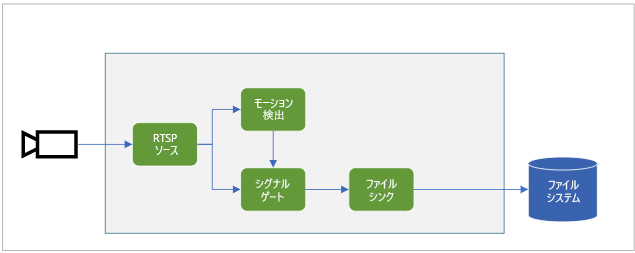

# <a name="quickstart-detect-motion-record-video-on-edge-devices"></a>クイック スタート:モーションの検出、エッジ デバイス上でのビデオの記録
 
このクイックスタートでは、Live Video Analytics on IoT Edge を使用して、(シミュレートされた) IP カメラからのライブ ビデオ フィードを分析し、何らかの動きがあるかどうかを検出し、ある場合には、MP4 ビデオ クリップをエッジ デバイス上のローカル ファイル システムに記録する方法について説明します。 IoT Edge デバイスとして Azure VM を使用すると共に、シミュレートしたライブ ビデオ ストリームを使用します。 この記事は、C# で作成されたサンプル コードを基にしています。

この記事は、[この](detect-motion-emit-events-quickstart.md)クイックスタートに基づいて作成されています。 

## <a name="prerequisites"></a>前提条件

* アクティブなサブスクリプションが含まれる Azure アカウント。 [無料でアカウントを作成できます](https://azure.microsoft.com/free/?WT.mc_id=A261C142F)。
* マシン上の [Visual Studio Code](https://code.visualstudio.com/) と次の拡張機能:
    * [Azure IoT Tools](https://marketplace.visualstudio.com/items?itemName=vsciot-vscode.azure-iot-tools)
    * [C#](https://marketplace.visualstudio.com/items?itemName=ms-dotnettools.csharp)
* [.NET Core 3.1 SDK](https://dotnet.microsoft.com/download/dotnet-core/3.1) がシステムにインストールされていること。
* [この](detect-motion-emit-events-quickstart.md)クイックスタートをまだ完了していない場合は、次の手順を完了してください。
     * [Azure リソースを設定する](detect-motion-emit-events-quickstart.md#set-up-azure-resources)
     * [開発環境を設定する](detect-motion-emit-events-quickstart.md#set-up-your-development-environment)
     * [IoT Edge の配置マニフェストを生成してデプロイする](detect-motion-emit-events-quickstart.md#generate-and-deploy-the-iot-edge-deployment-manifest)
     * [イベントを監視するための準備をする](detect-motion-emit-events-quickstart.md#prepare-for-monitoring-events)

> [!TIP]
> Azure IoT Tools をインストールしているときに、Docker のインストールを求められる場合があります。 これは無視してかまいません。

## <a name="review-the-sample-video"></a>サンプル ビデオを確認する
Azure リソースを設定する上記手順の一部として、駐車場の (短い) ビデオが、IoT Edge デバイスとして使用されている Azure の Linux VM にコピーされます。 このビデオ ファイルは、このチュートリアルのライブ ストリームをシミュレートするために使用されます。

[VLC プレーヤー](https://www.videolan.org/vlc/)のようなアプリケーションを使用してそれを起動し、Ctrl を押しながら N キーを押し、[この](https://lvamedia.blob.core.windows.net/public/lots_015.mkv)リンクを駐機場ビデオに貼り付けると再生を開始できます。 約 5 秒のマークで、白の車が駐車場を通って移動します。

次の手順を完了すると、Live Video Analytics on IoT Edge を使用してその車の動きを検出し、その 5 秒のマーク付近で始まるビデオ クリップが録画されます。

## <a name="overview"></a>概要



上の図は、このクイックスタートでのシグナルの流れを示しています。 エッジ モジュール (詳細については[こちら](https://github.com/Azure/live-video-analytics/tree/master/utilities/rtspsim-live555)を参照) は、RTSP サーバーをホストする IP カメラをシミュレートします。 [RTSP ソース](media-graph-concept.md#rtsp-source) ノードは、このサーバーからビデオ フィードを取得し、[モーション検出プロセッサ](media-graph-concept.md#motion-detection-processor) ノードにビデオ フレームを送信します。 RTSP ソースは、同じビデオ フレームを[シグナル ゲート プロセッサ](media-graph-concept.md#signal-gate-processor) ノードに送信します。これは、イベントによってトリガーされるまで閉じたままです。

モーション検出プロセッサは、ビデオにモーションがあると判断すると、イベントをシグナル ゲート プロセッサ ノードに送信してトリガーします。 ゲートは、構成されている期間開いて、[ファイル シンク](media-graph-concept.md#file-sink) ノードにビデオ フレームを送信します。 このシンク ノードは、構成された場所にあるエッジ デバイスのローカル ファイル システムに、ビデオを MP4 ファイルとして記録します。

このクイックスタートでは次の作業を行います。

1. メディア グラフを作成してデプロイする
1. 結果を解釈する
1. リソースをクリーンアップする

## <a name="examine-and-edit-the-sample-files"></a>サンプル ファイルを調べて編集する
前提条件の一部として、サンプル コードをフォルダーにダウンロードしました。 Visual Studio Code を起動し、そのフォルダーを開きます。

1. Visual Studio Code で "src/edge" に移動します。 いくつかの展開テンプレート ファイルと共に、作成した .env ファイルを確認できます。
    * 展開テンプレートでは、いくつかのプレースホルダー値で、エッジ デバイスの配置マニフェストが参照されています。 env ファイルには、それらの変数の値が含まれています。
1. 次に、"src/cloud-to-device-console-app" フォルダーに移動します。 ここでは、作成した appsettings.json ファイルと、他のいくつかのファイルを確認できます。
    * c2d-console-app.csproj - これは Visual Studio Code のプロジェクト ファイルです。
    * operations.json - このファイルには、プログラムで実行するさまざまな操作がリストされます。
    * Program.cs - これはサンプル プログラムのコードです。次の処理を実行します。

        * アプリ設定を読み込みます。
        * Live Video Analytics on IoT Edge モジュールによって公開されているダイレクト メソッドを呼び出します。 このモジュールを使用し、[ダイレクト メソッド](direct-methods.md)を呼び出すことにでライブ ビデオ ストリームを分析できます。 
        * プログラムからの出力をターミナル ウィンドウで、また、モジュールによって生成されたイベントを出力ウィンドウで詳しく調べることができるように、一時停止します。
        * ダイレクト メソッドを呼び出して、リソースをクリーンアップします。   

1. operations.json ファイルに対して次の編集を行います。
    * グラフ トポロジへのリンクを変更します: `"topologyUrl" : "https://raw.githubusercontent.com/Azure/live-video-analytics/master/MediaGraph/topologies/evr-motion-files/topology.json"`
    * GraphInstanceSet で、上のリンクの値と一致するようにグラフ トポロジの名前を編集します: `"topologyName" : "EVRToFilesOnMotionDetection"`
    * また、必要なビデオ ファイルを指すように RTSP URL を編集します: `"value": "rtsp://rtspsim:554/media/lots_015.mkv"`
    * GraphTopologyDelete で、名前を編集します: `"name": "EVRToFilesOnMotionDetection"`

## <a name="review---check-status-of-the-modules"></a>レビュー - モジュールの状態を確認する
「[IoT Edge の配置マニフェストを生成してデプロイする](detect-motion-emit-events-quickstart.md#generate-and-deploy-the-iot-edge-deployment-manifest)」の手順において、Visual Studio Code で、(左下のセクションの) AZURE IOT HUB の下にある "lva-sample-device" を展開すると、次のモジュールがデプロイされているのを確認できます。

    1. "lvaEdge" という名前の Live Video Analytics モジュール
    1. "rtspsim" という名前のモジュール。RTSP サーバーをシミュレートし、ライブ ビデオ フィードのソースとして機能します

        


## <a name="review---prepare-for-monitoring-events"></a>レビュー - イベントを監視するための準備をする
「[イベントを監視するための準備をする](detect-motion-emit-events-quickstart.md#prepare-for-monitoring-events)」の手順を完了していることを確認します。


## <a name="run-the-sample-program"></a>サンプル プログラムを実行する

1. デバッグ セッションを開始します (F5 キーを押します)。 ターミナル ウィンドウへのメッセージ出力が開始されます。
1. operations.json は、ダイレクト メソッド GraphTopologyList と GraphInstanceList の呼び出しで開始されます。 前回のクイックスタート後にリソースをクリーンアップした場合は、空のリストが返された後、一時停止して、Enter キーの入力待ち状態になります。
```
--------------------------------------------------------------------------
Executing operation GraphTopologyList
-----------------------  Request: GraphTopologyList  --------------------------------------------------
{
  "@apiVersion": "1.0"
}
---------------  Response: GraphTopologyList - Status: 200  ---------------
{
  "value": []
}
--------------------------------------------------------------------------
Executing operation WaitForInput
Press Enter to continue
```
1. ターミナル ウィンドウで "Enter" キーを押すと、次に示す一連のダイレクト メソッドの呼び出しが実行されます。
     * 前出の topologyUrl を使用した GraphTopologySet の呼び出し
     * 次の body を使用した GraphInstanceSet の呼び出し
     ```
     {
       "@apiVersion": "1.0",
       "name": "Sample-Graph",
       "properties": {
         "topologyName": "EVRToFilesOnMotionDetection",
         "description": "Sample graph description",
         "parameters": [
           {
             "name": "rtspUrl",
             "value": "rtsp://rtspsim:554/media/lots_015.mkv"
           },
           {
             "name": "rtspUserName",
             "value": "testuser"
           },
           {
             "name": "rtspPassword",
             "value": "testpassword"
           }
         ]
       }
     }
     ```
     * GraphInstanceActivate を呼び出すことでグラフ インスタンスが起動し、ビデオのフローが開始されます。
     * GraphInstanceList の 2 回目の呼び出しで、実際にグラフ インスタンスが実行状態として表示されます。
1. ターミナル ウィンドウの出力が、今度は "Press Enter to continue (続行するには Enter キーを押してください)" というプロンプトで一時停止状態となります。 この時点では "Enter" キーは押さないでください。 上にスクロールすると、呼び出したダイレクト メソッドの JSON 応答のペイロードを確認できます。
1. ここで Visual Studio Code の出力ウィンドウに切り替えると、Live Video Analytics on IoT Edge モジュールから IoT Hub に送信されているメッセージが表示されます。
     * これらのメッセージについては、以降のセクションで取り上げます。
1. 引き続きメディア グラフが実行され、結果が出力されます。つまり、RTSP シミュレーターによってソース ビデオがループ処理されます。 メディア グラフを停止するには、ターミナル ウィンドウに戻って "Enter" キーを押します。 次の一連の呼び出しによって、リソースがクリーンアップされます。
     * GraphInstanceDeactivate を呼び出すことでグラフ インスタンスが非アクティブ化されます。
     * GraphInstanceDelete を呼び出すことでインスタンスが削除されます。
     * GraphTopologyDelete を呼び出すことでトポロジが削除されます。
     * 最後に、GraphTopologyList を呼び出すことで、リストが空になったことが示されます。

## <a name="interpret-results"></a>結果を解釈する 
メディア グラフを実行すると、モーション検出プロセッサ ノードから IoT Hub シンク ノードを介して IoT Hub に結果が送信されます。 Visual Studio Code の出力ウィンドウに表示されるメッセージには、"body" セクションと "applicationProperties" セクションが含まれています。 これらのセクションが表す内容については、[こちら](https://docs.microsoft.com/azure/iot-hub/iot-hub-devguide-messages-construct)の記事を参照してください。

以下のメッセージでは、アプリケーションのプロパティと body の内容が Live Video Analytics モジュールによって定義されています。

## <a name="mediasession-established-event"></a>MediaSession Established イベント

メディア グラフがインスタンス化されると、RTSP ソース ノードは、rtspsim-live555 コンテナーで実行されている RTSP サーバーへの接続を試みます。 成功した場合、このイベントが出力されます。

```
[IoTHubMonitor] [05:37:21 AM] Message received from [lva-sample-device/lvaEdge]:
{  
"body": {
"sdp": "SDP:\nv=0\r\no=- 1586450538111534 1 IN IP4 xxx.xxx.xxx.xxx\r\ns=Matroska video+audio+(optional)subtitles, streamed by the LIVE555 Media Server\r\ni=media/camera-300s.mkv\r\nt=0 0\r\na=tool:LIVE555 Streaming Media v2020.03.06\r\na=type:broadcast\r\na=control:*\r\na=range:npt=0-300.000\r\na=x-qt-text-nam:Matroska video+audio+(optional)subtitles, streamed by the LIVE555 Media Server\r\na=x-qt-text-inf:media/camera-300s.mkv\r\nm=video 0 RTP/AVP 96\r\nc=IN IP4 0.0.0.0\r\nb=AS:500\r\na=rtpmap:96 H264/90000\r\na=fmtp:96 packetization-mode=1;profile-level-id=4D0029;sprop-parameter-sets={SPS}\r\na=control:track1\r\n"  
},  
"applicationProperties": {  
    "dataVersion": "1.0",  
    "topic": "/subscriptions/{subscriptionID}/resourceGroups/{name}/providers/microsoft.media/mediaservices/hubname",  
    "subject": "/graphInstances/Sample-Graph-1/sources/rtspSource",  
    "eventType": "Microsoft.Media.MediaGraph.Diagnostics.MediaSessionEstablished",  
    "eventTime": "2020-05-21T05:37:21.398Z",
    }  
}
```

* このメッセージは Diagnostics イベントです。MediaSessionEstablished は、RTSP ソース ノード (subject) が RTSP シミュレーターとの接続を確立し、(シミュレートされた) ライブ フィードの受信を開始できたことを示します。
* applicationProperties の "subject" が、メッセージの生成元となったグラフ トポロジ内のノードを参照しています。 このケースでは、RTSP ソース ノードからメッセージが生成されています。
* applicationProperties の "eventType" を見ると、これは Diagnostics イベントであることがわかります。
* イベントの発生時刻が "eventTime" に示されています。
* 診断イベントに関するデータ (このケースでは [SDP](https://en.wikipedia.org/wiki/Session_Description_Protocol) の詳細) は "body" に含まれています。


## <a name="recording-started-event"></a>Recording Started イベント

[こちら](#overview)で説明されているように、モーションが検出されると、シグナル ゲート プロセッサ ノードがアクティブになり、メディア グラフのファイル シンク ノードが MP4 ファイルの書き込みを開始します。 ファイル シンク ノードは、Operational イベントを送信します。 type は、モーション検出プロセッサからの結果であることを示す "motion" に設定され、また、eventTime を見るとモーションが発生した時刻 (UTC) がわかります。 次に例を示します。

```
[IoTHubMonitor] [05:37:27 AM] Message received from [lva-sample-device/lvaEdge]:
{
  "body": {
    "outputType": "filePath",
    "outputLocation": "/var/media/sampleFilesFromEVR-filesinkOutput-20200521T053726Z.mp4"
  },
  "applicationProperties": {
    "topic": "/subscriptions/{subscriptionID}/resourceGroups/{name}/providers/microsoft.media/mediaservices/hubname",  
    "subject": "/graphInstances/Sample-Graph-1/sinks/fileSink",
    "eventType": "Microsoft.Media.Graph.Operational.RecordingStarted",
    "eventTime": "2020-05-21T05:37:27.713Z",
    "dataVersion": "1.0"
  }
}
```

* applicationProperties の "subject" が、メッセージの生成元となったメディア グラフ内のノードを参照しています。 このケースでは、ファイル シンク ノードからメッセージが生成されています。
* applicationProperties の "eventType" を見ると、これは Operational イベントであることがわかります。
* イベントの発生時刻が "eventTime" に示されています。 MediaSessionEstablished の 5-6 秒後に、ビデオがフローを開始することを注意してください。 これは、駐車場へと[車が移動を開始した](#review-the-sample-video)ときの 5-6 秒のマークに対応しています。
* "body" には、操作イベントに関するデータが含まれています。この場合は、"outputType" と "outputLocation" のデータです。
* "outputType" は、この情報がファイル パスに関するものであることを示しています。
* "outputLocation" は、エッジ モジュール内からの MP4 ファイルの場所を指定します。

## <a name="recording-stopped-and-available-events"></a>Recording Stopped および Available イベント

[グラフ トポロジ](https://github.com/Azure/live-video-analytics/blob/master/MediaGraph/topologies/evr-motion-files/topology.json)でシグナル ゲート プロセッサ ノードのプロパティを確認すると、アクティブ化の時間が 5 秒に設定されていることがわかります。 したがって、RecordingStarted イベントを受信してから約 5 秒後に、次を受け取ります。
* 記録が停止したことを示す RecordingStopped イベント
* MP4 ファイルを表示に使用できるようになったことを示す RecordingAvailable イベント

これらの 2 つのイベントは、通常、数秒以内に次々に出力されます。

### <a name="playing-back-the-mp4-clip"></a>MP4 クリップの再生

1. MP4 ファイルは、OUTPUT_VIDEO_FOLDER_ON_DEVICE キーを使用して .env ファイルに構成したエッジ デバイス上のディレクトリに書き込まれます。 これを既定値のままにした場合、結果は /home/lvaadmin/samples/output/ に含まれます。
1. リソース グループにアクセスして VM を見つけ、Bastion を使用して接続します。

    
 
    
1. ([この](detect-motion-emit-events-quickstart.md#set-up-azure-resources)手順で生成された資格情報を使用して) サインインしたら、コマンド プロンプトで関連するディレクトリ (既定: /home/lvaadmin/samples/output) に移動すると、そこで MP4 ファイルを確認できます。 ローカル マシンに[ファイルを scp](https://docs.microsoft.com/azure/virtual-machines/linux/copy-files-to-linux-vm-using-scp) して、[VLC プレーヤー](https://www.videolan.org/vlc/)またはその他の MP4 プレーヤーを使用して再生できます。

    

## <a name="clean-up-resources"></a>リソースをクリーンアップする

これから他のクイックスタートに取り組む場合は、作成したリソースをそのまま残しておく必要があります。 それ以外の場合は、Azure portal にアクセスして、ご利用のリソース グループに移動し、このクイックスタートの実行に使用したリソース グループを選択して、すべてのリソースを削除してください。

## <a name="next-steps"></a>次のステップ

* 「[ご自分のモデルを使用して Live Video Analytics を実行する](use-your-model-quickstart.md)」クイックスタートを実行します。これは、AI をライブ ビデオ フィードに適用する方法を示します。
* 上級ユーザー向けのその他の課題を確認します。

    * RTSP シミュレーターを使用する代わりに、RTSP のサポートを含む [IP カメラ](https://en.wikipedia.org/wiki/IP_camera) を使用します。 RTSP をサポートする IP カメラを検索するには、[ONVIF 準拠製品](https://en.wikipedia.org/wiki/IP_camera)のページでプロファイル G、S、または T に準拠しているデバイスを検索します。
    * AMD64 または X64 Linux デバイスを使用します (Azure Linux VM を使用するのではなく)。 このデバイスは、IP カメラと同じネットワーク内にある必要があります。 [Azure IoT Edge ランタイムの Linux へのインストール](https://docs.microsoft.com/azure/iot-edge/how-to-install-iot-edge-linux)手順に従い、次に「[初めての IoT Edge モジュールを Linux 仮想デバイスにデプロイする](https://docs.microsoft.com/azure/iot-edge/quickstart-linux)」クイックスタートの手順に従って、Azure IoT Hub にデバイスを登録することができます。
