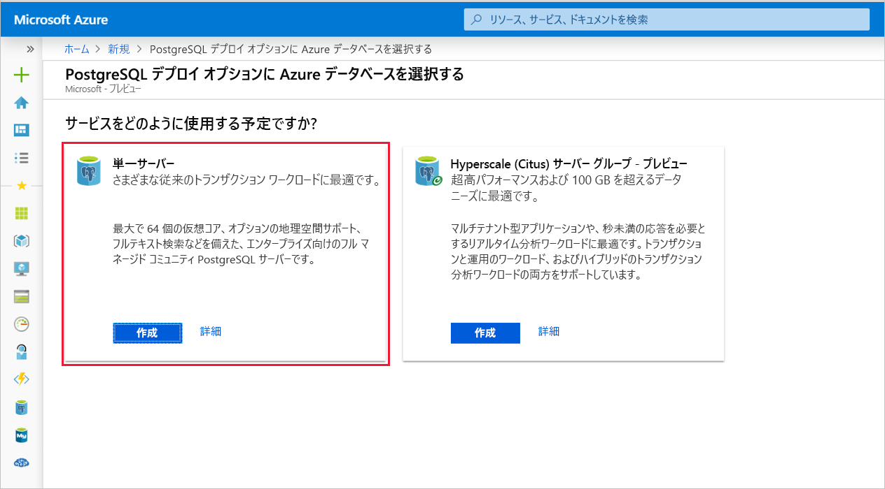
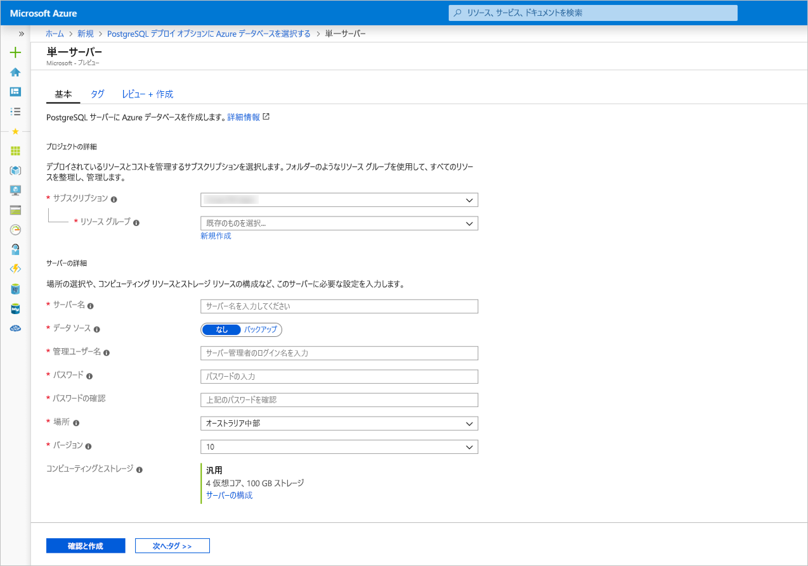
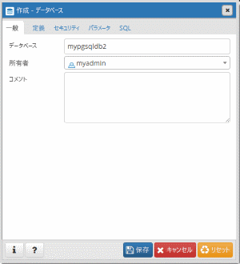

# <a name="quickstart-create-an-azure-database-for-postgresql-server-in-the-azure-portal"></a>クイック スタート:Azure Portal で Azure Database for PostgreSQL サーバーを作成する

Azure Database for PostgreSQL は、高可用性の PostgreSQL データベースをクラウドで実行、管理、スケールできるマネージド サービスです。 このクイック スタートでは、Azure Portal を使用して Azure Database for PostgreSQL サーバーを作成する方法について説明します。所要時間は約 5 分です。

Azure サブスクリプションをお持ちでない場合は、開始する前に[無料の Azure アカウント](https://azure.microsoft.com/free/)を作成してください。

## <a name="sign-in-to-the-azure-portal"></a>Azure portal にサインインする
Web ブラウザーを開き、[ポータル](https://portal.azure.com/)に移動します。 資格情報を入力してポータルにサインインします。 既定のビューはサービス ダッシュボードです。

## <a name="create-an-azure-database-for-postgresql-server"></a>Azure Database for PostgreSQL サーバーの作成

Azure Database for PostgreSQL サーバーは、構成済みの一連の[コンピューティング リソースとストレージ リソース](./concepts-pricing-tiers.md)を使って作成されます。 サーバーは、[Azure リソース グループ](../azure-resource-manager/resource-group-overview.md)内に作成されます。

Azure Database for PostgreSQL サーバーを作成するには、次の手順に従います。
1. ポータルの左上隅にある **[リソースの作成]** (+) を選択します。

2. **[データベース]**  >  **[Azure Database for PostgreSQL]** の順に選択します。

    ![メニューの [Azure Database for PostgreSQL]](./media/quickstart-create-database-portal/1-create-database.png)

3. **[単一サーバー]** デプロイ オプションを選択します。

   

4. **[基本]** フォームに以下の情報を入力します。

    

    Setting|推奨値|説明
    ---|---|---
    Subscription|お使いのサブスクリプション名|サーバーに使用する Azure サブスクリプション。 複数のサブスクリプションをお持ちの場合は、リソースの課金対象となるサブスクリプションを選択してください。
    Resource group|*myresourcegroup*| 新しいリソース グループ名、またはサブスクリプションの既存のリソース グループ名。
    サーバー名 |*mydemoserver*|Azure Database for PostgreSQL サーバーを識別する一意の名前。 指定したサーバー名にドメイン名 *postgres.database.azure.com* が追加されます。 サーバー名に含めることができるのは、英小文字、数字、ハイフン (-) のみです。 3 文字以上 63 文字以内にする必要があります。
    データ ソース | *なし* | *[なし]* を選択し、最初から新しいサーバーを作成します (既存の Azure Database for PostgreSQL サーバーの geo バックアップからサーバーを作成している場合は、 *[Backup]* を選択します)。
    管理者ユーザー名 |*myadmin*| サーバーに接続するときに使用する独自のログイン アカウント。 管理者のログイン名に **azure_superuser**、**azure_pg_admin**、**admin**、**administrator**、**root**、**guest**、または **public** は使用できません。 **pg_** で始めることはできません。
    パスワード |お使いのパスワード| サーバー管理者アカウントの新しいパスワード。 8 ～ 128 文字にする必要があります。 パスワードには、英大文字、英小文字、数字 (0 から 9)、英数字以外の文字 (!、$、#、% など) のうち、3 つのカテゴリの文字が含まれている必要があります。
    Location|ユーザーに最も近いリージョン| ユーザーに最も近い場所。
    Version|最新のメジャー バージョン| 他の特定の要件がない場合は、最新の PostgreSQL メジャー バージョン。
    コンピューティングとストレージ | **汎用**、**Gen 5**、**2 仮想コア**、**5 GB**、**7 日**、**地理冗長** | 新しいサーバーのコンピューティング、ストレージ、およびバックアップ構成。 **[サーバーの構成]** を選択します。 次に、 **[汎用]** タブを選択します。*Gen 5*、"*4 仮想コア*"、*100 GB*、および "*7 日*" は、それぞれ **[コンピューティング世代]** 、 **[仮想コア]** 、 **[ストレージ]** 、および **[バックアップの保有期間]** の既定値です。 これらのスライダーはそのままにすることも、調整することもできます。 サーバー バックアップを geo 冗長ストレージで有効にするには、 **[バックアップ冗長オプション]** から **[地理冗長]** を選択します。 この価格レベルの選択を保存するには、 **[OK]** を選択します。 次のスクリーンショットは、これらの選択を示しています。

   > [!NOTE]
   > 低負荷なコンピューティングと I/O がワークロードに適している場合は、Basic 価格レベルの使用を検討してください。 Basic 価格レベルで作成されたサーバーは後で General Purpose またはメモリ最適化にスケーリングできないことに注意してください。 詳細については、[価格に関するページ](https://azure.microsoft.com/pricing/details/postgresql/)を参照してください。
   > 

    ![[価格レベル] ウィンドウ](./media/quickstart-create-database-portal/2-pricing-tier.png)

5. **[確認および作成]** を選択して、選択内容を確認します。 **[作成]** を選択して、サーバーをプロビジョニングします。 この操作には数分かかることがあります。

6. ツール バーの **[通知]** アイコン (ベル) を選択して、デプロイ プロセスを監視します。 デプロイが完了したら、 **[ダッシュボードにピン留めする]** を選択できます。これにより、このサーバーのタイルが、サーバーの **[概要]** ページへのショートカットとして、Azure Portal ダッシュボードに作成されます。 **[リソースに移動]** を選択すると、サーバーの **[概要]** ページが開きます。

    ![[通知] ウィンドウ](./media/quickstart-create-database-portal/3-notifications.png)
   
   既定では、**postgres** データベースがサーバーに作成されます。 [postgres](https://www.postgresql.org/docs/9.6/static/app-initdb.html) は既定のデータベースで、ユーザー、ユーティリティ、サード パーティ製のアプリケーションが使用するためのものです。 (その他の既定のデータベースは **azure_maintenance** です。 その機能は、管理されたサービス プロセスをユーザーのアクションから分離することです。 このデータベースにはアクセスできません。)

## <a name="configure-a-server-level-firewall-rule"></a>サーバーレベルのファイアウォール規則の構成

Azure Database for PostgreSQL は、サーバー レベルでファイアウォールを作成します。 これにより、外部のアプリケーションやツールからの、サーバーとサーバー上のすべてのデータベースへの接続が禁止されます。接続を許可するには、特定の IP アドレスに対してファイアウォールを開放する規則を作成します。 

1. デプロイが完了したら、目的のサーバーを探します。 必要に応じて、検索することができます。 たとえば、左側のメニューで **[すべてのリソース]** を選択します。 使用しているサーバー名 (例に示した **mydemoserver** など) を入力して、新しく作成されたサーバーを検索します。 検索結果の一覧からご利用のサーバー名を選択します。 サーバーの **[概要]** ページが開き、さらに多くの構成オプションが表示されます。
 
    

2. サーバーのページで、 **[接続のセキュリティ]** を選択します。

3. **[ファイアウォール規則]** で、 **[規則名]** 列の空白のテキスト ボックス内を選択し、ファイアウォール規則の作成を開始します。 

   テキスト ボックスに、サーバーにアクセスする予定のクライアントの、名前と開始および終了の IP 範囲を入力します。 1 つの IP の場合は、開始 IP と終了 IP に同じ値を使用します。

   
     

4. **[接続のセキュリティ]** ページの上部のツール バーで、 **[保存]** を選択します。 接続のセキュリティの更新が正常に完了したことを示す通知が表示されるまで待ってから、次に進んでください。

    > [!NOTE]
    > Azure Database for PostgreSQL サーバーとの接続では、ポート 5432 が通信に使用されます。 企業ネットワーク内から接続しようとしたときに、ポート 5432 での送信トラフィックがネットワークのファイアウォールで許可されていないことがあります。 その場合、会社の IT 部門によってポート 5432 が開放されない限り、サーバーに接続することはできません。
    >

## <a name="get-the-connection-information"></a>接続情報の取得

Azure Database for PostgreSQL サーバーを作成したときに、**postgres** という名前の既定のデータベースも作成されています。 データベース サーバーに接続するには、サーバーの完全な名前と管理者ログイン資格情報が必要です。 これらの値は、クイック スタートの前の手順でメモしてあるはずです。 メモしていなかった場合は、ポータルのサーバーの **[概要]** ページから、サーバー名とログイン情報を簡単に見つけることができます。

サーバーの **[概要]** ページを開きます。 **[サーバー名]** と **[サーバー管理者ログイン名]** をメモしておきます。 各フィールドの上にカーソルを合わせると、テキストの右側にコピー シンボルが表示されます。 必要に応じてコピー シンボルを選択して値をコピーします。

 ![サーバーの [概要] ページ](./media/quickstart-create-database-portal/6-server-name.png)

## <a name="connect-to-the-postgresql-database-using-psql"></a>psql を使用した PostgreSQL データベースへの接続

Azure Database for PostgreSQL サーバーに接続するために使用できる、多くのアプリケーションがあります。 クライアント コンピューターに PostgreSQL がインストールされている場合は、[psql](https://www.postgresql.org/docs/current/static/app-psql.html) のローカル インスタンスを使用して Azure PostgreSQL サーバーに接続できます。 ここでは psql コマンド ライン ユーティリティを使用して、Azure PostgreSQL サーバーに接続しましょう。

1. 次の psql コマンドを実行して Azure Database for PostgreSQL に接続します。
   ```bash
   psql --host=<servername> --port=<port> --username=<user@servername> --dbname=<dbname>
   ```

   たとえば次のコマンドは、アクセス資格情報を使用して、PostgreSQL サーバー **mydemoserver.postgres.database.azure.com** にある既定のデータベース **postgres** に接続します。 パスワードの入力を求められたら、選択した `<server_admin_password>` を入力します。
  
   ```bash
   psql --host=mydemoserver.postgres.database.azure.com --port=5432 --username=myadmin@mydemoserver --dbname=postgres
   ```

   > [!TIP]
   > Postgres への接続に URL パスを使用する場合は、`%40` を使用してユーザー名の @ 記号を URL エンコードします。 たとえば、psql の接続文字列は次のようになります。 
   > ```
   > psql postgresql://myadmin%40mydemoserver@mydemoserver.postgres.database.azure.com:5432/postgres
   > ```

   接続されると、sql コマンドの入力を求める postgres プロンプトが psql ユーティリティによって表示されます。 初回接続時の出力には、使用している psql のバージョンが Azure Database for PostgreSQL サーバー側のバージョンと異なることが原因で、警告が表示されることがあります。 

   psql の出力例:
   ```bash
   psql (9.5.7, server 9.6.2)
   WARNING: psql major version 9.5, server major version 9.6.
    Some psql features might not work.
    SSL connection (protocol: TLSv1.2, cipher: ECDHE-RSA-AES256-SHA384, bits: 256, compression: off)
   Type "help" for help.

   postgres=> 
   ```

   > [!TIP]
   > クライアントの IP アドレスを許可するようにファイアウォールが構成されていない場合、次のエラーが発生します。
   > 
   > "psql: FATAL:  no pg_hba.conf entry for host `<IP address>`, user "myadmin", database "postgres", SSL on FATAL: SSL connection is required. ("psql: 致命的:  ホスト <IP アドレス>、ユーザー "myadmin"、データベース "postgres" のエントリが pg_hba.conf にありません。SSL オン 致命的: SSL 接続が必要です。) Specify SSL options and retry. (SSL のオプションを指定して再試行してください。)
   > 
   > クライアントの IP が上記のファイアウォール規則の手順で許可されていることを確認します。

2. プロンプトで次のコマンドを入力して、"mypgsqldb" という空のデータベースを作成します。
    ```bash
    CREATE DATABASE mypgsqldb;
    ```

3. プロンプトで次のコマンドを実行し、新しく作成したデータベース **mypgsqldb** に接続を切り替えます。
    ```bash
    \c mypgsqldb
    ```

4. 「`\q`」を入力し、Enter キーを押して、psql を終了します。 

psql を介して Azure Database for PostgreSQL サーバーに接続し、空のユーザー データベースを作成しました。 他の一般的なツールである pgAdmin を使用して接続するには、次のセクションに進みます。

## <a name="connect-to-the-postgresql-server-using-pgadmin"></a>pgAdmin を使用して PostgreSQL サーバーに接続する

pgAdmin は PostgreSQL で使用されるオープンソース ツールです。 [pgAdmin の Web サイト](https://www.pgadmin.org/)からインストールできます。 使用する pgAdmin のバージョンは、このクイック スタートで使用されているものと異なる可能性があります。 追加のガイダンスが必要な場合は、pgAdmin のドキュメントをご覧ください。

1. クライアント コンピューターで pgAdmin アプリケーションを開きます。

2. ツール バーから **[オブジェクト]** に移動し、 **[作成]** をポイントして、 **[サーバー]** を選択します。

3. **[作成 - サーバー]** ダイアログ ボックスの **[全般]** タブに、サーバーの一意のフレンドリ名 (**mydemoserver** など) を入力します。

    ![[General]\(全般\) タブ](./media/quickstart-create-database-portal/9-pgadmin-create-server.png)

4. **[作成 - サーバー]** ダイアログ ボックスの **[接続]** タブで、設定テーブルに入力します。

   ![[接続] タブ](./media/quickstart-create-database-portal/10-pgadmin-create-server.png)

    pgAdmin パラメーター |値|説明
    ---|---|---
    ホスト名/アドレス | サーバー名 | 前の手順で Azure Database for PostgreSQL サーバーを作成したときに使用したサーバー名の値。 例に示したサーバーは、**mydemoserver.postgres.database.azure.com** です。 Use the fully qualified domain name ( **\*.postgres.database.azure.com**) as shown in the example. サーバー名を覚えていない場合は、前のセクションの手順に従って接続情報を取得してください。 
    Port | 5432 | Azure Database for PostgreSQL サーバーに接続するときに使用するポート。 
    メンテナンス データベース | *postgres* | システムによって生成される既定のデータベース名。
    ユーザー名 | サーバー管理者ログイン名 | 前の手順で Azure Database for PostgreSQL サーバーを作成したときに指定したサーバー管理者ログイン ユーザー名。 ユーザー名を覚えていない場合は、前のセクションの手順に従って接続情報を取得してください。 形式は *username\@servername* です。
    パスワード | 管理者パスワード | このクイック スタートでサーバーを作成したときに選択したパスワードです。
    Role | 空白 | この時点でロール名を指定する必要はありません。 このフィールドは空白にしてください。
    SSL モード | "*必須*" | pgAdmin の [SSL] タブで、SSL モードを設定できます。既定では、すべての Azure Database for PostgreSQL サーバーは SSL の強制がオンの状態で作成されます。 SSL の強制をオフにする方法については、[SSL の強制](./concepts-ssl-connection-security.md)に関する記事をご覧ください。
    
5. **[保存]** を選択します。

6. 左側の **[ブラウザー]** ウィンドウで **[サーバー]** ノードを展開します。 **mydemoserver** など、ご利用のサーバーを選択して接続します。

7. サーバー ノードを展開し、その下の **[Databases]\(データベース\)** を展開します。 一覧には既存の *postgres* データベースと、作成した他のデータベースすべてを含める必要があります。 Azure Database for PostgreSQL では、サーバーごとに複数のデータベースを作成できます。

8. **[データベース]** を右クリックし、 **[作成]** メニューを選択して **[データベース]** を選択します。

9. **[データベース]** フィールドに、任意のデータベース名 (**mypgsqldb2** など) を入力します。

10. データベースの**所有者**をリスト ボックスから選択します。 サーバー管理者ログイン名 (例に示した **my admin** など) を選択します。

    

11. **[保存]** を選択して、新しい空のデータベースを作成します。

12. **[ブラウザー]** ウィンドウで、該当するサーバー名のデータベースの一覧で、作成したデータベースを確認できます。


## <a name="clean-up-resources"></a>リソースのクリーンアップ
このクイック スタートで作成したリソースは、2 つある方法のうちいずれかでクリーンアップすることができます。 [Azure リソース グループ](../azure-resource-manager/resource-group-overview.md)を削除した場合、そのリソース グループに含まれたすべてのリソースが対象となります。 他のリソースをそのまま維持する場合は、サーバー リソースだけを削除してください。

> [!TIP]
> このコレクションの他のクイック スタートは、このクイック スタートに基づいています。 引き続きクイック スタートの作業を行う場合は、このクイック スタートで作成したリソースをクリーンアップしないでください。 これ以上作業を行わない場合は、次の手順に従って、このクイック スタートで作成したリソースをポータルで削除してください。

新しく作成したサーバーを含むリソース グループ全体を削除する手順は次のとおりです。
1. ポータルで目的のリソース グループを探します。 左側のメニューで **[リソース グループ]** を選択します。 次に、リソース グループ名 (例に示した **myresourcegroup** など) を選択します。

2. リソース グループ ページで **[削除]** を選択します。 リソース グループ名 (例に示した **myresourcegroup** など) をテキスト ボックスに入力して、削除の確認を行います。 **[削除]** を選択します。

新しく作成したサーバーを削除するには、次の手順に従います。
1. ポータルで目的のサーバーを探します (サーバーをまだ開いていない場合)。 左側のメニューで **[すべてのリソース]** を選択します。 次に、作成したサーバーを検索します。

2. **[概要]** ページで **[削除]** を選択します。

    ![[削除] ボタン](./media/quickstart-create-database-portal/12-delete.png)

3. 削除するサーバーの名前を確認し、影響を受けるデータベースをその下に表示します。 テキスト ボックスにサーバー名 (例に示した **mydemoserver** など) を入力します。 **[削除]** を選択します。

## <a name="next-steps"></a>次の手順
> [!div class="nextstepaction"]
> [エクスポートとインポートを使用したデータベースの移行](./howto-migrate-using-export-and-import.md)
