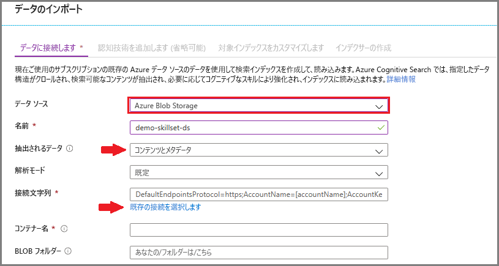
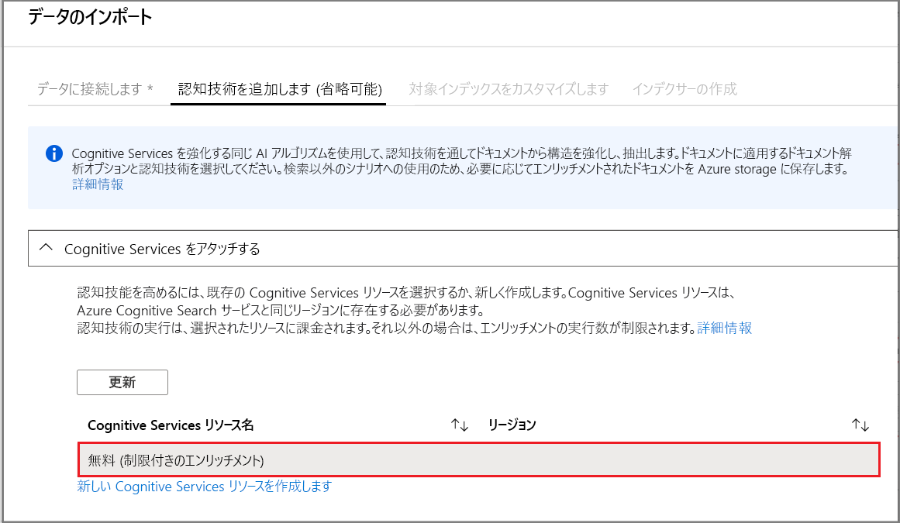
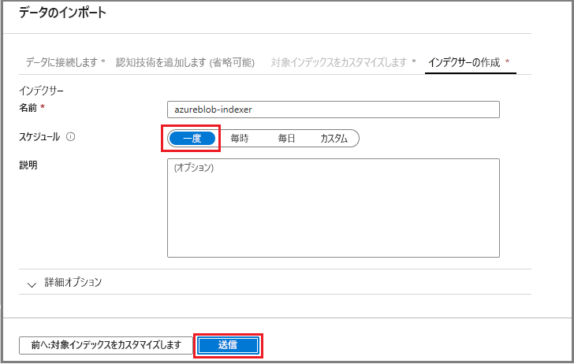
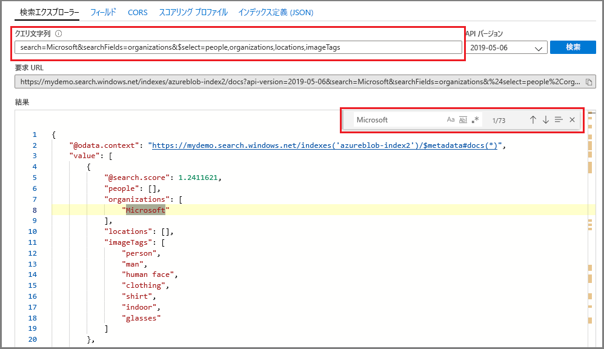

# クイック スタート:Azure Cognitive Search コグニティブ スキルセットを Azure portal で作成する

スキルセットとは、構造化されていない大量のテキストや画像ファイルから情報や構造を抽出し、Azure Cognitive Search でフルテキスト検索クエリを実行できるよう、インデックスを作成して検索できるようにする AI の機能です。 

このクイックスタートでは、Azure クラウドのサービスとデータを組み合わせてスキルセットを作成します。 すべての準備が整ったら、ポータルの**データ インポート** ウィザードを実行して、それらを 1 つにまとめます。 最終的な成果物は、AI 処理によって作成されたデータを投入した検索可能なインデックスで、ポータル ([Search エクスプローラー](search-explorer.md)) から照会することができます。

Azure サブスクリプションをお持ちでない場合は、開始する前に [無料アカウント](https://azure.microsoft.com/free/?WT.mc_id=A261C142F) を作成してください。

## サービスを作成してデータを読み込む

このクイックスタートでは、Azure Cognitive Search、Azure Blob Storage、[Azure Cognitive Services](https://azure.microsoft.com/services/cognitive-services/) を AI に使用します。 

ワークロードは非常に小さいので、1 日に最大 20 トランザクションの処理を無料で Azure Cognitive Search から呼び出して使うことができる Cognitive Services を内部で利用しています。 提供されるサンプル データを使用する限り、Cognitive Services リソースの作成とアタッチはスキップしてかまいません。

1. さまざまなタイプの小さいファイル セットで構成されている[サンプル データをダウンロード](https://1drv.ms/f/s!As7Oy81M_gVPa-LCb5lC_3hbS-4)します。 .zip ファイルを解凍します

1. [Azure Storage アカウントを作成](https://docs.microsoft.com/azure/storage/common/storage-quickstart-create-account?tabs=azure-portal)するか、ご自分の現在のサブスクリプションから[既存のアカウントを検索](https://ms.portal.azure.com/#blade/HubsExtension/BrowseResourceBlade/resourceType/Microsoft.Storage%2storageAccounts/)してください。 

   リージョンは、Azure Cognitive Search と同じものを選択します。 後で別のチュートリアルのナレッジ ストア機能を試してみたい場合は、アカウントの種類として StorageV2 (General Purpose V2) を選択してください。 それ以外の場合、種類はどれでもかまいません。

1. Blob service ページを開き、コンテナーを作成します。 既定のパブリック アクセス レベルを使用できます。 

1. コンテナーの **[アップロード]** をクリックして、最初の手順でダウンロードしたサンプル ファイルをアップロードします。 ネイティブ形式ではフルテキスト検索ができない画像やアプリケーション ファイルなど、さまざまな種類のコンテンツがあることがわかります。

   

1. [Azure Cognitive Search サービスを作成](search-create-service-portal.md)するか、同じサブスクリプションで[既存のサービスを見つけます](https://ms.portal.azure.com/#blade/HubsExtension/BrowseResourceBlade/resourceType/Microsoft.Search%2FsearchServices)。 このクイック スタート用には、無料のサービスを使用できます。

<!-- 1. You are almost done with this resource, but before you leave these pages, use a link on the left navigation pane to open the **Access Keys** page. In many tutorials, especially those that use the REST API, you will need a connection string to retrieve data from Blob storage. A connection string looks similar to the following example: `DefaultEndpointsProtocol=https;AccountName=<YOUR-ACCOUNT-NAME>;AccountKey=<YOUR-ACCOUNT-KEY>;EndpointSuffix=core.windows.net` -->

これでデータ インポート ウィザードに進む準備が整いました。

## データ インポート ウィザードを実行する

Search サービスの概要ページにあるコマンド バーの **[データのインポート]** をクリックし、4 つの手順でコグニティブ エンリッチメントを設定します。

  ![[データのインポート] コマンド](media/cognitive-search-quickstart-blob/import-data-cmd2.png)

### 手順 1:データ ソースを作成する

1. **[データへの接続]** で、 **[Azure Blob Storage]** を選択し、作成したストレージ アカウントとコンテナーを選択します。 データ ソースの名前を指定し、残りの部分には既定値を使用します。 

   

1. 次のページに進みます。

### 手順 2:コグニティブ スキルを追加する

次に、自然言語処理を呼び出すコグニティブ スキルを追加します。 サンプル データは 12 個のファイルで構成されているため、このクイックスタートでは、Cognitive Services の無料枠である 20 トランザクションで十分間に合います。 OCR は使用しないので、この処理でカウント、解析、使用されるのは画像以外のファイルだけです。

1. このクイックスタートでは、**無料**の Cognitive Services リソースを使用します。

   

1. **[Add skills]\(スキルの追加\)** を展開し、自然言語処理を実行するスキルを選択します。 このクイックスタートでは、人、組織、および場所のエンティティの認識を選択します。

   

1. 既定のソース フィールド (`content`) をそのまま使用します。 これは小さいターゲットのように見えることもありますが、Azure BLOB の場合は `content` フィールドにほとんどの BLOB ドキュメント (たとえば、Word 文書または PowerPoint デッキ) が含まれているため、候補として適切です。

1. 次のページに進みます。

> [!NOTE]
> 自然言語処理スキルは、サンプルのデータ セット内のテキスト コンテンツで動作します。 OCR オプションは選択していないので、サンプルのデータ セット内にある JPEG および PNG ファイルはこのクイック スタートでは処理されません。 

### 手順 3:インデックスの構成

Azure Cognitive Search では、検索可能なコンテンツがインデックスに格納され、**データ インポート** ウィザードでは通常、データ ソースをサンプリングすることによってスキーマを自動的に作成することができます。 この手順では、生成されたスキーマを確認し、必要であれば設定に変更を加えます。 以下は、デモの BLOB データ セット用に作成された既定のスキーマです。

このクイックスタートでは、ウィザードによって妥当な既定値が適切に設定されます。 

+ 既定の名前は、データ ソースの種類に基づいて *azureblob-index* となります。 

+ 既定のフィールドは、元のソース データ フィールド (`content`) に加え、コグニティブ スキルによって作成された出力フィールド (`people`、`organizations`、`locations`) に基づきます。 既定のデータ型は、メタデータとデータのサンプリングから推定されます。

+ 既定のドキュメント キーは *metadata_storage_path* です (このフィールドが選択されるのは一意の値が含まれるため)。

+ これらのフィールドの既定の属性は **Retrievable** と **Searchable** です。 **[検索可能]** は、フィールドが検索可能であることを示します。 **[取得可能]** は、結果で返すことができることを意味します。 これらのフィールドはスキルセットを介して作成されていることから、取得可能かつ検索可能にするのがユーザーの意図であると見なされます。

  

`content` フィールドの近くにある **[取得可能]** 属性の取り消し線と疑問符に注目してください。 テキスト量の多い BLOB ドキュメントでは、`content` フィールドにファイルの大部分が格納され、それは数千行にも及ぶ可能性があります。 ファイルの内容をクライアント コードに渡す必要がある場合は必ず、 **[取得可能]** をオンにしておいてください。 それ以外の場合、抽出された要素 (`people`、`organizations`、`locations`) さえあれば目的上問題がなければ、この `content` の属性はオフにすることを検討してください。

フィールドを **[取得可能]** としてマークしたからといって、このフィールドが検索結果に "*必ず*" 存在するという意味ではありません。 検索結果の構成は、対象となるフィールドを **$select** クエリ パラメーターを使用して指定することにより、厳密に制御することができます。 テキスト量の多いフィールド (`content` など) には、 **$select** パラメーターが役立ちます。アプリケーションのユーザーには扱いやすい検索結果を提供しつつ、クライアント コードからは必要なすべての情報にアクセスできる状態を **[取得可能]** 属性で確保できます。
  
次のページに進みます。

### 手順 4:インデクサーを構成する

インデクサーは、インデックス作成プロセスを開始する高度なリソースです。 これは、データ ソース名、ターゲット インデックス、および実行の頻度を指定します。 **データ インポート** ウィザードでは、いくつかのオブジェクトが作成されます。その中には、繰り返し実行できるインデクサーが常に含まれます。

1. **[インデクサー]** ページで、既定の名前を受け入れ、**一度だけ**実行するスケジュール オプションをクリックすれば、即時にこれを実行できます。 

   

1. **[送信]** をクリックして、インデクサーを作成し、同時に実行します。

## 状態を監視する

コグニティブ スキルのインデックス作成は、一般的なテキストベースのインデックス作成よりも完了までに時間がかかります。 進行状況を監視するには、概要ページに移動して、ページの中央にある **[インデクサー]** をクリックします。

データ ソースには JPG および PNG 画像ファイルが含まれていますが、このパイプラインからは OCR スキルを省略したので、警告が発生します。 切り捨ての通知が表示されることもあります。 Free レベルでは、抽出が 32,000 文字に制限されます。

  

インデックス作成とエンリッチメントには時間がかかることがあるため、初期の探索には小さいデータ セットが推奨されます。 

Azure portal の [通知] アクティビティ ログで、クリック可能な **[Azure Cognitive Search notification]\(Azure Cognitive Search による通知\)** 状態リンクを監視することもできます。 実行が完了するまでに数分かかる場合があります。

## Search エクスプローラーでクエリを実行する

インデックスを作成した後は、クエリを送信して、インデックスからドキュメントを返すことができます。 Portal で、**Search エクスプローラー**を使用してクエリを実行し、結果を表示します。 

1. Search サービスのダッシュボード ページで、コマンド バーの **[Search エクスプローラー]** をクリックします。

1. 一番上にある **[インデックスの変更]** を選択して、作成したインデックスを選択します。

1. インデックスのクエリを実行する検索文字列 (`search=Microsoft&searchFields=Organizations` など) を入力します。

結果は JSON で返されます。これは、Azure BLOB から送信された大きいドキュメントでは特に、詳細で読み取りにくい場合があります。 簡単に結果に目を通すことができない場合は、CTRL + F キーを使用してドキュメント内で検索します。 このクエリでは、特定の用語を JSON 内で検索できます。 

CTRL + F キーでは、特定の結果セット内のドキュメントの数を確認することもできます。 Azure BLOB の場合は、各値がドキュメントごとに一意であるため、Portal でキーとして "metadata_storage_path" が選択されます。 ドキュメントの数を取得するには、CTRL + F キーを使用して "metadata_storage_path" を検索します。 

  

## 重要なポイント

初めてのスキルセットの作成を通じて、独自のデータを使って、エンリッチメントされた検索ソリューションのプロトタイプを作成するために役立つ重要な概念を見てきました。

習得していただきたい主な概念には、Azure データ ソースの依存関係が含まれます。 スキルセットはインデクサーにバインドされ、インデクサーは Azure とソースに固有です。 このクイックスタートでは Azure Blob Storage を使用していますが、他の Azure データ ソースも使用可能です。 詳細については、[Azure Cognitive Search のインデクサー](search-indexer-overview.md)に関するページを参照してください。

もう 1 つの重要な概念は、スキルが入力フィールドで動作することです。 Portal では、すべてのスキル用に 1 つのソース フィールドを選択する必要があります。 コードでは、入力は、その他のフィールドであることも、アップストリーム スキルの出力であることもあります。

出力は、検索インデックスに送られます。また、インデックス作成時に作成される名前と値の組と、インデックス内の個々のフィールドとの間にはマッピングが存在します。 内部的には、Portal が[注釈](cognitive-search-concept-annotations-syntax.md)を設定し、[スキルセット](cognitive-search-defining-skillset.md)を定義して、操作と一般的なフローの順序を確立します。 これらの手順は Portal には表示されませんが、コードの記述を開始するときは、これらの概念が重要になります。

最後に、インデックスに対してクエリを実行することで内容を確認できることを学習しました。 最終的に、Azure Cognitive Search が提供するものは、[単純](https://docs.microsoft.com/rest/api/searchservice/simple-query-syntax-in-azure-search)または[完全に拡張されたクエリ構文](https://docs.microsoft.com/rest/api/searchservice/lucene-query-syntax-in-azure-search)のいずれかを使用してクエリを実行できる、検索可能なインデックスです。 エンリッチされたフィールドを含むインデックスは、他のフィールドと同様です。 標準または[カスタム アナライザー](search-analyzers.md)、[スコアリング プロファイル](https://docs.microsoft.com/rest/api/searchservice/add-scoring-profiles-to-a-search-index)、[シノニム](search-synonyms.md)、[ファセット フィルター](search-filters-facets.md)、地理空間検索、またはその他の Azure Cognitive Search 機能を組み込みたい場合は、確実に実行できます。

## クリーンアップ

独自のサブスクリプションを使用している場合は、プロジェクトの最後に、作成したリソースがまだ必要かどうかを確認してください。 リソースを実行したままにすると、お金がかかる場合があります。 リソースは個別に削除することも、リソース グループを削除してリソースのセット全体を削除することもできます。

ポータルの左側のナビゲーション ウィンドウにある **[すべてのリソース]** または **[リソース グループ]** リンクを使って、リソースを検索および管理できます。

無料サービスを使っている場合は、3 つのインデックス、インデクサー、およびデータソースに制限されることに注意してください。 ポータルで個別の項目を削除して、制限を超えないようにすることができます。 

## 次の手順

スキルセットは、ポータル、.NET SDK、または REST API を使用して作成できます。 さらに知識を深めたければ、Postman と他のサンプル データを使って REST API を試してみてください。

> [!div class="nextstepaction"]
> [チュートリアル:AI エンリッチメントを使用して "非構造化コンテンツ" に構造を追加する](cognitive-search-tutorial-blob.md)

> [!Tip]
> ここに示した手順をもう一度やってみたい場合や、別の AI エンリッチメントに関するチュートリアルに挑戦してみたい場合には、ポータルからインデクサーを削除してください。 インデクサーを削除すると、Cognitive Services の処理に関する 1 日あたりの無料トランザクションのカウンターがリセットされ、ゼロに戻ります。