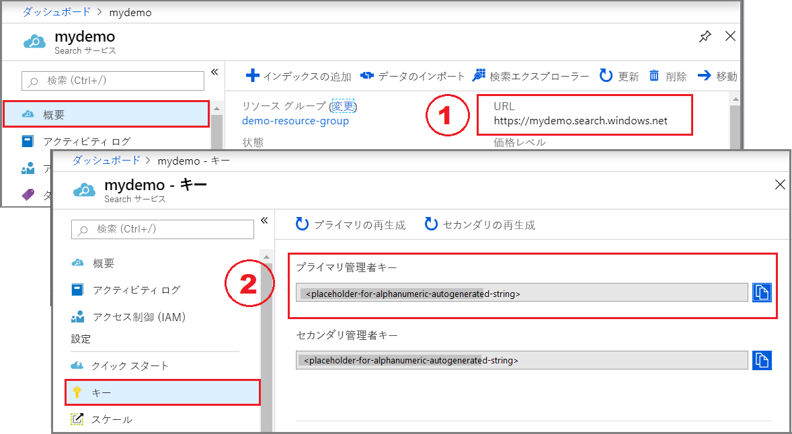

# チュートリアル:スキルセットに対する診断、修復、および変更のコミットを行う

この記事では、Azure portal を使用してデバッグ セッションにアクセスし、指定されたスキルセットの問題を修復します。 このスキルセットには、対処する必要があるいくつかのエラーがあります。 このチュートリアルでは、デバッグ セッションを通じて、スキルの入力と出力に関する問題を特定し、解決します。

> [!Important]
> Azure Cognitive Search のデバッグ セッションのサポートは、アクセスを制限されたプレビューとして、[要求に応じて](https://aka.ms/DebugSessions)利用できます。 このプレビュー機能は、サービス レベル アグリーメントなしで提供されています。したがってプロダクション ワークロードへの使用は推奨しません。 詳しくは、[Microsoft Azure プレビューの追加使用条件](https://azure.microsoft.com/support/legal/preview-supplemental-terms/)に関するページをご覧ください。
>
> プレビューへのアクセスが許可されると、Azure portal を使用して、サービスのデバッグ セッションにアクセスして利用できるようになります。
>   

Azure サブスクリプションをお持ちでない場合は、開始する前に [無料アカウント](https://azure.microsoft.com/free/?WT.mc_id=A261C142F) を作成してください。

## 前提条件

> [!div class="checklist"]
> * Azure サブスクリプション。 [無料アカウント](https://azure.microsoft.com/free/?WT.mc_id=A261C142F)を作成するか、現在のサブスクリプションを使用してください
> * Azure Cognitive Search サービス インスタンス
> * Azure ストレージ アカウント
> * [Postman デスクトップ アプリ](https://www.getpostman.com/)

## サービスを作成してデータを読み込む

このチュートリアルでは、Azure Cognitive Search サービスと Azure Storage サービスを使用します。

* 19 個のファイルから成る[サンプル データをダウンロード](https://github.com/Azure-Samples/azure-search-sample-data/tree/master/clinical-trials-pdf-19)してください。

* [Azure Storage アカウントを作成](https://docs.microsoft.com/azure/storage/common/storage-quickstart-create-account?tabs=azure-portal)するか、[既存のアカウントを検索](https://ms.portal.azure.com/#blade/HubsExtension/BrowseResourceBlade/resourceType/Microsoft.Storage%2storageAccounts/)してください。 

   帯域幅の料金を避けるため、リージョンは、Azure Cognitive Search と同じものを選択してください。
   
   [StorageV2 (汎用 v2)] のアカウントの種類を選択します。

* ストレージ サービス ページを開き、コンテナーを作成してください。 アクセス レベルとして "プライベート" を指定することをお勧めします。 コンテナーの名前は `clinicaltrialdataset` にします。

* コンテナーの **[アップロード]** をクリックして、最初の手順でダウンロードして解凍したサンプル ファイルをアップロードします。

* [Azure Cognitive Search サービスを作成](search-create-service-portal.md)するか、[既存のサービスを見つけます](https://ms.portal.azure.com/#blade/HubsExtension/BrowseResourceBlade/resourceType/Microsoft.Search%2FsearchServices)。 このクイック スタート用には、無料のサービスを使用できます。

## キーと URL を入手する

REST 呼び出しには、要求ごとにサービス URL とアクセス キーが必要です。 両方を使用して検索サービスが作成されるので、Azure Cognitive Search をサブスクリプションに追加した場合は、次の手順に従って必要な情報を入手してください。

1. [Azure portal にサインイン](https://portal.azure.com/)し、ご使用の検索サービスの **[概要]** ページで、URL を入手します。 たとえば、エンドポイントは `https://mydemo.search.windows.net` のようになります。

1. **[設定]**  >  **[キー]** で、サービスに対する完全な権限の管理キーを取得します。 管理キーをロールオーバーする必要がある場合に備えて、2 つの交換可能な管理キーがビジネス継続性のために提供されています。 オブジェクトの追加、変更、および削除の要求には、主キーまたはセカンダリ キーのどちらかを使用できます。

すべての要求では、サービスに送信されるすべての要求に API キーが必要です。 有効なキーがあれば、要求を送信するアプリケーションとそれを処理するサービスの間で、要求ごとに信頼を確立できます。

## データ ソース、スキルセット、インデックス、およびインデクサーを作成する

このセクションでは、Postman と指定されたコレクションを使用して、検索サービスのデータ ソース、スキルセット、インデックス、およびインデクサーを作成します。

1. Postman がない場合は、[こちらから Postman デスクトップ アプリをダウンロード](https://www.getpostman.com/)できます。
1. [Debug Sessions Postman コレクションをダウンロード](https://github.com/Azure-Samples/azure-search-postman-samples/tree/master/Debug-sessions)します
1. Postman を起動します
1. **[ファイル]**  >  **[新規作成]** で、インポートするコレクションを選択します。
1. コレクションがインポートされたら、アクションの一覧 ([...]) を展開します。
1. **[編集]** をクリックします。
1. searchService の名前を入力します (たとえば、エンドポイントが https://mydemo.search.windows.net の場合、サービス名は "mydemo" です)。
1. apiKey と、検索サービスのプライマリ キーまたはセカンダリ キーを入力します。
1. Azure Storage アカウントのキー ページにある storageConnectionString を入力します。
1. ストレージ アカウントに作成したコンテナーの containerName を入力します。

> [!div class="mx-imgBorder"]
> 

コレクションには、このセクションを完了するために使用される 4 種類の REST 呼び出しが含まれています。

最初の呼び出しでは、データ ソースが作成されます。 `clinical-trials-ds` 2 つ目の呼び出しでは、スキルセット `clinical-trials-ss` が作成されます。 3 つ目の呼び出しでは、インデックスの `clinical-trials` が作成されます。 最後の 4 つ目の呼び出しでは、インデクサーの `clinical-trials-idxr` が作成されます。 コレクション内のすべての呼び出しが完了したら、Postman を閉じて Azure portal に戻ります。

> [!div class="mx-imgBorder"]
> 

## 結果を確認する

このスキルセットには、いくつかの一般的なエラーが含まれています。 このセクションでは、すべてのドキュメントが返されるように空のクエリを実行することで、複数のエラーが表示されます。 その後の手順で、デバッグ セッションを使用して問題を解決します。

1. Azure portal で、検索サービスに移動します。 
1. **[インデックス]** タブを選択します。 
1. `clinical-trials` インデックスを選択します
1. **[検索]** をクリックして、空のクエリを実行します。 

検索が終了した後、データを持たない 2 つのフィールド、"organizations" と "locations" がウィンドウの一覧に表示されます。 手順に従って、スキルセットによって生成されたすべての問題を検出します。

1. 検索サービスの [概要] ページに戻ります。
1. **[インデクサー]** タブを選択します。 
1. `clinical-trials-idxr` をクリックし、警告通知を選択します。 

プロジェクション出力フィールド マッピングには多くの問題があり、3 ページ目には複数の警告が表示されています。これは、1 つ以上のスキルの入力が無効であるためです。

検索サービスの [概要] 画面に戻ります。

## デバッグ セッションを開始する

> [!div class="mx-imgBorder"]
> 

1. [Debug sessions (preview)]\(デバッグ セッション (プレビュー)\) タブをクリックします。
1. [+NewDebugSession] を選択します
1. セッションに名前を指定します。 
1. セッションをストレージ アカウントに接続します。 
1. インデクサー名を指定します。 インデクサーには、データ ソース、スキルセット、およびインデックスへの参照があります。
1. コレクション内の最初のドキュメントとして、既定のドキュメント選択を受け入れます。 
1. セッションを**保存**します。 セッションを保存すると、スキルセットでの定義に従って AI エンリッチメント パイプラインが開始されます。

> [!Important]
> デバッグ セッションは、1 つのドキュメントでのみ機能します。 データ セット内の特定のドキュメントを選択できます。また、セッションでは既定で最初のドキュメントが対象になります。

> [!div class="mx-imgBorder"]
> 

デバッグ セッションの実行が完了すると、セッションでは既定で [AI Enrichments]\(AI エンリッチメント\) タブが表示され、スキル グラフが強調表示されます。

+ スキル グラフには、スキルセットの視覚的な階層と、上から下への実行順序が示されます。 グラフで左右に並んでいるスキルは、並列で実行されます。 グラフ内のスキルの色分けは、スキルセットで実行されているスキルの種類を示します。 この例では、緑色のスキルはテキストであり、赤のスキルはビジョンです。 グラフ内の個々のスキルをクリックすると、そのスキルのインスタンスの詳細が、セッション ウィンドウの右側のペインに表示されます。 スキルの設定、JSON エディター、実行の詳細、エラーと警告は、いずれも確認および編集できます。
+ エンリッチ処理されたデータ構造には、スキルによってソース ドキュメントのコンテンツから生成されるエンリッチメント ツリー内のノードの詳細が示されます。

[エラー/警告] タブには、前に表示された一覧よりもはるかに細かい一覧が表示されます。この一覧には、1 つのドキュメントのエラーの詳細のみが表示されるためです。 インデクサーによって表示される一覧と同様に、警告メッセージをクリックして、その警告の詳細を確認できます。

## 不足しているスキル入力値を修正する

[エラー/警告] タブには、`Enrichment.NerSkillV2.#1` というラベルが付いている操作に関するエラーが表示されます。 このエラーの詳細では、スキル入力値 "/document/languageCode" に問題があることが示されています。 

1. [AI Enrichments]\(AI エンリッチメント\) タブに戻ります。
1. **スキル グラフ**をクリックします。
1. #1 というラベルのスキルをクリックすると、その詳細が右側のペインに表示されます。
1. "languageCode" の入力を見つけます。
1. 行の先頭にある **</>** 記号を選択し、式エバリュエーターを開きます。
1. **[評価]** ボタンをクリックして、この式の結果がエラーになることを確認します。 "languageCode" プロパティが有効な入力ではないことが確認されます。

> [!div class="mx-imgBorder"]
> 

セッションでこのエラーを調査するには、2 つの方法があります。 1 つ目は、入力がどこから来ているかを調べることです。この結果を生成すると考えられるのは、階層内のどのスキルでしょうか。 スキルの詳細ペインの [実行] タブに、入力のソースが表示されるはずです。 ソースが存在しない場合は、フィールド マッピング エラーであることを意味します。

1. **[実行]** タブをクリックします。
1. [INPUTS]\(入力\) で "languageCode" を見つけます。 この入力のソースが一覧に表示されていません。 
1. 左ペインを切り替えて、エンリッチ処理されたデータ構造を表示します。 "languageCode" に対応する、マッピングされたパスがありません。

> [!div class="mx-imgBorder"]
> 

"language" にはマッピングされたパスがあります。 つまり、スキルの設定に入力ミスがあります。 これを解決するには、式 "/document/language" がある #1 スキルの式を更新する必要があります。

1. パス "language" の **</>** で式エバリュエーターを開きます。
1. 式をコピーします。 ウィンドウを閉じます。
1. #1 スキルのスキル設定に移動し、入力 "languageCode" の **</>** で式エバリュエーターを開きます。
1. 新しい値 "/document/language" を [式] ボックスに貼り付けて、 **[評価]** をクリックします。
1. 正しい入力 "en" が表示されるはずです。 [適用] をクリックして、式を更新します。
1. 右側のスキルの詳細ペインで **[保存]** をクリックします。
1. セッションのウィンドウ メニューで **[実行]** をクリックします。 これにより、ドキュメントを使用してスキルセットの別の実行が開始されます。 

デバッグ セッションの実行が完了してから、[エラー/警告] タブをクリックすると、"Enrichment.NerSkillV2.#1" というラベルのエラーが表示されなくなります。 ただし、サービスが組織および場所の出力フィールドを検索インデックスにマップできなかったという警告が、まだ 2 つあります。 "/document/merged_content/organizations" と "/document/merged_content/locations" という値が不足しています。

## 不足しているスキル出力値を修正する

> [!div class="mx-imgBorder"]
> 

スキルからの出力値が不足しています。 エラーが発生したスキルを特定するには、エンリッチ処理されたデータ構造に移動し、値の名前を検索して、[Originating Source]\(元のソース\) を確認します。 組織と場所の値が不足している場合、それらはスキル #1 からの出力です。 各パスの </> で式エバリュエーターを開くと、"/document/content/organizations" および "/document/content/locations" として一覧表示されているそれぞれの式が表示されます。

> [!div class="mx-imgBorder"]
> 

これらのエンティティの出力は空ですが、空にするべきではありません。 この結果を生成する入力は何でしょうか。

1. **スキル グラフ**に移動して、スキル #1 を選択します。
1. 右側のスキルの詳細ペインで **[実行]** タブを選択します。
1. 入力 "text" の **</>** で式エバリュエーターを開きます。

> [!div class="mx-imgBorder"]
> 

この入力に表示される結果は、テキスト入力のようには見えません。 改行で囲まれた画像のように見えます。 テキストがないことは、エンティティを識別できないことを意味します。 スキルセットの階層を見ると、コンテンツは最初に #6 (OCR) スキルによって処理され、次に #5 (マージ) スキルに渡されると表示されています。 

1. **スキル グラフ**で #5 (マージ) スキルを選択します。
1. 右側のスキルの詳細ペインで **[実行]** タブを選択し、出力 "mergedText" の **</>** で式エバリュエーターを開きます。

> [!div class="mx-imgBorder"]
> 

ここで、テキストは画像とペアになっています。 式 "/document/merged_content" を見ると、#1 スキルの "organizations" および "locations" パスのエラーが表示されています。 "text" 入力には、"/document/content" ではなく、"/document/merged_content" を使用する必要があります。

1. "mergedText" 出力の式をコピーし、式エバリュエーター ウィンドウを閉じます。
1. **スキル グラフ**でスキル #1 を選択します。
1. 右側のスキルの詳細ペインで **[Skill Settings]\(スキルの設定\)** タブを選択します。
1. "text" 入力の **</>** で式エバリュエーターを開きます。
1. 新しい式をボックスに貼り付けます。 **[評価]** をクリックします。
1. 追加したテキストを含む正しい入力が表示されるはずです。 **[適用]** をクリックして、スキルの設定を更新します。
1. 右側のスキルの詳細ペインで **[保存]** をクリックします。
1. セッションのウィンドウ メニューで **[実行]** をクリックします。 これにより、ドキュメントを使用してスキルセットの別の実行が開始されます。

インデクサーの実行の完了後、エラーは引き続き発生します。 スキル #1 に戻り、調査します。 スキルへの入力は、"content" から "merged_content" に修正しました。 スキルにおけるこれらのエンティティの出力は何でしょうか。

1. **[AI Enrichments]\(AI エンリッチメント\)** タブを選択します。
1. **スキル グラフ**を選択して、スキル #1 をクリックします。
1. **スキルの設定**内を移動して、"outputs" を探します。
1. "organizations" エンティティの **</>** で式エバリュエーターを開きます。

> [!div class="mx-imgBorder"]
> 

式の結果を評価すると、正しい結果が得られます。 このスキルは、"organizations" というエンティティの正しい値を識別するために機能しています。 ただし、エンティティのパス内の出力マッピングでは、引き続きエラーがスローされます。 スキルの出力パスとエラーの出力パスを比較すると、/document/content ノードの下の出力、組織、および場所の親となっているスキルがあります。 一方、出力フィールド マッピングでは、結果が /document/merged_content ノードの下で子になることが想定されています。 前の手順では、入力を "/document/content" から "/document/merged_content" に変更しました。 出力が正しいコンテキストで生成されるようにするには、スキル設定のコンテキストを変更する必要があります。

1. **[AI Enrichments]\(AI エンリッチメント\)** タブを選択します。
1. **スキル グラフ**を選択して、スキル #1 をクリックします。
1. **スキルの設定**内を移動して、"context" を探します。
1. "context" の設定をダブルクリックして、"/document/merged_content" となるように編集します。
1. 右側のスキルの詳細ペインで **[保存]** をクリックします。
1. セッションのウィンドウ メニューで **[実行]** をクリックします。 これにより、ドキュメントを使用してスキルセットの別の実行が開始されます。

> [!div class="mx-imgBorder"]
> 

すべてのエラーが解決されました。

## スキルセットに変更をコミットする

デバッグ セッションが開始されたとき、検索サービスによってスキルセットのコピーが作成されました。 これは、行われた変更が運用システムに影響しないようにするためです。 スキルセットのデバッグが完了したので、修正を運用システムにコミット (元のスキルセットを上書き) できるようになりました。 運用システムに影響を与えることなく、スキルセットを引き続き変更する場合は、デバッグ セッションを保存して、後で再度開くことができます。

1. メイン デバッグ セッション メニューの **[Commit changes]\(変更のコミット\)** をクリックします。
1. **[OK]** をクリックして、スキルセットの更新に同意します。
1. デバッグ セッションを閉じ、 **[インデクサー]** タブを選択します。
1. "clinical-trials-idxr" を開きます。
1. **[リセット]** をクリックします。
1. **[実行]** をクリックします。 **[OK]** をクリックして確定します。

インデクサーの実行が完了すると、[実行履歴] タブに緑色のチェックマークが表示され、最新の実行のタイム スタンプの横に "成功" という単語が表示されるはずです。変更が適用されたことを確認するには、次のようにします。

1. **インデクサー**を終了し、 **[インデックス]** タブを選択します。
1. "clinical-trials" インデックスを開き、[検索エクスプローラー] タブで **[検索]** をクリックします。
1. 結果ウィンドウで、組織と場所のエンティティに予期した値が設定されるようになったことが示されるはずです。

## リソースをクリーンアップする

独自のサブスクリプションを使用している場合は、プロジェクトの最後に、作成したリソースがまだ必要かどうかを確認してください。 リソースを実行したままにすると、お金がかかる場合があります。 リソースは個別に削除することも、リソース グループを削除してリソースのセット全体を削除することもできます。

ポータルの左側のナビゲーション ウィンドウにある **[すべてのリソース]** または **[リソース グループ]** リンクを使って、リソースを検索および管理できます。

無料サービスを使っている場合は、3 つのインデックス、インデクサー、およびデータソースに制限されることに注意してください。 ポータルで個別の項目を削除して、制限を超えないようにすることができます。 

## 次のステップ

> [!div class="nextstepaction"]
> [スキルセットの詳細を学習する](https://docs.microsoft.com/azure/search/cognitive-search-working-with-skillsets)
> [インクリメンタル エンリッチメントとキャッシュの詳細を学習する](https://docs.microsoft.com/azure/search/cognitive-search-incremental-indexing-conceptual)