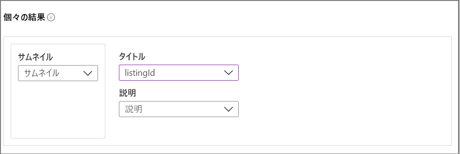
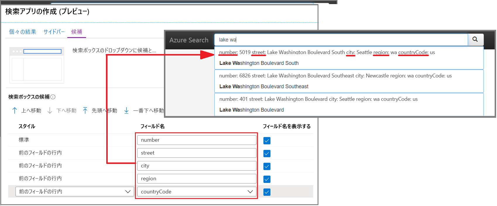
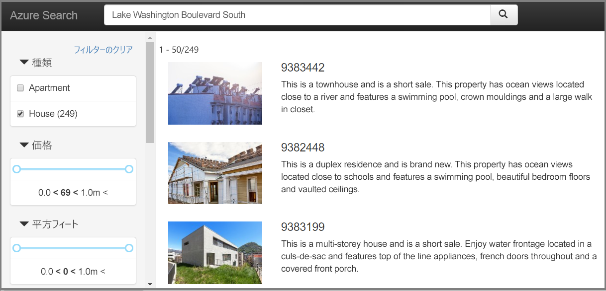

# クイック スタート:ポータルでデモ アプリを作成する (Azure Cognitive Search)

ブラウザーで動作する "localhost" スタイルのダウンロード可能な Web アプリを生成するには、Azure portal の**デモ アプリの作成**ウィザードを使用します。 その構成にもよりますが、生成されたアプリは、リモート インデックスへのライブ読み取り専用接続を備えており、そのままで実用性があります。 既定のアプリは、検索バーや結果領域、サイド バーのフィルターを備えているほか、先行入力をサポートします。

デモ アプリは、インデックスがクライアント アプリでどのように機能するかを視覚化するのに役立ちますが、運用環境のシナリオ向けではありません。 クライアント アプリには、生成された HTML ページでは提供されないセキュリティ、エラー処理、およびホスティング ロジックを含める必要があります。 クライアント アプリを作成する準備ができたら、次の手順について、「[.NET SDK を使用して最初の検索アプリを作成する](tutorial-csharp-create-first-app.md)」を参照してください。

## 前提条件

開始する前に、次の項目を用意する必要があります。

+ アクティブなサブスクリプションが含まれる Azure アカウント。 [無料でアカウントを作成できます](https://azure.microsoft.com/free/)。

+ Azure Cognitive Search サービス。 [サービスを作成](search-create-service-portal.md)するか、現在のサブスクリプションから[既存のサービスを検索](https://ms.portal.azure.com/#blade/HubsExtension/BrowseResourceBlade/resourceType/Microsoft.Search%2FsearchServices)します。 このクイック スタート用には、無料のサービスを使用できます。 

+ [Microsoft Edge (最新バージョン)](https://www.microsoft.com/edge) または Google Chrome。

+ 生成されるアプリケーションの基礎として使用する[検索インデックス](search-create-index-portal.md)。 

  このクイックスタートでは、縮小版画像を含んだ組み込みの不動産サンプル データとインデックスを使用します (このウィザードでは、結果ページへの画像の追加がサポートされます)。 この演習で使用するインデックスを作成するには、**データのインポート** ウィザードを実行します。その際、データ ソースとして *realestate-us-sample* を選択してください。

  

インデックスを使用する準備が整ったら、次の手順に進みます。

## ウィザードを起動する

1. Azure アカウントで [Azure Portal](https://portal.azure.com/) にサインインします。

1. [自分の検索サービスを探し](https://ms.portal.azure.com/#blade/HubsExtension/BrowseResourceBlade/resourceType/Microsoft.Storage%2storageAccounts/)、概要ページの中央のリンクから **[インデックス]** を選択します。 

1. 既存のインデックスの一覧から *[realestate-us-sample-index]* を選択します。

1. インデックス ページの上部にある、 **[Create demo app (preview)]\(デモ アプリの作成 (プレビュー)\)** を選択してウィザードを開始します。

1. 最初のウィザード ページで **[Enable Cross Origin Resource Sharing (CORS)]\(クロス オリジン リソース共有 (CORS) を有効にする\)** を選択して、CORS のサポートをインデックスの定義に追加します。 この手順は省略できますが、省略した場合は、ローカル Web アプリがリモート インデックスに接続できなくなります。

## 検索結果を構成する

このウィザードには、縮小版画像やタイトル、説明のための領域など、検索結果のレンダリングに使用される基本的なレイアウトが用意されています。 そうした各要素の基礎となるのは、インデックス内のデータを提供するフィールドです。 

1. [縮小版] で、*realestate-us-sample* インデックスの *thumbnail* フィールドを選択します。 このサンプルにはたまたま、画像の縮小版が含まれています。画像は URL アドレスの形式で、*thumbnail* というフィールドに格納されています。 インデックスに画像が含まれていない場合は、このフィールドは空のままにしてください。

1. [タイトル] には、各ドキュメントを一意に識別するフィールドを選択します。 このサンプルでは、listingId を選択しています。

1. [説明] では、クリックしてその特定のドキュメントにアクセスするかどうかの判断に役立つような詳しい情報が格納されているフィールドを選択します。

   

## サイド バーを追加する

この検索サービスは、ファセット ナビゲーションをサポートしています。ファセット ナビゲーションは、多くの場合、サイド バーとしてレンダリングされます。 ファセットは、インデックスのスキーマで表現された、フィルター可能かつファセット可能なフィールドがベースとなっています。

Azure Cognitive Search のファセット ナビゲーションは、累積的なフィルタリング エクスペリエンスとなっています。 カテゴリ内で複数のフィルターを選択すると、その結果が展開されます (City 内の Seattle と Bellevue を選択するなど)。 異なるカテゴリにまたがって複数のフィルターを選択することで、結果が絞り込まれます。

> [!TIP]
> インデックス スキーマの全容はポータルで確認できます。 各インデックスの概要ページにある **[インデックス定義 (JSON)]** というリンクを探してください。 ファセット ナビゲーションの要件を満たしたフィールドには、"filterable: true" 属性と "facetable: true" 属性があります。

現在選択されているファセットを受け入れて、次のページに進みます。

## 先行入力を追加する

先行入力機能は、オートコンプリートとクエリ候補の形式で提供されます。 このウィザードでサポートされているのはクエリ候補です。 ユーザーによるキーボード操作の入力に基づいて、検索サービスから "補完" されたクエリ文字列のリストが返され、それを入力として選択することができます。

候補は、特定のフィールド定義に対して有効になります。 どの程度の量の情報を候補に含めるかは、ウィザードで選択することができます。 

次のスクリーンショットは、ウィザードのオプションとアプリでレンダリングされるページとを並べて示したものです。 選択フィールドの使い方や、[フィールド名を表示する] を使用して候補内のラベルを追加したり除外したりする方法が確認できます。

## 作成、ダウンロード、実行する

1. **[Create demo app ]\(デモ アプリの作成\)** を選択して、HTML ファイルを生成します。

1. 確認を求められたら、 **[Download your app]\(アプリのダウンロード\)** を選択してファイルをダウンロードします。

1. ファイル を開きます。 以下のスクリーンショットのようなページが表示されます。 結果を絞り込むには、何か語句を入力してからフィルターを使用します。 

基になるインデックスは、複数のドキュメントにまたがって複製された架空の生成データからできていて、説明と画像が一致しない場合があります。 独自のインデックスに基づいてアプリを作成すれば、両者の関連性を高めることができます。

## リソースをクリーンアップする

独自のサブスクリプションを使用している場合は、プロジェクトの最後に、作成したリソースがまだ必要かどうかを確認してください。 リソースを実行したままにすると、お金がかかる場合があります。 リソースは個別に削除することも、リソース グループを削除してリソースのセット全体を削除することもできます。

ポータルの左側のナビゲーション ウィンドウにある **[すべてのリソース]** または **[リソース グループ]** リンクを使って、リソースを検索および管理できます。

無料サービスを使っている場合は、3 つのインデックス、インデクサー、およびデータソースに制限されることに注意してください。 ポータルで個別の項目を削除して、制限を超えないようにすることができます。 

## 次のステップ

既定のアプリは最初の探索や小規模なタスクに役立ちますが、API を早い段階で確認することは、概念とワークフローをより深いレベルで理解するのに役立ちます。

> [!div class="nextstepaction"]
> [.NET SDK を使用してインデックスを作成する](https://docs.microsoft.com/azure/search/search-create-index-dotnet)