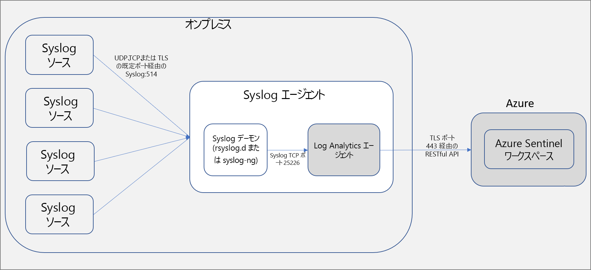

# 共通イベント形式を使用して外部ソリューションを接続する

この記事では、外部セキュリティ ソリューションで Azure Sentinel を接続し、Syslog の上部に Common Event Format (CEF) メッセージを送信する方法について説明します。 

> [!NOTE] 
> データは、Azure Sentinel を実行しているワークスペースの地域に保存されます。

## 動作のしくみ

エージェントを専用の Linux マシン (VM またはオンプレミス) に展開して、アプライアンスと Azure Sentinel の間の通信をサポートする必要があります。 次の図は、Azure での Linux VM の場合の設定を示しています。

 

または、別のクラウド内の VM、またはオンプレミスのマシンを使用する場合にも、この設定が存在します。 

 

## セキュリティに関する考慮事項

組織のセキュリティ ポリシーに従って、コンピューターのセキュリティを構成してください。 たとえば、企業のネットワーク セキュリティ ポリシーに合わせてネットワークを構成し、デーモンのポートとプロトコルを要件に合わせて変更することができます。   [Azure で VM をセキュリティ保護する](../virtual-machines/linux/security-policy.md)方法に関するページと[ネットワーク セキュリティのベスト プラクティス](../security/fundamentals/network-best-practices.md)に関するページの手順を行うと、コンピューターのセキュリティ構成を改善できます。

セキュリティ ソリューションと Syslog コンピューターの間で TLS 通信を使用するには、TLS で通信するように Syslog デーモン (rsyslog または syslog-ng) を構成する必要があります。[TLS -rsyslog で Syslog トラフィックを暗号化する](https://www.rsyslog.com/doc/v8-stable/tutorials/tls_cert_summary.html)方法に関するページと [TLS –syslog-ng でログ メッセージを暗号化する](https://support.oneidentity.com/technical-documents/syslog-ng-open-source-edition/3.22/administration-guide/60#TOPIC-1209298)方法に関するページをご覧ください。

 
## 前提条件
プロキシとして使用する Linux マシンで、次のいずれかのオペレーティング システムが実行されていることを確認します。

- 64 ビット
  - CentOS 6 および 7
  - Amazon Linux 2017.09
  - Oracle Linux 6 および 7
  - Red Hat Enterprise Linux Server 6 および 7
  - Debian GNU/Linux 8 および 9
  - Ubuntu Linux 14.04 LTS、16.04 LTS、および 18.04 LTS
  - SUSE Linux Enterprise Server 12
- 32 ビット
   - CentOS 6
   - Oracle Linux 6
   - Red Hat Enterprise Linux Server 6
   - Debian GNU/Linux 8 および 9
   - Ubuntu Linux 14.04 LTS および 16.04 LTS
 
 - デーモンのバージョン
   - Syslog-ng: 2.1 から 3.22.1
   - Rsyslog: v8
  
 - サポートされている Syslog RFC
   - Syslog RFC 3164
   - Syslog RFC 5424
 
コンピューターが次の要件も満たしていることを確認します。 
- アクセス許可
    - コンピューターに対する管理者特権のアクセス許可 (sudo) が必要です。 
- ソフトウェア要件
    - コンピューターで Python が実行されていることを確認します
## 手順 1: エージェントをデプロイする

この手順では、Azure Sentinel とセキュリティ ソリューションの間のプロキシとして機能する Linux マシンを選択する必要があります。 プロキシ マシンで次のスクリプトを実行する必要があります。
- Log Analytics エージェントをインストールし、必要に応じて、TCP 経由のポート 514 で Syslog メッセージをリッスンし、Azure Sentinel ワークスペースに CEF メッセージを送信するように構成します。
- ポート 25226 を使用して、CEF メッセージを Log Analytics エージェントに転送するように Syslog デーモンを構成します。
- データを収集しそれを Log Analytics に安全に送信するように Syslog エージェントを設定します。ここで、データが解析および改良されます。
 
 
1. Azure Sentinel ポータルで、 **[Data connectors]\(データ コネクタ\)** をクリックし、 **[Common Event Format (CEF)]** を選択して、 **[Open connector page]\(コネクタ ページを開く\)** を選択します。 

1. **[Install and configure the Syslog agent]\(Syslog エージェントのインストールと構成\)** で、マシンの種類として Azure、他のクラウド、またはオンプレミスのいずれかを選択します。 
   > [!NOTE]
   > 次の手順のスクリプトでは Log Analytics エージェントをインストールし、マシンを Azure Sentinel ワークスペースに接続するため、このマシンが他のワークスペースに接続されていないことを確認します。
1. コンピューターに対する管理者特権のアクセス許可 (sudo) が必要です。 次のコマンド `python –version` を使用して、マシンに Python が備わっていることを確認します。

1. プロキシ マシンで次のスクリプトを実行します。
   `sudo wget https://raw.githubusercontent.com/Azure/Azure-Sentinel/master/DataConnectors/CEF/cef_installer.py&&sudo python cef_installer.py [WorkspaceID] [Workspace Primary Key]`
1. スクリプトの実行中に、エラーまたは警告メッセージが表示されないことを確認してください。

## 手順 2: CEF メッセージを送信するように、セキュリティ ソリューションを構成する

1. アプライアンスでこれらの値を設定して、このアプライアンスが Log Analytics エージェントに基づいて、必要な形式で必要なログを Azure Sentinel Syslog エージェントに送信するようにします。 Azure Sentinel エージェントの Syslog デーモンでこれらのパラメーターを変更できれば、ご利用のアプライアンスでもこれらのパラメーターを変更することができます。
    - プロトコル = TCP
    - ポート = 514
    - 形式 = CEF
    - IP アドレス - CEF メッセージを、この目的専用の仮想マシンの IP アドレスに送信していることを確認します。

   > [!NOTE]
   > このソリューションでは、Syslog RFC 3164 または RFC 5424 をサポートしています。

1. Log Analytics で CEF イベントに関連するスキーマを使用するために、`CommonSecurityLog` を検索します。

## 手順 3: 接続の検証

1. Log Analytics を開いて、CommonSecurityLog スキーマを使用してログを受信していることを確認します。  ログが Log Analytics に表示され始めるまで、20 分以上かかる場合があります。 

1. スクリプトを実行する前に、セキュリティ ソリューションからメッセージを送信して、構成した Syslog プロキシ マシンにそれらが転送されていることを確認することをお勧めします。 
1. コンピューターに対する管理者特権のアクセス許可 (sudo) が必要です。 次のコマンド `python –version` を使用して、マシンに Python が備わっていることを確認します。
1. 次のスクリプトを実行して、エージェント、Azure Sentinel、セキュリティ ソリューション間の接続を確認します。 デーモンの転送が正しく構成されていること、正しいポートでリッスンしていること、デーモンと Log Analytics エージェント間の通信がブロックされていないことを確認します。 また、このスクリプトでは、モック メッセージ "TestCommonEventFormat" を送信して、エンドツーエンドの接続も確認されます。  
 `sudo wget https://raw.githubusercontent.com/Azure/Azure-Sentinel/master/DataConnectors/CEF/cef_troubleshoot.py&&sudo python cef_troubleshoot.py [WorkspaceID]`

## 次の手順
このドキュメントでは、CEF アプライアンスを Azure Sentinel に接続する方法について説明しました。 Azure Sentinel の詳細については、以下の記事を参照してください。
- [データと潜在的な脅威を可視化](quickstart-get-visibility.md)する方法についての説明。
- [Azure Sentinel を使用した脅威の検出](tutorial-detect-threats.md)の概要。

