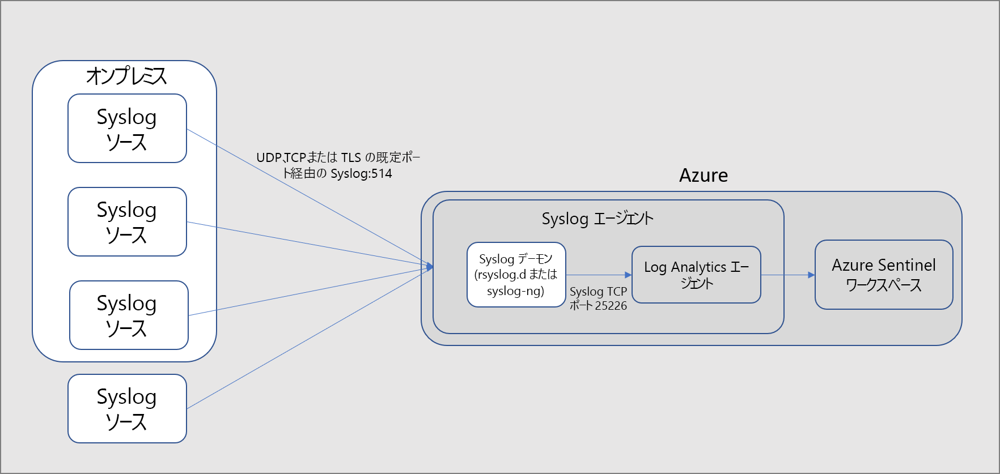

# Zscaler インターネット アクセスを Azure Sentinel に接続する

> [!IMPORTANT]
> Azure Sentinel の Zscaler データ コネクタは、現在パブリック プレビュー段階にあります。
> この機能はサービス レベル アグリーメントなしで提供されています。運用環境のワークロードに使用することはお勧めできません。 特定の機能はサポート対象ではなく、機能が制限されることがあります。 詳しくは、[Microsoft Azure プレビューの追加使用条件](https://azure.microsoft.com/support/legal/preview-supplemental-terms/)に関するページをご覧ください。

この記事では、Zscaler インターネット アクセス アプライアンスを Azure Sentinel に接続する方法について説明します。 Zscaler データ コネクタを使用すると、Azure Sentinel に Zscaler インターネット アクセス (ZIA) のログを簡単に接続でき、ダッシュボードの表示、カスタム アラートの作成、および調査の改善も行うことができます。 Azure Sentinel で Zscaler を使用すると、組織のインターネット使用状況に関するより多くの洞察が得られ、セキュリティ操作機能が強化されます。 

## 動作のしくみ

エージェントを専用の Linux マシン (VM またはオンプレミス) に展開して、Zscaler インターネット アクセスと Azure Sentinel の間の通信をサポートする必要があります。 次の図は、Azure で Linux VM が発生した場合の設定を示しています。

 

あるいは、別のクラウドの VM かオンプレミスのマシンを使用する場合は、以下の設定が存在することになります。 

 

## セキュリティに関する考慮事項

組織のセキュリティ ポリシーに従って、コンピューターのセキュリティを構成してください。 たとえば、企業のネットワーク セキュリティ ポリシーに合わせてネットワークを構成し、デーモンのポートとプロトコルを要件に合わせて変更することができます。   [Azure で VM をセキュリティ保護する](../virtual-machines/linux/security-policy.md)方法に関するページと[ネットワーク セキュリティのベスト プラクティス](../security/fundamentals/network-best-practices.md)に関するページの手順を行うと、コンピューターのセキュリティ構成を改善できます。

セキュリティ ソリューションと Syslog コンピューターの間で TLS 通信を使用するには、TLS で通信するように Syslog デーモン (rsyslog または syslog-ng) を構成する必要があります。[TLS -rsyslog で Syslog トラフィックを暗号化する](https://www.rsyslog.com/doc/v8-stable/tutorials/tls_cert_summary.html)方法に関するページと [TLS –syslog-ng でログ メッセージを暗号化する](https://support.oneidentity.com/technical-documents/syslog-ng-open-source-edition/3.22/administration-guide/60#TOPIC-1209298)方法に関するページをご覧ください。

 
## 前提条件
プロキシとして使用する Linux マシンで、次のいずれかのオペレーティングシステムが実行されていることを確認します。

- 64 ビット
  - CentOS 6 および 7
  - Amazon Linux 2017.09
  - Oracle Linux 6 および 7
  - Red Hat Enterprise Linux Server 6 および 7
  - Debian GNU/Linux 8 および 9
  - Ubuntu Linux 14.04 LTS、16.04 LTS、および 18.04 LTS
  - SUSE Linux Enterprise Server 12
- 32 ビット
   - CentOS 6
   - Oracle Linux 6
   - Red Hat Enterprise Linux Server 6
   - Debian GNU/Linux 8 および 9
   - Ubuntu Linux 14.04 LTS および 16.04 LTS
 
 - デーモンのバージョン
   - Syslog-ng:2.1 - 3.22.1
   - Rsyslog: v8
  
 - サポートされている Syslog RFC
   - Syslog RFC 3164
   - Syslog RFC 5424
 
マシンが次の要件も満たしていることを確認します。 
- アクセス許可
    - マシンに対する管理者特権のアクセス許可 (sudo) が必要です。 
- ソフトウェア要件
    - マシンで Python が実行されていることを確認します
## 手順 1: エージェントをデプロイする

このステップでは、Azure Sentinel とセキュリティ ソリューションの間のプロキシとして機能する Linux マシンを選択する必要があります。 プロキシ マシンで次のスクリプトを実行する必要があります。
- Log Analytics エージェントをインストールし、必要に応じて、ポート 514 で TCP 経由で Syslog メッセージをリッスンし、Azure Sentinel ワークスペースに CEF メッセージを送信するように構成します。
- ポート 25226 を使用して、CEF メッセージを Log Analytics エージェントに転送するように Syslog デーモンを構成します。
- データを収集しそれを Log Analytics に安全に送信するように Syslog エージェントを設定します。ここで、データが解析および改良されます。
 
 
1. Azure Sentinel ポータルで、 **[Data connectors]\(データ コネクタ\)** をクリックし、 **[Zscaler]** を選択してから、 **[Open connector page]\(コネクタ ページを開く\)** を選択します。 

1. **[Install and configure the Syslog agent]\(Syslog エージェントのインストールと構成\)** で、マシンの種類として Azure、他のクラウド、またはオンプレミスを選択します。 
   > [!NOTE]
   > 次の手順のスクリプトでは Log Analytics エージェントをインストールし、コンピューターを Azure Sentinel ワークスペースに接続するため、このコンピューターが他のワークスペースに接続されていないことを確認してください。
1. マシンに対する管理者特権のアクセス許可 (sudo) が必要です。 コマンド `python –version` を使用して、コンピューターに Python がインストールされていることを確認します。

1. プロキシ マシンで次のスクリプトを実行します。
   `sudo wget https://raw.githubusercontent.com/Azure/Azure-Sentinel/master/DataConnectors/CEF/cef_installer.py&&sudo python cef_installer.py [WorkspaceID] [Workspace Primary Key]`
1. スクリプトの実行中に、エラーまたは警告メッセージが表示されないことを確認してください。

## 手順 2: CEF メッセージを送信するように Zscaler を構成する

1. Zscaler アプライアンスでこれらの値を設定して、このアプライアンスが Log Analytics エージェントに基づいて、必要な形式で必要なログを Azure Sentinel Syslog エージェントに送信するようにします。 Azure Sentinel エージェントの Syslog デーモンでこれらのパラメーターを変更できれば、ご利用のアプライアンスでもこれらのパラメーターを変更することができます。
    - プロトコル = TCP
    - ポート = 514
    - 形式 = CEF
    - IP アドレス - CEF メッセージを、この目的専用の仮想マシンの IP アドレスに送信していることを確認します。
 詳細については、[Zscaler and Azure Sentinel Deployment Guide (Zscaler および Azure Sentinel デプロイ ガイド)](https://aka.ms/ZscalerCEFInstructions) を参照してください。
 
   > [!NOTE]
   > このソリューションは、Syslog RFC 3164 または RFC 5424 をサポートしています。

1. Log Analytics で CEF イベントに関連するスキーマを使用するために、`CommonSecurityLog` を検索します。

## 手順 3:接続の検証

1. Log Analytics を開いて、CommonSecurityLog スキーマを使用してログを受信していることを確認します。  ログが Log Analytics に表示され始めるまで、20 分以上かかる場合があります。 

1. スクリプトを実行する前に、セキュリティ ソリューションからメッセージを送信して、構成した Syslog プロキシ マシンに転送されていることを確認することをお勧めします。 
1. マシンに対する管理者特権のアクセス許可 (sudo) が必要です。 コマンド `python –version` を使用して、コンピューターに Python がインストールされていることを確認します。
1. 次のスクリプトを実行して、エージェント、Azure Sentinel、セキュリティ ソリューションの間の接続を確認します。 これにより、デーモンの転送が正しく構成されていること、正しいポートでリッスンしていること、デーモンと Log Analytics エージェントの間の通信がブロックされていないことが確認されます。 また、このスクリプトは、モック メッセージ「TestCommonEventFormat」を送信して、エンドツーエンドの接続を確認します。  
 `sudo wget https://raw.githubusercontent.com/Azure/Azure-Sentinel/master/DataConnectors/CEF/cef_troubleshoot.py&&sudo python cef_troubleshoot.py [WorkspaceID]`

## 次の手順
このドキュメントでは、Zscaler インターネット アクセスを Azure Sentinel に接続する方法について学習しました。 Azure Sentinel の詳細については、次の記事をご覧ください。
- [データと潜在的な脅威を可視化](quickstart-get-visibility.md)する方法についての説明。
- [Azure Sentinel を使用した脅威の検出](tutorial-detect-threats.md)の概要。

