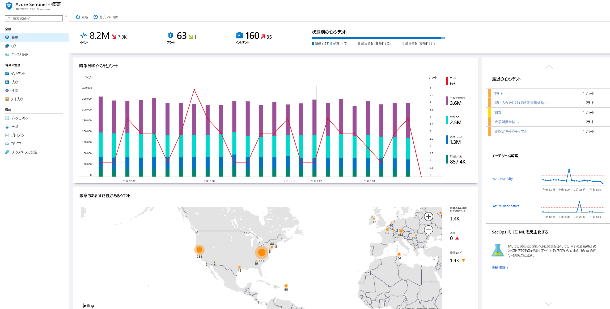
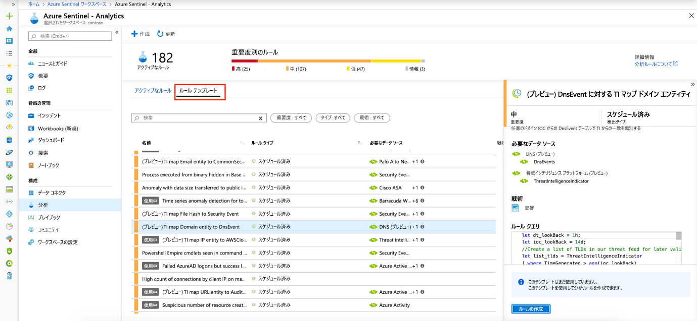

# クイック スタート:Azure Sentinel の概要

このクイックスタートでは、Azure Sentinel を使用して、環境全体で発生していることをすばやく表示および監視できるようにする方法について説明します。 データ ソースを Azure Sentinel に接続すると、すぐにデータを視覚化して分析できるため、接続されているすべてのデータ ソースで発生していることを把握できます。 Azure Sentinel には、Azure で既に使用できるツールをフルに活用できるブックと、ログとクエリの分析機能を提供するために組み込まれているテーブルとグラフが用意されています。 組み込みのブックを使用するか、最初から、または既存のブックに基づいて新しいブックを簡単に作成できます。 

## 視覚化する

環境で発生していること視覚化して分析するには、まず概要ダッシュボードを見て、組織のセキュリティ体制を把握します。 このようなタイルの各要素をクリックして、それらが作成された元の生データにドリルダウンすることができます。 ノイズを減らし、確認および調査する必要があるアラートの数を最小限に抑えるために、Azure Sentinel は融合手法を使用してアラートをインシデントに関連付けます。 **インシデント**は、調査して解決できる対応可能なインシデントをまとめた、関連するアラートのグループです。

- Azure portal で Azure Sentinel を選択してから、監視するワークスペースを選択します。

  

- 上部のツール バーには、選択した期間中に取得したイベントの数が表示され、過去 24 時間のイベントと比較されます。 ツール バーには、このようなイベントからトリガーされたアラートが表示されます (過去 24 時間の変化を表す小さい数字)。また、そのようなイベントの開いている数、進行中の数、閉じた数も表示されます。 イベント数の大幅な増減がないことを確認してください。 急落がある場合は、接続が Azure Sentinel へのレポートを停止した可能性があります。 増加がある場合は、何か疑わしいことが起こった可能性があります。 新しいアラートがあるかどうかを確認してください。

   

概要ページの本文から、ワークスペースのセキュリティ状態を一目で確認できます。

- **イベントとアラート (時系列)** :イベント数と、それらのイベントから作成されたアラートの数が一覧表示されます。 通常とは異なる急上昇がある場合は、アラートが表示されるはずです。イベントの急上昇があってもアラートが表示されないという通常とは異なることが発生した場合は、問題が発生してる可能性があります。

- **悪意のある可能性があるイベント**:悪意のあることがわかっているソースからのトラフィックが検出されると、Azure Sentinel はマップ上で警告します。 オレンジ色が表示される場合は受信トラフィックです。誰かが既知の悪意のある IP アドレスから組織にアクセスしようとしています。 送信 (赤) アクティビティが表示される場合は、ネットワークからのデータが組織から既知の悪意のある IP アドレスにストリーミングされていることを意味します。

   

- **最近のインシデント**:最近のインシデント、その重大度、そのインシデントに関連するアラートの数を表示します。 特定の種類のアラートで突然のピークが発生した場合は、現在実行中のアクティブな攻撃があることを意味している可能性があります。 たとえば、Azure ATP からの 20 回の Pass-the-hash イベントの突然のピークが発生した場合、現在、誰かが攻撃しようとしている可能性があります。

- **データ ソースの異常**:Microsoft のデータ アナリストは、データ ソースのデータから常に異常を探すモデルを作成しました。 異常がなければ、何も表示されません。 異常が検出された場合は、詳しく調べて発生したことを確認してください。 たとえば、Azure アクティビティの急上昇をクリックします。 **[グラフ]** をクリックして急上昇が発生した時期を確認し、その期間に発生したアクティビティをフィルター処理して、急上昇の原因を確認できます。

   

## 組み込みのブックを使用する

組み込みのブックには、接続されたデータ ソースから統合されたデータが表示されるので、そのようなサービスで生成されたイベントを詳しく調べることができます。 組み込みのブックには、Azure AD、Azure アクティビティ イベント、およびオンプレミスのデータが表示されます。たとえば、サーバーからの Windows イベントのデータ、ファースト パーティ アラートのデータ、ファイアウォール トラフィック ログ、Office 365、Windows イベントに基づく安全ではないプロトコルを含むサード パーティからのデータです。 ブックは Azure Monitor Workbooks に基づいており、独自のブックを設計する際のカスタマイズ性と柔軟性が強化されています。 詳細については、[ブック](../azure-monitor/platform/workbooks-overview.md)に関する記事を参照してください。

1. **[設定]** で **[ブック]** を選択します。 **[インストール済み]** には、インストールされているすべてのブックが表示されます。 **[すべて]** には、インストールできる組み込みのブックのギャラリー全体が表示されます。 
2. 特定のブックを検索して、各オファーの一覧全体と説明を確認してください。 
3. Azure AD を使用する場合、Azure Sentinel を使い始めるには、少なくとも次のブックをインストールすることをお勧めします。
   - **Azure AD**:次のいずれかまたは両方を使用します。
       - **Azure AD サインイン**は、時間の経過と共にサインインを分析し、異常があるかどうかを表示します。 このブックには、アプリケーション、デバイス、および場所ごとに失敗したサインインが表示されるため、異常が発生した場合は一目でわかります。 複数の失敗したサインインに注意してください。 
       - **Azure AD 監査ログ**では、ユーザーの変更 (追加、削除など)、グループの作成、変更などの管理アクティビティを分析します。  

   - ファイアウォールのブックを追加します。 たとえば、Palo Alto ブックを追加します。 このブックでは、ファイアウォールのトラフィックを分析し、ファイアウォールのデータと脅威イベントの間の相関関係を表示し、エンティティ全体の疑わしいイベントを強調表示します。 ブックには、トラフィックの傾向に関する情報が表示され、結果をドリル ダウンしてフィルター処理することができます。 

      

メイン クエリ を編集してブックをカスタマイズできます。 ボタン  をクリックして [Log Analytics に移動し、そこでクエリを編集](../azure-monitor/log-query/get-started-portal.md)できます。また、省略記号 (...) を選択し、 **[タイル データのカスタマイズ]** を選択して、メイン タイム フィルターを編集したり、ブックから特定のタイルを削除したりすることができます。

クエリの使用方法の詳細については、「[チュートリアル:Log Analytics でのデータの視覚化](../azure-monitor/learn/tutorial-logs-dashboards.md)」を参照してください

### 新しいタイルを追加する

新しいタイルを追加する場合は、既存のブック (自分で作成したブックまたは Azure Sentinel の組み込みのブック) に追加できます。 
1. Log Analytics で、「[チュートリアル:Log Analytics でのデータの視覚化](../azure-monitor/learn/tutorial-logs-dashboards.md)」の手順に従ってタイルを作成します。 
2. タイルが作成されたら、 **[ピン留め]** でタイルを表示するブックを選択します。

## 新しいブックを作成する
新しいブックを最初から作成するか、組み込みのブックを新しいブックのベースとして使用することができます。

1. 新しいブックを最初から作成するには、 **[ブック]** 、 **[+New workbook]\(+ 新しいブック\)** の順に選択します。
2. ブックを作成したサブスクリプションを選択し、わかりやすい名前を付けます。 各ブックは他のブックと同様に Azure リソースであり、アクセスできるユーザーを定義および制限するためにロールを割り当てることができます (RBAC)。 
3. ブックに表示して視覚化をピン留めできるようにするには、共有する必要があります。 **[共有]** 、 **[ユーザーの管理]** の順にクリックします。 
 
1. 他の Azure リソースと同様に、 **[Check access]\(アクセスの確認\)** および **[ロールの割り当て]** を使用します。 詳細については、[RBAC を使用した Azure ブックの共有](../azure-portal/azure-portal-dashboard-share-access.md)に関する記事を参照してください。

## 新しいブックの例

次のサンプル クエリを使用すると、数週間にわたるトラフィックの傾向を比較できます。 クエリを実行するデバイスの製造元とデータ ソースを簡単に切り替えることができます。 この例では Windows の SecurityEvent を使用していますが、他のファイアウォールの AzureActivity または CommonSecurityLog に対して実行するために切り替えることができます。

     |where DeviceVendor == "Palo Alto Networks":
      // week over week query
      SecurityEvent
      | where TimeGenerated > ago(14d)
      | summarize count() by bin(TimeGenerated, 1d)
      | extend Week = iff(TimeGenerated>ago(7d), "This Week", "Last Week"), TimeGenerated = iff(TimeGenerated>ago(7d), TimeGenerated, TimeGenerated + 7d)

複数のソースからのデータを組み込んだクエリを作成することをお勧めします。 作成されたばかりの新しいユーザーの Azure Active Directory 監査ログを確認し、Azure ログをチェックして作成後 24 時間以内にユーザーがロールの割り当てを変更し始めたかどうかを確認するクエリを作成できます。 その疑わしいアクティビティは、このダッシュボードに表示されます。

    AuditLogs
    | where OperationName == "Add user"
    | project AddedTime = TimeGenerated, user = tostring(TargetResources[0].userPrincipalName)
    | join (AzureActivity
    | where OperationName == "Create role assignment"
    | project OperationName, RoleAssignmentTime = TimeGenerated, user = Caller) on user
    | project-away user1

データを見るユーザーのロール必要なものに基づいて、さまざまなブックを作成できます。 たとえば、ファイアウォール データを含むネットワーク管理者用のブックを作成できます。 また、確認する頻度、毎日確認することがあるかどうか、1 時間に 1 回確認する必要がある項目などに基づいてブックを作成することもできます。たとえば、Azure AD のサインを毎時確認し、異常を検索することができます。 

## 新しい検出を作成する

[Azure Sentinel に接続したデータ ソース](connect-data-sources.md)に対し、組織内の脅威を調査するための検出を生成します。

新しい検出を作成する際は、Microsoft のセキュリティ研究員によって作成されたビルトインの検出を活用しましょう。接続先のデータ ソースに合わせてカスタマイズされています。

難しい設定の要らない検出機能をすべて表示するには、 **[Analytics]** 、 **[Rule templates]\(ルール テンプレート\)** の順に選択します。 このタブには、すべての Azure Sentinel 組み込み規則が含まれています。

   

組み込みの検出を取得する方法の詳細については、[チュートリアルの組み込みの分析の取得](tutorial-detect-threats-built-in.md)に関する記事を参照してください。
 
## 次のステップ
このクイック スタートでは、Azure Sentinel を使い始める方法について説明しました。 [脅威の検出方法](tutorial-detect-threats-built-in.md)のチュートリアルに進んでください。
> [!div class="nextstepaction"]
> [カスタムの脅威検出ルールを作成](tutorial-detect-threats-custom.md)して、脅威への対応を自動化します。

