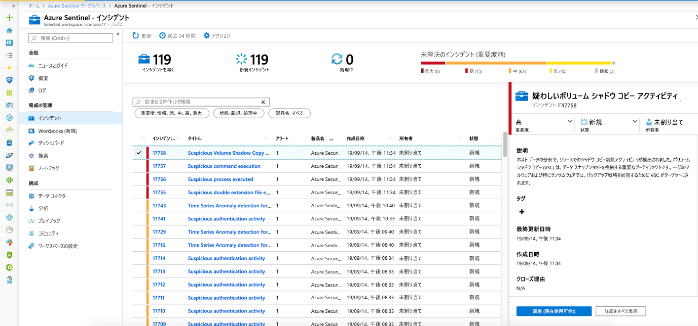

# チュートリアル:Azure Sentinel でインシデントを調査する

> [!IMPORTANT]
> 調査グラフは、現在、パブリック プレビュー段階にあります。
> この機能はサービス レベル アグリーメントなしで提供されています。運用環境のワークロードに使用することはお勧めできません。
> 詳しくは、[Microsoft Azure プレビューの追加使用条件](https://azure.microsoft.com/support/legal/preview-supplemental-terms/)に関するページをご覧ください。

このチュートリアルは、Azure Sentinel でインシデントを調査するためのものです。 Azure Sentinel にデータ ソースを接続した後で、不審な事態が起きたときに通知を受けるようにします。 これを実現するために、Azure Sentinel では、割り当てや調査が可能なインシデントを生成する高度なアラート ルールを作成できます。

この記事には、次の内容が含まれます。
> [!div class="checklist"]
> * インシデントの調査
> * 調査グラフを使用する
> * 脅威に対応する

インシデントには複数のアラートを含めることができます。 ケースは、特定の調査に関連するすべての証拠を集計したものです。 インシデントは、 **[分析]** ページで作成した分析ルールに基づいて作成されます。 重大度および状態など、アラートに関連するプロパティはインシデント レベルで設定されます。 探している脅威の種類とその検出方法が Azure Sentinel に認識された後、インシデントを調査することで検出された脅威を監視できます。

## 前提条件
分析ルールを設定するときにエンティティ マッピング フィールドを使用した場合にのみ、インシデントを調査できます。 調査グラフでは、元のインシデントにエンティティが含まれている必要があります。

## インシデントの調査方法

1. **[インシデント]** を選択します。 **[インシデント]** ページには、自分に割り当てられたインシデントの数、開いているインシデントの数、 **[処理中]** に設定したインシデントの数、閉じたインシデントの数が表示されます。 各インシデントについて、その発生時刻とインシデントの状態を確認できます。 重大度を調べて、最初に処理するインシデントを決定します。

    

1. 状態や重要度など、必要に応じてインシデントをフィルター処理できます。

1. 調査を開始するには、特定のインシデントを選択します。 右側に、その重大度、関連するエンティティの数の概要、このインシデントをトリガーした生イベント、インシデントの一意の ID など、インシデントの詳細情報が表示されます。

1. インシデント内のアラートとエンティティの詳細を表示するには、インシデントのページで **[View full details]\(完全な詳細の表示\)** を選択し、インシデントの情報がまとめられている関連タブを確認します。 **[アラート]** タブで、アラート自体を確認します。 アラートをトリガーしたクエリ、クエリごとに返された結果の数、アラートに対してプレイブックを実行する機能といった、アラートに関するすべての関連情報を確認できます。 インシデントをさらにドリルダウンするには、 **[イベント]** の数を選択します。 これにより、結果を生成したクエリと、アラートをトリガーしたイベントが Log Analytics で開きます。 **[エンティティ]** タブで、アラート ルールの定義の一部としてマップしたすべてのエンティティを表示できます。

    

1. 積極的にインシデントを調査している場合、インシデントを閉じるまではその状態を **[処理中]** に設定することをお勧めします。

1. インシデントは特定のユーザーに割り当てることができます。 インシデントごとに、 **[Incident owner]\(インシデントの所有者\)** フィールドを設定することで、所有者を割り当てることができます。 すべてのインシデントは、開始時点では未割り当ての状態です。 また、調査した内容やインシデントに関する懸念事項を他のアナリストが理解できるように、コメントを追加することもできます。

    

1. **[調査]** を選択して、調査マップを表示します。

## 調査グラフを使用して詳細に調査する

調査グラフを使用すると、アナリストは調査ごとに適切な質問を行うことができます。 調査グラフを使用すると、関連データとすべての関連するエンティティを関連付けることによって、潜在的なセキュリティ脅威の範囲を理解し、根本原因を特定するのに役立ちます。 グラフに表示される任意のエンティティを選択して、さまざまな展開オプションを選択することにより、より詳細に調査できます。  
  
調査グラフには、次のものがあります。

- **生データからのビジュアル コンテキスト**:ライブのビジュアル グラフには、生データから自動的に抽出されたエンティティのリレーションシップが表示されます。 これにより、さまざまなデータ ソース間の接続を簡単に確認できます。

- **調査範囲全体の検出**:組み込みの探索クエリを使用して調査範囲を拡大し、侵害の全範囲を明らかにします。

- **組み込みの調査手順**:定義済みの探索オプションを使用して、脅威の発生時に適切な質問をするようにします。

調査グラフを使用するには:

1. インシデントを選択し、 **[調査]** を選択します。 これにより、調査グラフが表示されます。 グラフには、アラートに直接接続されているエンティティと、さらに接続されている各リソースのイラスト マップが示されます。

   > [!IMPORTANT] 
   > 分析ルールを設定するときにエンティティ マッピング フィールドを使用した場合にのみ、インシデントを調査できます。 調査グラフでは、元のインシデントにエンティティが含まれている必要があります。

   

1. エンティティを選択すると、 **[エンティティ]** ウィンドウが開き、そのエンティティに関する情報を確認できます。

    
  
1. 各エンティティの上にカーソルを置くと、エンティティの種類ごとにセキュリティ エクスパートやアナリストによって作成された質問の一覧が表示され、調査を深めることができます。 これらのオプションを**探索クエリ**と呼びます。

    

   たとえば、コンピューターで、関連するアラートを要求できます。 探索クエリを選択すると、結果として得られたエンティティがグラフに追加されます。 この例では、 **[Related alerts]\(関連するアラート\)** を選択すると、グラフに次のアラートが返されます。

    

1. 探索クエリごとに、 **[イベント]\>** を選択して、生イベントの結果と、Log Analytics で使用されるクエリを開くオプションを選択できます。

1. インシデントの理解のために、グラフには平行したタイムラインが表示されます。

    

1. タイムライン上にカーソルを移動して、グラフ上のどの項目がどの時点で発生したかを確認します。

    

## 次のステップ
このチュートリアルでは、Azure Sentinel を使用して、インシデントの調査を開始する方法について説明しました。 [自動プレイブックを使用した脅威への対応](tutorial-respond-threats-playbook.md)に関するチュートリアルに進んでください。
> [!div class="nextstepaction"]
> [[Respond to threats]](tutorial-respond-threats-playbook.md) (脅威への対応) を行って、脅威への対応を自動化します。

