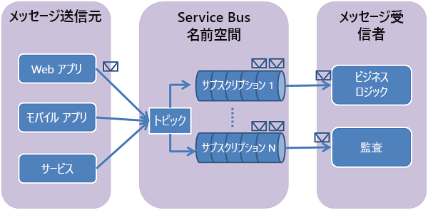

# クイック スタート:Azure portal を使用して Service Bus トピックとそのサブスクリプションを作成する
このクイック スタートでは、Azure portal を使用して Service Bus トピックを作成した後、そのトピックのサブスクリプションを作成します。 

## Service Bus トピックとサブスクリプションとは
Service Bus のトピックとサブスクリプションは、メッセージ通信の *発行/サブスクライブ* モデルをサポートします。 トピックとサブスクリプションを使用すると、分散アプリケーションのコンポーネントが互いに直接通信することがなくなり、仲介者の役割を果たすトピックを介してメッセージをやり取りすることになります。

各メッセージが 1 つのコンシューマーによって処理される Service Bus キューとは異なり、トピックとサブスクリプションは、発行/サブスクライブ パターンを使用して "1 対多" 形式の通信を行います。 複数のサブスクリプションを 1 つのトピックに登録できます。 トピックに送信されたメッセージはサブスクリプションに渡され、各サブスクリプションで独立して処理できます。 トピックにとってのサブスクリプションは、トピックに送信されたメッセージのコピーを受け取る仮想キューのようなものです。 トピックに対するフィルター ルールをサブスクリプション単位で登録することもできます。この場合、トピックに送信されるどのメッセージをどのトピック サブスクリプションで受信するかのフィルター処理や制限が可能になります。

Service Bus のトピックとサブスクリプションを使用すると、多数のユーザーとアプリケーションの間でやり取りされる膨大な数のメッセージを処理することもできます。

[!INCLUDE [service-bus-create-namespace-portal](../../includes/service-bus-create-namespace-portal.md)]

[!INCLUDE [service-bus-create-topics-three-subscriptions-portal](../../includes/service-bus-create-topics-three-subscriptions-portal.md)]

> [!NOTE]
> Service Bus リソースは、[Service Bus Explorer](https://github.com/paolosalvatori/ServiceBusExplorer/) で管理できます。 Service Bus Explorer を使用すると、ユーザーは Service Bus 名前空間に接続し、簡単な方法でメッセージング エンティティを管理できます。 このツールには、インポート/エクスポート機能や、トピック、キュー、サブスクリプション、リレー サービス、通知ハブ、イベント ハブをテストする機能などの高度な機能が用意されています。 

## 次のステップ
トピックにメッセージを送信してそれらのメッセージをサブスクリプション経由で受信する方法については、次の記事を参照してください。TOC からプログラミング言語を選択してください。 

> [!div class="nextstepaction"]
> [メッセージの発行とサブスクライブ](service-bus-dotnet-how-to-use-topics-subscriptions.md)
