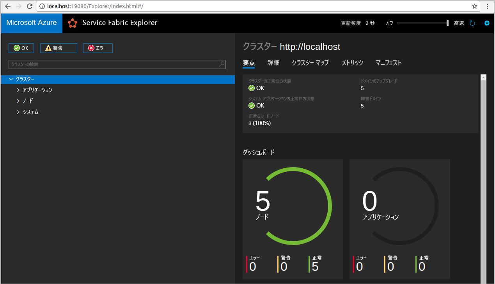
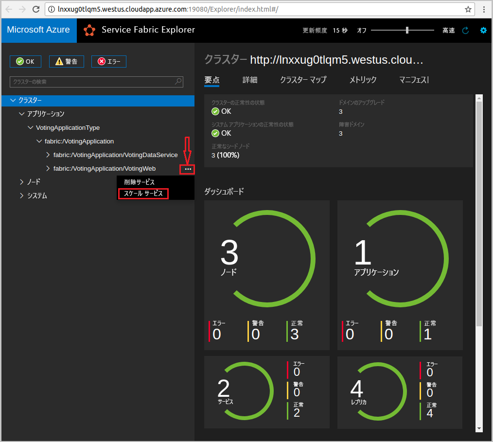
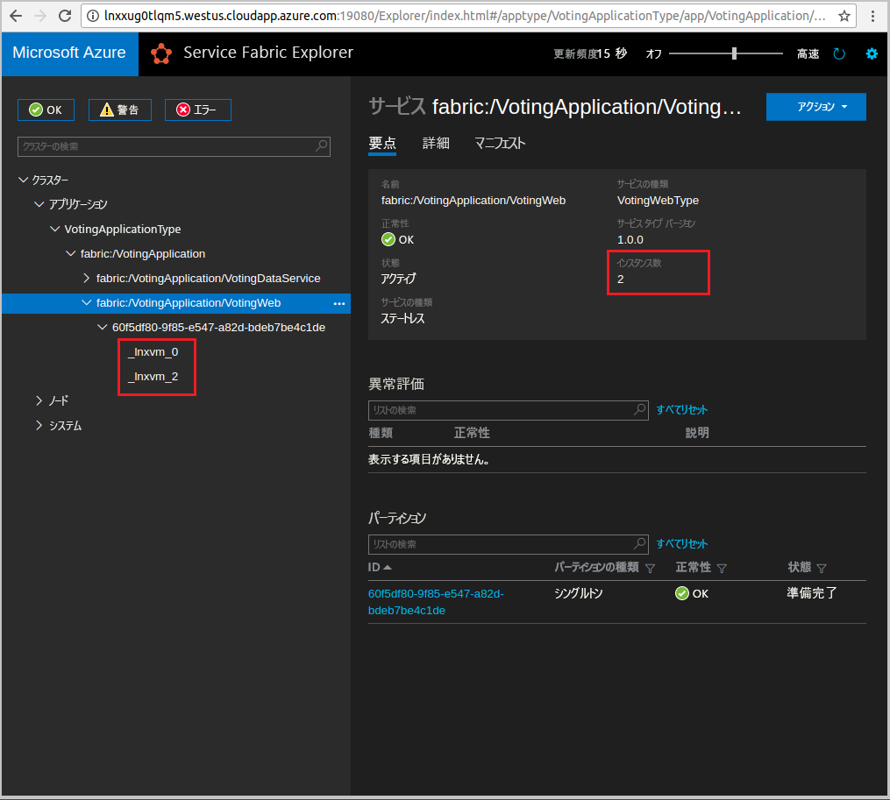

# <a name="quickstart--deploy-a-java-app-to-azure-service-fabric-on-linux"></a>クイック スタート:Azure Service Fabric on Linux に Java アプリをデプロイする

このクイックスタートでは、Linux 開発者マシンで Eclipse IDE を使用して、Azure Service Fabric に Java アプリケーションをデプロイします。 最後まで読み進めていけば、Java Web フロントエンドからクラスター内のステートフルなバックエンド サービスに投票結果を保存するアプリケーションが完成します。

Azure Service Fabric は、マイクロサービスとコンテナーのデプロイと管理を行うための分散システム プラットフォームです。

## <a name="prerequisites"></a>前提条件

- [Java 環境](https://docs.microsoft.com/azure/service-fabric/service-fabric-get-started-linux#set-up-java-development)と [Yeoman](https://docs.microsoft.com/azure/service-fabric/service-fabric-get-started-linux#set-up-yeoman-generators-for-containers-and-guest-executables)
- [Eclipse Neon (4.6) 以上](https://www.eclipse.org/downloads/packages/)および [Service Fabric 用 Eclipse プラグイン](https://docs.microsoft.com/azure/service-fabric/service-fabric-get-started-linux#install-the-eclipse-plug-in-optional)
- [Service Fabric SDK およびコマンド ライン インターフェイス (CLI)](https://docs.microsoft.com/azure/service-fabric/service-fabric-get-started-linux#installation-methods)
- [Git](https://git-scm.com/downloads)

## <a name="download-the-sample"></a>サンプルのダウンロード

コマンド ウィンドウで、次のコマンドを実行して、サンプル アプリのリポジトリをローカル コンピューターに複製します。

```bash
git clone https://github.com/Azure-Samples/service-fabric-java-quickstart.git
```

## <a name="run-the-application-locally"></a>ローカルでアプリケーションを実行する

1. 次のコマンドを実行して、ローカル クラスターを開始します。

    ```bash
    sudo /opt/microsoft/sdk/servicefabric/common/clustersetup/devclustersetup.sh
    ```
    ローカル クラスターの起動には、一定の時間がかかります。 クラスターが完全に起動されたことを確認するには、`http://localhost:19080` で Service Fabric Explorer にアクセスします。 5 つの正常なノードは、ローカル クラスターが起動され、実行されていることを示します。

    

2. Eclipse を開きます。
3. **[File]\(ファイル\)**  >  **[Import]\(インポート\)**  >  **[Gradle]**  >  **[Existing Gradle Project]\(既存の Gradle プロジェクト\)** の順に選択してウィザードに従います。
4. **[Directory]\(ディレクトリ\)** を選択し、GitHub からクローンした **service-fabric-java-quickstart** フォルダーから **Voting** ディレクトリを選択します。 **[完了]** を選択します。

    

5. これで、Eclipse のパッケージ エクスプローラーに `Voting` プロジェクトが配置されました。
6. プロジェクトを右クリックして、 **[Service Fabric]** ドロップダウンの **[Publish Application]\(アプリケーションの発行\)** を選択します。 ターゲット プロファイルとして **[PublishProfiles/Local.json]** を選択し、 **[発行]** を選択します。

    

7. 使い慣れた Web ブラウザーを開き、`http://localhost:8080` に接続してアプリケーションにアクセスします。

    

これで一連の投票の選択肢を追加して投票を開始できます。 アプリケーションが実行され、データはすべて Service Fabric クラスターに保存されます。別途データベースを用意する必要はありません。


## <a name="scale-applications-and-services-in-a-cluster"></a>クラスター内のアプリケーションとサービスをスケールする

サービスは、その負荷の変化に対応するために、クラスターで簡単にスケールすることができます。 サービスをスケールするには、クラスターで実行されるインスタンスの数を変更します。 サービスをスケーリングする方法は多数あります。 たとえば、Service Fabric CLI (`sfctl`) のスクリプトやコマンドを使用できます。 次の手順では、Service Fabric Explorer を使用します。

Service Fabric Explorer は、すべての Service Fabric クラスターで動作し、ブラウザーからクラスターの HTTP 管理ポート (19080) にアクセスして利用することができます。 たとえば、「 `http://localhost:19080` 」のように入力します。

Web フロントエンド サービスをスケーリングするには、以下を実行します。

1. クラスターで Service Fabric Explorer を開きます。 たとえば、「 `https://localhost:19080` 」のように入力します。
2. ツリービューで **fabric:/Voting/VotingWeb** ノードの横にある省略記号 ( **...** ) を選択し、 **[サービスのスケール]** を選択します。

    

    これで Web フロントエンド サービスのインスタンス数をスケールできる状態になりました。

3. 数値を **2** に変更し、 **[サービスのスケール]** を選択します。
4. ツリービューの **fabric:/Voting/VotingWeb** ノードを選択し、パーティション ノード (GUID で表されます) を展開します。

    

    このサービスには 2 つのインスタンスがあることがわかります。また、ツリー ビューを見れば、それらのインスタンスがどのノードで実行されているかが確認できます。

この簡単な管理タスクを通じて、フロントエンド サービスでユーザー負荷を処理するためのリソースが 2 倍になりました。 実行するサービスの信頼性を高めるために、サービスのインスタンスを複数用意する必要はないことに注目してください。 サービスで障害が発生した場合、Service Fabric によって新しいサービス インスタンスがクラスターで実行されます。

## <a name="next-steps"></a>次のステップ

このクイック スタートでは、次の方法について説明しました。

* Service Fabric Java アプリケーションのツールとして Eclipse を使用する
* Java アプリケーションをローカル クラスターにデプロイする
* 複数のノードにアプリケーションをスケールアウトする

Service Fabric で Java アプリを操作する方法を学習するには、Java アプリのチュートリアルに進んでください。

> [!div class="nextstepaction"]
> [Java アプリのデプロイ](./service-fabric-tutorial-create-java-app.md)
