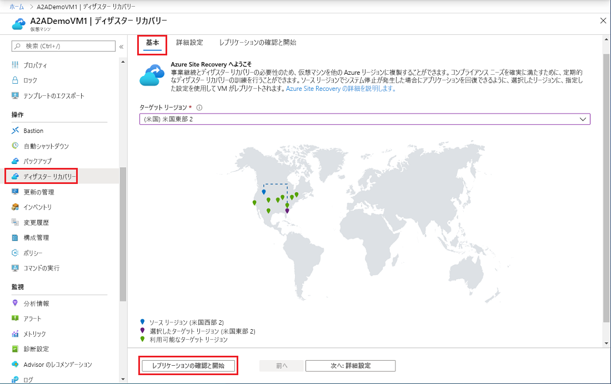

# Azure VM のセカンダリ Azure リージョンへのディザスター リカバリーの設定

[Azure Site Recovery](site-recovery-overview.md) サービスは、計画された停止や計画外の停止の際にビジネス アプリを実行し続け、使用できるようにすることで、ビジネス継続性とディザスター リカバリー (BCDR) 戦略に貢献します。 Site Recovery は、レプリケーション、フェールオーバー、フェールバックなど、オンプレミスのマシンと Azure Virtual Machines (VM) のディザスター リカバリーを管理し、調整します。

このクイック スタートでは、別の Azure リージョンにレプリケートすることによって、Azure VM のディザスター リカバリーを設定する方法について説明します。

Azure サブスクリプションをお持ちでない場合は、開始する前に [無料アカウント](https://azure.microsoft.com/free/?WT.mc_id=A261C142F) を作成してください。

> [!NOTE]
> この記事は、新しいユーザーのための簡単なチュートリアルです。 既定のオプションと最小限のカスタマイズによる、最も簡単なパスを使用します。 詳しい説明については、「[レプリケーションを有効にする](azure-to-azure-tutorial-enable-replication.md)」のチュートリアルを参照してください。

## Azure にログインする

[Azure Portal](https://portal.azure.com) にログインします。

## Azure VM のレプリケーションの有効化

1. Azure portal のメニューで **[仮想マシン]** を選択するか、任意のページ上で "*仮想*" マシンを検索して選択します。 レプリケーションする VM を選択します。
2. **[操作]** で、 **[ディザスター リカバリー]** を選択します。
3. **[Configure disaster recovery]\(ディザスター リカバリーを構成する\)**  >  **[ターゲット リージョン]** で、レプリケート先のターゲット リージョンを選択します。
4. このクイック スタートでは、その他は既定の設定をそのまま使用します。
5. **[レプリケーションを確認して開始する]** を選択します。 次に、 **[レプリケーションの開始]** を選択して、VM のレプリケーションを有効にするジョブを開始します。

   

## 設定の確認

レプリケーション ジョブの完了後、レプリケーションの状態を確認し、レプリケーションの設定を変更して、デプロイをテストできます。

1. Azure portal のメニューで **[仮想マシン]** を選択するか、任意のページ上で "*仮想*" マシンを検索して選択します。 確認したい VM を選択します。
2. **[操作]** で、 **[ディザスター リカバリー]** を選択します。

   レプリケーションの正常性、作成された復旧ポイント、およびマップ上のソース リージョンとターゲット リージョンを確認できます。

   

## リソースをクリーンアップする

プライマリ リージョンの VM のレプリケーションは、そのレプリケーションを無効にすると停止されます。

- ソース レプリケーションの設定は自動的にクリーンアップされます。 レプリケーションの一部として VM にインストールされた Site Recovery 拡張機能は削除されないため、手動で削除する必要があります。
- VM の Site Recovery の課金は停止します。

レプリケーションを停止するには、次の手順に従います。

1. Azure portal のメニューで **[仮想マシン]** を選択するか、任意のページ上で "*仮想*" マシンを検索して選択します。 変更したい VM を選択します。
2. **[ディザスター リカバリー]** で、 **[レプリケーションの無効化]** を選択します。

   

## 次のステップ

このクイック スタートでは、1 つの VM をセカンダリ リージョンにレプリケートしました。 ここで、復旧計画を使用して複数の Azure VM をレプリケートしてみてください。

> [!div class="nextstepaction"]
> [Azure VM のディザスター リカバリーを設定する](azure-to-azure-tutorial-enable-replication.md)
