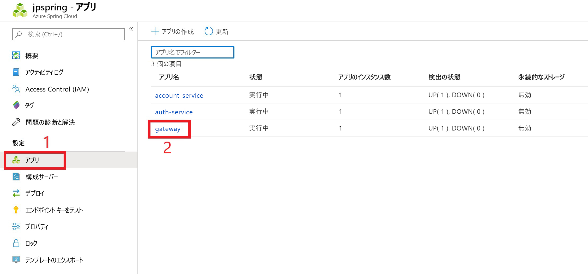
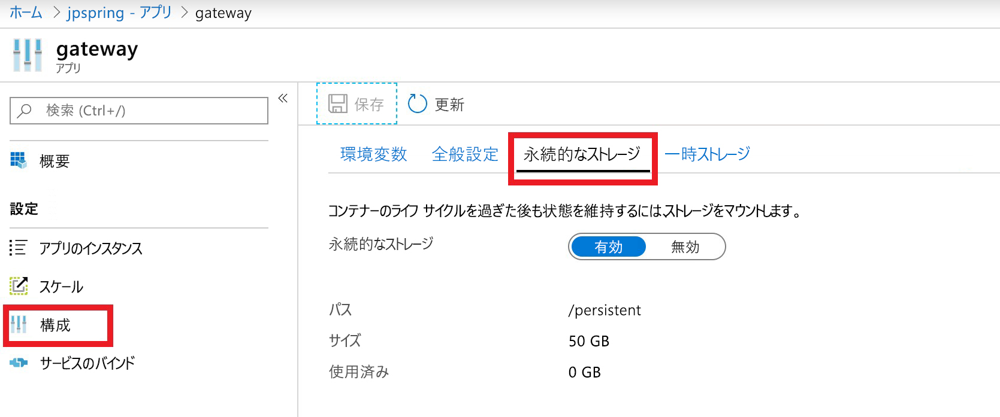

# <a name="how-to-use-persistent-storage-in-azure-spring-cloud"></a>Azure Spring Cloud で永続的ストレージを使用する方法

Azure Spring Cloud には、アプリケーション用に永続的ストレージと一時ストレージの 2 種類のストレージが用意されています。  Azure Spring Cloud では、各アプリケーション インスタンスに対して既定で一時ストレージが有効になります。 一時ストレージは、上限が 5 GB で、既定のマウント パスが `/tmp` となっています。

> [!WARNING]
> アプリケーション インスタンスに関連付けられている一時ストレージは、そのインスタンスを再起動すると完全に削除されます。

永続的ストレージは、アプリケーションごとに割り当てられる、Azure が管理するファイル共有コンテナーです。 永続的ストレージに格納されているデータは、アプリケーションの全インスタンスが共有します。 各 Azure Spring Cloud サービス インスタンスは、永続的ディスクを有効にしたアプリケーションを最大 10 個持つことができます。 各アプリケーションは、50 GB の永続的ストレージを受け取ります。 永続的ストレージの既定のマウント パスは、`/persistent` です。

> [!WARNING]
> 永続的ストレージを "*無効にする*" と、そのアプリケーションに対するストレージの割り当てが解除されます。  そのストレージ アカウント内のデータはすべて失われます。 

## <a name="enable-persistent-storage-using-the-azure-portal"></a>Azure portal を使用して永続的ストレージを有効にする

1. Azure portal のホーム画面から、 **[すべてのリソース]** を選択します。

     >![[すべてのリソース] アイコンを見つける](media/portal-all-resources.jpg)

1. 永続的ストレージを必要とする Azure Spring Cloud リソースを見つけて選択します。  この例では、*jpspring* という名前のアプリケーションです。

    > 

1. **[設定]** という見出しの下にある **[アプリ]** を選択します。

1. 表に Spring Cloud のサービスが表示されます。  永続的ストレージを追加するサービスを選択します。  この例では**ゲートウェイ** サービスを選択します。

    > 

1. サービスの構成ブレードから、 **[構成]** を選択します

1. **[Persistent Storage] (永続的ストレージ)** タブを選択し、永続的ストレージを有効にします。

    > 

永続的ストレージが有効になっていると、サイズとパスの両方がこのページに表示されます。

## <a name="use-the-azure-cli-to-modify-persistent-storage"></a>Azure CLI を使用して永続的ストレージを変更する

必要な場合は、Azure CLI 用の Spring Cloud 拡張機能をインストールします。

```azurecli
az extension add --name spring-cloud
```

永続的ディスクが有効になった状態のアプリを作成します。
 
```azurecli
az spring-cloud app create -n <app> -g <resource-group> -s <service-name> --enable-persistent-storage true
```

既存のアプリで永続的ストレージを有効にします。

```azurecli
az spring-cloud app update -n <app> -g <resource-group> -s <service-name> --enable-persistent-storage true
``` 

既存のアプリで永続的ストレージを無効にします。

> [!WARNING]
> 永続的ストレージを無効にすると、そのアプリケーションに関するストレージの割り当てが解除されます。そのストレージに保存されていたデータはいずれも、完全に失われます。 

```azurecli
az spring-cloud app update -n <app> -g <resource-group> -s <service-name> --enable-persistent-storage false
```

## <a name="next-steps"></a>次の手順

[アプリケーションとサービスのクォータ](spring-cloud-quotas.md)または[アプリケーションを手動でスケーリングする方法](spring-cloud-tutorial-scale-manual.md)を確認してください。