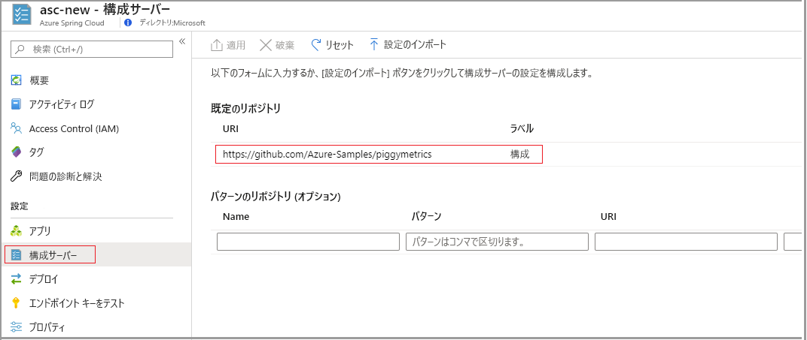

# <a name="quickstart-launch-an-azure-spring-cloud-application-using-the-azure-portal"></a>クイック スタート:Azure portal を使用して Azure Spring Cloud アプリケーションを起動する

Azure Spring Cloud では、Spring Cloud ベースのマイクロサービス アプリケーションを Azure で簡単に実行できます。

このクイックスタートでは、既存の Spring Cloud アプリケーションを Azure にデプロイする方法について説明します。  このチュートリアルで使用するサンプル アプリケーション コードについては、[GitHub サンプル リポジトリ](https://github.com/Azure-Samples/PiggyMetrics)を参照してください。 完了すると、準備したサンプル アプリケーションにオンラインでアクセスできるようになり、Azure portal で管理できるようになります。

このクイックスタートでは、次の方法について説明します。

> [!div class="checklist"]
> * サービス インスタンスをプロビジョニングする
> * インスタンスに構成サーバーを設定する
> * マイクロサービス アプリケーションをローカルにビルドする
> * 各マイクロサービスをデプロイする
> * アプリケーションのパブリック エンドポイントを割り当てる

## <a name="prerequisites"></a>前提条件

>[!Note]
> Azure Spring Cloud は現時点ではパブリック プレビューとして提供されています。 パブリック プレビュー オファリングにより、お客様は公式リリースの前に新機能を試すことができます。  パブリック プレビューの機能とサービスは、運用環境での使用を目的としたものではありません。  プレビュー期間中のサポートの詳細については、[FAQ](https://azure.microsoft.com/support/faq/) のページを参照するか、詳細について[サポート リクエスト](https://docs.microsoft.com/azure/azure-supportability/how-to-create-azure-support-request)を提出してください。

>[!TIP]
> Azure Cloud Shell は無料のインタラクティブ シェルです。この記事の手順は、Azure Cloud Shell を使って実行することができます。  最新バージョンの Git、JDK、Maven、Azure CLI など、一般的な Azure ツールがプレインストールされています。 Azure サブスクリプションにログインしている場合は、shell.azure.com から [Azure Cloud Shell](https://shell.azure.com) を起動します。  Azure Cloud Shell の詳細については、[ドキュメントを参照](../cloud-shell/overview.md)してください

このクイック スタートを完了するには、以下が必要です。

1. [Git をインストールする](https://git-scm.com/)
2. [JDK 8 をインストールする](https://docs.microsoft.com/java/azure/jdk/?view=azure-java-stable)
3. [Maven 3.0 以上をインストールする](https://maven.apache.org/download.cgi)
4. [Azure CLI バージョン 2.0.67 以上をインストールする](https://docs.microsoft.com/cli/azure/install-azure-cli?view=azure-cli-latest)
5. [Azure サブスクリプションにサインアップする](https://azure.microsoft.com/free/)

## <a name="install-the-azure-cli-extension"></a>Azure CLI 拡張機能をインストールする

次のコマンドを使用して、Azure CLI 用の Azure Spring Cloud 拡張機能をインストールします

```Azure CLI
az extension add --name spring-cloud
```

## <a name="provision-a-service-instance-on-the-azure-portal"></a>Azure portal でサービス インスタンスをプロビジョニングする

1. Web ブラウザーで、[Azure portal の Azure Spring Cloud へのこのリンク](https://ms.portal.azure.com/#create/Microsoft.AppPlatform)を開きます。

1. **[Azure Spring Cloud]** を選択して概要ページに移動します。 **[作成]** ボタンを選択して、作業を開始します。

1. 以下のガイドラインを考慮して、フォームに入力します。
    - サービス名:自分のサービス インスタンスの名前を指定します。  名前の長さは 4 文字から 32 文字で、小文字、数字、およびハイフンのみを使用できます。  サービス名の最初の文字は英字でなければならず、最後の文字は英字または数字でなければなりません。
    - サブスクリプション:このリソースに対する課金用のサブスクリプションを選択します。  そのサブスクリプションが Microsoft 側で Azure Spring Cloud の許可リストに追加されていることを確認してください。
    - リソース グループ: 新しいリソース用に新しいリソース グループを作成することをお勧めします。
    - 場所:自分のサービス インスタンスの場所を選択します。 現在サポートされている場所は、米国東部、米国西部 2、西ヨーロッパ、東南アジアなどです。
    
サービスのデプロイには約 5 分かかります。  デプロイされると、サービス インスタンスの **[概要]** ページが表示されます。

## <a name="set-up-your-configuration-server"></a>構成サーバーを設定する

1. サービスの **[概要]** ページに移動し、 **[Config Server]\(構成サーバー\)** を選択します。

1. **[既定のリポジトリ]** セクションで **[URI]** を "https\://github.com/Azure-Samples/piggymetrics" に設定し、 **[ラベル]** を "構成" に設定して、 **[適用]** を選択し、変更を保存します。

    

## <a name="build-and-deploy-microservice-applications"></a>マイクロサービス アプリケーションのビルドとデプロイ

1. [Azure Cloudshell](https://shell.azure.com) を開き、サンプル アプリのリポジトリをご利用のローカル コンピューターにクローンします。  ここでは、まず、`source-code` という名前の一時ディレクトリを作成してから、アプリを複製します。

    ```azurecli
    mkdir source-code
    cd source-code
    git clone https://github.com/Azure-Samples/piggymetrics
    ```

1. 複製されたパッケージをビルドします。

    ```azurecli
    cd piggymetrics
    mvn clean package -DskipTests
    ```

1. Azure CLI にログインし、アクティブなサブスクリプションを設定します。

    ```azurecli
    # Login to Azure CLI
    az login

    # List all subscriptions
    az account list -o table

    # Set active subscription
    az account set --subscription <target subscription ID>
    ```

1. リソース グループとサービスに名前を割り当てます。 次のプレースホルダーは、このチュートリアルで前にプロビジョニングしたリソース グループ名とサービス名で置き換えます。

    ```azurecli
    az configure --defaults group=<resource group name>
    az configure --defaults spring-cloud=<service instance name>
    ```

1. `gateway` アプリケーションを作成し、JAR ファイルをデプロイします。

    ```azurecli
    az spring-cloud app create -n gateway
    az spring-cloud app deploy -n gateway --jar-path ./gateway/target/gateway.jar
    ```

1. 同じパターンに従い、`account-service` および `auth-service` アプリケーションを作成し、JAR ファイルをデプロイします。

    ```azurecli
    az spring-cloud app create -n account-service
    az spring-cloud app deploy -n account-service --jar-path ./account-service/target/account-service.jar
    az spring-cloud app create -n auth-service
    az spring-cloud app deploy -n auth-service --jar-path ./auth-service/target/auth-service.jar
    ```

1. アプリケーションのデプロイが完了するまでに数分かかります。 デプロイが完了したことを確認するには、Azure portal で **[アプリ]** ブレードに移動します。 3 つのアプリケーションのそれぞれに 1 行が表示されます。

## <a name="assign-a-public-endpoint-to-gateway"></a>ゲートウェイにパブリック エンドポイントを割り当てる

1. 左側のメニューの **[アプリ]** タブをクリックします。

1. `gateway` アプリケーションを選択して、 **[概要]** ページを表示します。

1. **[Assign Domain]\(ドメインの割り当て\)** を選択して、ゲートウェイにパブリック エンドポイントを割り当てます。 これには数分かかることがあります。

    

1. 実行中のアプリケーションを表示するには、割り当てられたパブリック エンドポイント (**URL** のラベルが付いています) をブラウザーに入力します。

    


## <a name="next-steps"></a>次の手順

このクイック スタートでは、次の方法について説明しました。

> [!div class="checklist"]
> * サービス インスタンスをプロビジョニングする
> * インスタンスに構成サーバーを設定する
> * マイクロサービス アプリケーションをローカルにビルドする
> * 各マイクロサービスをデプロイする
> * アプリケーション ゲートウェイのパブリック エンドポイントを割り当てる

> [!div class="nextstepaction"]
> [Azure Spring Cloud アプリケーションをデプロイ用に準備する](spring-cloud-tutorial-prepare-app-deployment.md)
