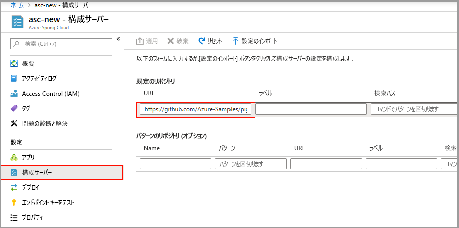

# <a name="quickstart-launch-an-azure-spring-cloud-application-using-the-azure-portal"></a>クイック スタート:Azure portal を使用して Azure Spring Cloud アプリケーションを起動する

Azure Spring Cloud では、Spring Cloud ベースのマイクロサービス アプリケーションを Azure で簡単に実行できます。

このクイックスタートでは、既存の Spring Cloud アプリケーションを Azure にデプロイする方法について説明します。 このチュートリアルで使用されるサンプル アプリケーション コードの[リンクはこちら](https://github.com/Azure-Samples/PiggyMetrics)です。 完了すると、準備したサンプル アプリケーションにオンラインでアクセスできるようになり、Azure portal で管理できるようになります。

このクイックスタートでは、次の方法について説明します。

> [!div class="checklist"]
> * サービス インスタンスをプロビジョニングする
> * インスタンスに構成サーバーを設定する
> * マイクロサービス アプリケーションをローカルにビルドする
> * 各マイクロサービスをデプロイする
> * アプリケーションのパブリック エンドポイントを割り当てる

## <a name="prerequisites"></a>前提条件

>[!Note]
> このクイックスタートを開始する前に、ご利用の Azure サブスクリプションで Azure Spring Cloud にアクセスできることを確認してください。  プレビュー サービスでは、お客様のサブスクリプションをこちらで許可リストに追加できるように、ご連絡いただくことをお願いしています。  Azure Spring Cloud の機能を実際に使われたい場合は、メールで azure-spring-cloud@service.microsoft.com までお問い合わせください。

>[!TIP]
> Azure Cloud Shell は無料のインタラクティブ シェルです。この記事の手順は、Azure Cloud Shell を使って実行することができます。  最新バージョンの Git、JDK、Maven、Azure CLI など、一般的な Azure ツールがプレインストールされています。 Azure サブスクリプションにログインしている場合は、shell.azure.com から [Azure Cloud Shell](https://shell.azure.com) を起動します。  Azure Cloud Shell の詳細については、[ドキュメントを参照](../cloud-shell/overview.md)してください

このクイック スタートを完了するには、以下が必要です。

1. [Git をインストールする](https://git-scm.com/)
2. [JDK 8 をインストールする](https://docs.microsoft.com/java/azure/jdk/?view=azure-java-stable)
3. [Maven 3.0 以上をインストールする](https://maven.apache.org/download.cgi)
4. [Azure CLI のインストール](https://docs.microsoft.com/cli/azure/install-azure-cli?view=azure-cli-latest)
5. [Azure サブスクリプションにサインアップする](https://azure.microsoft.com/free/)

## <a name="install-the-azure-cli-extension"></a>Azure CLI 拡張機能をインストールする

次のコマンドを使用して、Azure CLI 用の Azure Spring Cloud 拡張機能をインストールします

```Azure CLI
az extension add -y --source https://azureclitemp.blob.core.windows.net/spring-cloud/spring_cloud-0.1.0-py2.py3-none-any.whl
```

## <a name="provision-a-service-instance-on-the-azure-portal"></a>Azure portal でサービス インスタンスをプロビジョニングする

1. Web ブラウザーで、[Azure portal の Azure Spring Cloud へのこのリンク](https://ms.portal.azure.com/?microsoft_azure_marketplace_ItemHideKey=AppPlatformExtension#blade/Microsoft_Azure_Marketplace/MarketplaceOffersBlade/selectedMenuItemId/home/searchQuery/Azure%20Spring%20Cloud)を開きます。

    

1. **[Azure Spring Cloud]** を選択して概要ページに移動します。 次に、 **[作成]** を選択して、作業を開始します。

1. 以下のガイドラインを考慮して、フォームに入力します。
    - サービス名:自分のサービス インスタンスの名前を指定します。  名前の長さは 4 文字から 32 文字で、小文字、数字、およびハイフンのみを使用できます。  サービス名の最初の文字は英字でなければならず、最後の文字は英字または数字でなければなりません。
    - サブスクリプション:このリソースに対する課金用のサブスクリプションを選択します。  そのサブスクリプションが Microsoft 側で Azure Spring Cloud の許可リストに追加されていることを確認してください。
    - リソース グループ: 新しいリソース用に新しいリソース グループを作成することをお勧めします。
    - 場所:自分のサービス インスタンスの場所を選択します。 現在サポートされている場所は、米国東部、米国西部 2、西ヨーロッパ、東南アジアなどです。
    
サービスのデプロイには約 5 分かかります。  デプロイされると、サービス インスタンスの **[概要]** ページが表示されます。

## <a name="set-up-your-configuration-server"></a>構成サーバーを設定する

1. サービスの **[概要]** ページに移動し、 **[Config Server]\(構成サーバー\)** を選択します。

1. **[既定のリポジトリ]** セクションで **[URI]** を "https://github.com/Azure-Samples/piggymetrics" に設定し、 **[ラベル]** を "構成" に設定して、 **[適用]** を選択し、変更を保存します。

    

## <a name="build-and-deploy-microservice-applications"></a>マイクロサービス アプリケーションのビルドとデプロイ

1. コマンド ウィンドウを開き、次のコマンドを実行して、サンプル アプリのリポジトリをローカル コンピューターに複製します。

    ```cli
    git clone https://github.com/Azure-Samples/piggymetrics
    ```

1. 次のコマンドを実行してプロジェクトをビルドします。

    ```cli
    cd PiggyMetrics
    mvn clean package -DskipTests
    ```

1. Azure CLI にログインし、アクティブなサブスクリプションを設定します。

    ```cli
    # Login to Azure CLI
    az login

    # List all subscriptions
    az account list -o table

    # Set active subscription
    az account set --subscription <target subscription ID>
    ```

1. リソース グループとサービスに名前を割り当てます。 次のプレースホルダーは、このチュートリアルで前にプロビジョニングしたリソース グループ名とサービス名で置き換えます。

    ```azurecli
    az configure --defaults group=<resource group name>
    az configure --defaults spring-cloud=<service instance name>
    ```

1. `gateway` アプリケーションを作成し、JAR ファイルをデプロイします。

    ```azurecli
    az spring-cloud app create -n gateway
    az spring-cloud app deploy -n gateway --jar-path ./gateway/target/gateway.jar
    ```

1. 同じパターンに従い、`account-service` および `auth-service` アプリケーションを作成し、JAR ファイルをデプロイします。

    ```cli
    az spring-cloud app create -n account-service
    az spring-cloud app deploy -n account-service --jar-path ./account-service/target/account-service.jar
    az spring-cloud app create -n auth-service
    az spring-cloud app deploy -n auth-service --jar-path ./auth-service/target/auth-service.jar
    ```

1. アプリケーションのデプロイが完了するまでに数分かかります。 デプロイが完了したことを確認するには、Azure portal で **[アプリ]** ブレードに移動します。 3 つのアプリケーションのそれぞれに 1 行が表示されます。

## <a name="assign-a-public-endpoint-to-gateway"></a>ゲートウェイにパブリック エンドポイントを割り当てる

1. 左側のメニューの **[アプリ]** タブをクリックします。
2. `gateway` アプリケーションを選択して、 **[概要]** ページを表示します。
3. **[Assign Domain]\(ドメインの割り当て\)** を選択して、ゲートウェイにパブリック エンドポイントを割り当てます。 これには数分かかることがあります。

    

1. 実行中のアプリケーションを表示するには、割り当てられたパブリック エンドポイント (**URL** のラベルが付いています) をブラウザーに入力します。

    


## <a name="next-steps"></a>次の手順

このクイック スタートでは、次の方法について説明しました。

> [!div class="checklist"]
> * サービス インスタンスをプロビジョニングする
> * インスタンスに構成サーバーを設定する
> * マイクロサービス アプリケーションをローカルにビルドする
> * 各マイクロサービスをデプロイする
> * アプリケーション ゲートウェイのパブリック エンドポイントを割り当てる

> [!div class="nextstepaction"]
> [Azure Spring Cloud アプリケーションをデプロイ用に準備する](spring-cloud-tutorial-prepare-app-deployment.md)
