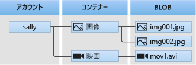

# <a name="quickstart-azure-blob-storage-client-library-v12-for-net"></a>クイック スタート:.NET 用 Azure Blob Storage クライアント ライブラリ v12

.NET 用 Azure Blob Storage クライアント ライブラリ v12 を使用してみましょう。 Azure Blob Storage は、Microsoft のクラウド用オブジェクト ストレージ ソリューションです。 手順に従ってパッケージをインストールし、基本タスクのコード例を試してみましょう。 Blob Storage は、テキスト データやバイナリ データなどの大量の非構造化データを格納するために最適化されています。

> [!NOTE]
> 以前の SDK バージョンを使ってみるには、「[クイックスタート: .NET 用 Azure Blob Storage クライアント ライブラリ](storage-quickstart-blobs-dotnet-legacy.md)」を参照してください。

.NET 用 Azure Blob Storage クライアント ライブラリ v12 を使用すると、以下のことができます。

* コンテナーを作成する
* Azure Storage へ BLOB をアップロードする
* コンテナー内のすべての BLOB を一覧表示する
* ローカル コンピューターに BLOB をダウンロードする
* コンテナーを削除する

[API のリファレンスのドキュメント](/dotnet/api/azure.storage.blobs) | [ライブラリのソース コード](https://github.com/Azure/azure-sdk-for-net/tree/master/sdk/storage/Azure.Storage.Blobs) | [パッケージ (NuGet)](https://www.nuget.org/packages/Azure.Storage.Blobs) | [サンプル](https://docs.microsoft.com/azure/storage/common/storage-samples-dotnet?toc=%2fazure%2fstorage%2fblobs%2ftoc.json#blob-samples)

[!INCLUDE [storage-multi-protocol-access-preview](../../../includes/storage-multi-protocol-access-preview.md)]

## <a name="prerequisites"></a>前提条件

* Azure サブスクリプション - [無料アカウントを作成する](https://azure.microsoft.com/free/)
* Azure Storage アカウント - [ストレージ アカウントの作成](https://docs.microsoft.com/azure/storage/common/storage-quickstart-create-account)
* 使用するオペレーティング システム用の最新の [.NET Core SDK](https://dotnet.microsoft.com/download/dotnet-core)。 ランタイムではなく、必ず SDK を入手してください。

## <a name="setting-up"></a>設定

このセクションでは、.NET 用 Azure Blob Storage クライアント ライブラリ v12 を操作するためのプロジェクトの準備について説明します。

### <a name="create-the-project"></a>プロジェクトを作成する

*BlobQuickstartV12* という名前の .NET Core アプリケーションを作成します。

1. コンソール ウィンドウ (cmd、PowerShell、Bash など) 上で、`dotnet new` コマンドを使用し、*BlobQuickstartV12* という名前の新しいコンソール アプリを作成します。 このコマンドにより、1 つのソース ファイルを使用する単純な "Hello World" C# プロジェクトが作成されます。*Program.cs*。

   ```console
   dotnet new console -n BlobQuickstartV12
   ```

1. 新しく作成した *BlobQuickstartV12* ディレクトリに切り替えます。

   ```console
   cd BlobQuickstartV12
   ```

1. *BlobQuickstartV12* ディレクトリ内に、*data* という別のディレクトリを作成します。 BLOB データ ファイルは、ここに作成され格納されます。

    ```console
    mkdir data
    ```

### <a name="install-the-package"></a>パッケージをインストールする

まだアプリケーション ディレクトリにいる間に、`dotnet add package` コマンドを使用して、.NET 用の Azure Blob Storage クライアント ライブラリ パッケージをインストールします。

```console
dotnet add package Azure.Storage.Blobs
```

### <a name="set-up-the-app-framework"></a>アプリのフレームワークを設定する

プロジェクト ディレクトリで次の操作を行います。

1. ご使用のエディターで *Program.cs* ファイルを開きます
1. `Console.WriteLine("Hello World!");` ステートメントを削除します
1. `using` ディレクティブを追加します
1. 非同期コードをサポートするように `Main` メソッドの宣言を更新します

コードは次のとおりです。

```csharp
using Azure.Storage.Blobs;
using Azure.Storage.Blobs.Models;
using System;
using System.IO;
using System.Threading.Tasks;

namespace BlobQuickstartV12
{
    class Program
    {
        static async Task Main()
        {
        }
    }
}
```

[!INCLUDE [storage-quickstart-credentials-include](../../../includes/storage-quickstart-credentials-include.md)]

## <a name="object-model"></a>オブジェクト モデル

Azure Blob Storage は、大量の非構造化データを格納するために最適化されています。 非構造化データとは、特定のデータ モデルや定義に従っていないデータであり、テキスト データやバイナリ データなどがあります。 Blob Storage には、3 種類のリソースがあります。

* ストレージ アカウント
* ストレージ アカウント内のコンテナー
* コンテナー内の BLOB

次の図に、これらのリソースの関係を示します。



これらのリソースとやり取りするには、以下の .NET クラスを使用します。

* [BlobServiceClient](/dotnet/api/azure.storage.blobs.blobserviceclient):`BlobServiceClient` クラスを使用して、Azure Storage リソースと BLOB コンテナーを操作できます。
* [BlobContainerClient](/dotnet/api/azure.storage.blobs.blobcontainerclient):`BlobContainerClient` クラスを使用して、Azure Storage コンテナーとその BLOB を操作できます。
* [BlobClient](/dotnet/api/azure.storage.blobs.blobclient):`BlobClient` クラスを使用して、Azure Storage BLOB を操作できます。
* [BlobDownloadInfo](/dotnet/api/azure.storage.blobs.models.blobdownloadinfo):`BlobDownloadInfo` クラスは、BLOB のダウンロードによって返されるプロパティとコンテンツを表します。

## <a name="code-examples"></a>コード例

以下のサンプル コード スニペットは、.NET 用 Azure Blob Storage クライアント ライブラリを使用して以下を実行する方法を示します。

* [接続文字列を取得する](#get-the-connection-string)
* [コンテナーの作成](#create-a-container)
* [コンテナーに BLOB をアップロードする](#upload-blobs-to-a-container)
* [コンテナー内の BLOB を一覧表示する](#list-the-blobs-in-a-container)
* [BLOB をダウンロードする](#download-blobs)
* [コンテナーの削除](#delete-a-container)

### <a name="get-the-connection-string"></a>接続文字列を取得する

以下のコードでは、「[ストレージ接続文字列の構成](#configure-your-storage-connection-string)」セクションで作成した環境変数から、ストレージ アカウントに対する接続文字列を取得します。

このコードを `Main` メソッド内に追加します。

```csharp
Console.WriteLine("Azure Blob storage v12 - .NET quickstart sample\n");

// Retrieve the connection string for use with the application. The storage
// connection string is stored in an environment variable on the machine
// running the application called AZURE_STORAGE_CONNECTION_STRING. If the
// environment variable is created after the application is launched in a
// console or with Visual Studio, the shell or application needs to be closed
// and reloaded to take the environment variable into account.
string connectionString = Environment.GetEnvironmentVariable("AZURE_STORAGE_CONNECTION_STRING");
```

### <a name="create-a-container"></a>コンテナーを作成する

新しいコンテナーの名前を決定します。 次のコードでは、確実に一意になるように、コンテナー名に GUID 値を追加します。

> [!IMPORTANT]
> コンテナーの名前は小文字にする必要があります。 コンテナーと BLOB の名前付けの詳細については、「[Naming and Referencing Containers, Blobs, and Metadata (コンテナー、BLOB、メタデータの名前付けと参照)](/rest/api/storageservices/naming-and-referencing-containers--blobs--and-metadata)」を参照してください。

[BlobServiceClient](/dotnet/api/azure.storage.blobs.blobserviceclient) クラスのインスタンスを作成します。 次に、[CreateBlobContainerAsync](/dotnet/api/azure.storage.blobs.blobserviceclient.createblobcontainerasync) メソッドを呼び出して、ストレージ アカウントにコンテナーを作成します。

`Main` メソッドの末尾に次のコードを追加します。

```csharp
// Create a BlobServiceClient object which will be used to create a container client
BlobServiceClient blobServiceClient = new BlobServiceClient(connectionString);

//Create a unique name for the container
string containerName = "quickstartblobs" + Guid.NewGuid().ToString();

// Create the container and return a container client object
BlobContainerClient containerClient = await blobServiceClient.CreateBlobContainerAsync(containerName);
```

### <a name="upload-blobs-to-a-container"></a>コンテナーに BLOB をアップロードする

次のコード スニペット:

1. ローカルの *data* ディレクトリにテキスト ファイルを作成します。
1. 「[コンテナーを作成する](#create-a-container)」セクションからのコンテナー上で [GetBlobClient](/dotnet/api/azure.storage.blobs.blobcontainerclient.getblobclient) メソッドを呼び出すことで、[BlobClient](/dotnet/api/azure.storage.blobs.blobclient) オブジェクトへの参照を取得します。
1. [UploadAsync](/dotnet/api/azure.storage.blobs.blobclient.uploadasync#Azure_Storage_Blobs_BlobClient_UploadAsync_System_IO_Stream_System_Boolean_System_Threading_CancellationToken_) メソッドを呼び出して、ローカル テキスト ファイルを BLOB にアップロードします。 このメソッドは、BLOB がまだ存在しない場合は作成し、既に存在する場合は上書きします。

`Main` メソッドの末尾に次のコードを追加します。

```csharp
// Create a local file in the ./data/ directory for uploading and downloading
string localPath = "./data/";
string fileName = "quickstart" + Guid.NewGuid().ToString() + ".txt";
string localFilePath = Path.Combine(localPath, fileName);

// Write text to the file
await File.WriteAllTextAsync(localFilePath, "Hello, World!");

// Get a reference to a blob
BlobClient blobClient = containerClient.GetBlobClient(fileName);

Console.WriteLine("Uploading to Blob storage as blob:\n\t {0}\n", blobClient.Uri);

// Open the file and upload its data
using FileStream uploadFileStream = File.OpenRead(localFilePath);
await blobClient.UploadAsync(uploadFileStream, true);
uploadFileStream.Close();
```

### <a name="list-the-blobs-in-a-container"></a>コンテナー内の BLOB を一覧表示する

[GetBlobsAsync](/dotnet/api/azure.storage.blobs.blobcontainerclient.getblobsasync) メソッドを呼び出して、コンテナー内の BLOB を一覧表示します。 この場合、コンテナーに BLOB が 1 つだけ追加されているので、一覧表示操作ではその 1 つの BLOB だけが返されます。

`Main` メソッドの末尾に次のコードを追加します。

```csharp
Console.WriteLine("Listing blobs...");

// List all blobs in the container
await foreach (BlobItem blobItem in containerClient.GetBlobsAsync())
{
    Console.WriteLine("\t" + blobItem.Name);
}
```

### <a name="download-blobs"></a>BLOB をダウンロードする

[DownloadAsync](/dotnet/api/azure.storage.blobs.specialized.blobbaseclient.downloadasync) メソッドを呼び出して、以前に作成した BLOB をダウンロードします。 サンプル コードは、ローカル ファイル システム内で両方のファイルを見ることができるように、ファイル名に "DOWNLOADED" というサフィックスを追加します。

`Main` メソッドの末尾に次のコードを追加します。

```csharp
// Download the blob to a local file
// Append the string "DOWNLOAD" before the .txt extension 
// so you can compare the files in the data directory
string downloadFilePath = localFilePath.Replace(".txt", "DOWNLOAD.txt");

Console.WriteLine("\nDownloading blob to\n\t{0}\n", downloadFilePath);

// Download the blob's contents and save it to a file
BlobDownloadInfo download = await blobClient.DownloadAsync();

using (FileStream downloadFileStream = File.OpenWrite(downloadFilePath))
{
    await download.Content.CopyToAsync(downloadFileStream);
    downloadFileStream.Close();
}
```

### <a name="delete-a-container"></a>コンテナーを削除する

次のコードでは、[DeleteAsync](/dotnet/api/microsoft.azure.storage.blob.cloudblobcontainer.deleteasync) を使用してコンテナー全体を削除することで、アプリによって作成されたリソースをクリーンアップします。 また、アプリによって作成されたローカル ファイルも削除します。

アプリでは、BLOB、コンテナー、およびローカル ファイルを削除する前に、`Console.ReadLine` を呼び出すことで、ユーザーの入力を一時停止します。 このとき、リソースが削除される前に、実際に正しく作成されたことを確認できます。

`Main` メソッドの末尾に次のコードを追加します。

```csharp
// Clean up
Console.Write("Press any key to begin clean up");
Console.ReadLine();

Console.WriteLine("Deleting blob container...");
await containerClient.DeleteAsync();

Console.WriteLine("Deleting the local source and downloaded files...");
File.Delete(localFilePath);
File.Delete(downloadFilePath);

Console.WriteLine("Done");
```

## <a name="run-the-code"></a>コードの実行

このアプリでは、ローカルの *data* フォルダーにテスト ファイルが作成され、BLOB ストレージにアップロードされます。 次に、コンテナー内の BLOB を一覧表示し、ファイルを新しい名前でダウンロードして、古いファイルと新しいファイルを比較できるようにします。

お使いのアプリケーションのディレクトリに移動し、アプリケーションをビルドして実行します。

```console
dotnet build
```

```console
dotnet run
```

アプリの出力は、次の例のようになります。

```output
Azure Blob storage v12 - .NET quickstart sample

Uploading to Blob storage as blob:
         https://mystorageacct.blob.core.windows.net/quickstartblobs60c70d78-8d93-43ae-954d-8322058cfd64/quickstart2fe6c5b4-7918-46cb-96f4-8c4c5cb2fd31.txt

Listing blobs...
        quickstart2fe6c5b4-7918-46cb-96f4-8c4c5cb2fd31.txt

Downloading blob to
        ./data/quickstart2fe6c5b4-7918-46cb-96f4-8c4c5cb2fd31DOWNLOADED.txt

Press any key to begin clean up
Deleting blob container...
Deleting the local source and downloaded files...
Done
```

クリーンアップ プロセスを開始する前に、*data* フォルダー内の 2 つのファイルをチェックします。 それらを開いて、同じであるかどうかを確認します。

ファイルを確認した後、**Enter** キーを押してテスト ファイルを削除し、デモを終了します。

## <a name="next-steps"></a>次のステップ

このクイック スタートでは、.NET を使用して BLOB をアップロード、ダウンロード、および一覧表示する方法について説明しました。

BLOB ストレージのサンプル アプリを確認するには、以下に進んでください。

> [!div class="nextstepaction"]
> [Azure BLOB ストレージ SDK v12 の .NET サンプル](https://github.com/Azure/azure-sdk-for-net/tree/master/sdk/storage/Azure.Storage.Blobs/samples)

* チュートリアル、サンプル、クイックスタートなどのドキュメントについては、「[.NET および .NET Core 開発者向けの Azure](/dotnet/azure/)」を参照してください。
* .NET Core の詳細については、「[Get started with .NET in 10 minutes (10 分で .NET を使い始める)](https://www.microsoft.com/net/learn/get-started/)」を参照してください。
