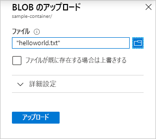

# クイック スタート: Azure portal を使用して BLOB をアップロード、ダウンロード、および一覧表示する

このクイックスタートでは、[Azure Portal](https://portal.azure.com/) を使用して、Asure Storage 内にコンテナーを作成したり、そのコンテナー内のブロック BLOB をアップロードおよびダウンロードしたりする方法を説明します。

## 前提条件

[!INCLUDE [storage-quickstart-prereq-include](../../../includes/storage-quickstart-prereq-include.md)]

## コンテナーを作成する

Azure Portal でコンテナーを作成するには、次の手順に従います。

1. Azure Portal で新しいストレージ アカウントに移動します。
2. ストレージ アカウントの左側のメニューで、 **[Blob service]** セクションまでスクロールしてから、 **[コンテナー]** を選択します。
3. **[+ コンテナー]** ボタンを選択します。
4. 新しいコンテナーの名前を入力します。 コンテナー名は小文字である必要があり、英文字または数字で始まる必要があり、英文字、数字、ダッシュ (-) 文字のみを含めることができます。 コンテナーと BLOB の名前の詳細については、「[Naming and referencing containers, blobs, and metadata (コンテナー、BLOB、およびメタデータの名前付けと参照)](https://docs.microsoft.com/rest/api/storageservices/naming-and-referencing-containers--blobs--and-metadata)」を参照してください。
5. コンテナーにパブリック アクセスのレベルを設定します。 既定のレベルは **[ プライベート (匿名アクセスなし)]** です。
6. **[OK]** を選択してコンテナーを作成します。

    

## ブロック BLOB をアップロードする

ブロック BLOB は、BLOB を作成するためにまとめられたデータのブロックで構成されます。 Blob ストレージを使用するほとんどのシナリオでは、ブロック BLOB を使用します。 ブロック BLOB は、クラウドでファイル、画像、およびビデオのようなテキストやバイナリ データを格納するために最適です。 このクイックスタートでは、ブロック BLOB を使用する方法を示します。 

Azure Portal で新しいコンテナーにブロック BLOB をアップロードするには、次の手順に従います。

1. Azure Portal で、前のセクションで作成したコンテナーに移動します。
2. コンテナーを選択して、それに含まれている BLOB の一覧を表示します。 このコンテナーは新しいため、BLOB はまだ含まれていません。
3. **[アップロード]** ボタンを選択してアップロード ブレードを開きます。
4. ローカル ファイル システムを参照して、ブロック BLOB としてアップロードするファイルを見つけます。
     
    

5. 必要に応じて詳細セクションを展開し、他の設定 (認証の種類、アクセス レベル、仮想フォルダーのパスなど) を定義することもできます。
6. **[アップロード]** ボタンを選択してアップロードをコミットします。
7. この方法で、希望する数の BLOB をアップロードします。 これで新しい BLOB がコンテナー内で一覧表示されていることを確認できます。

## ブロック BLOB をダウンロードする

ブロック BLOB をダウンロードして、ブラウザーで表示したり、ローカル ファイル システムに保存したりできます。 ブロック BLOB をダウンロードするには、次の手順に従います。

1. 前のセクションでアップロードした BLOB の一覧に移動します。 
2. ダウンロードする BLOB を右クリックし、 **[ダウンロード]** を選択します。 

## リソースをクリーンアップする

このクイック スタートで作成したリソースを削除するには、コンテナーを削除します。 コンテナー内のすべての BLOB も削除されます。

コンテナーを削除するには:

1. Azure Portal でストレージ アカウント内のコンテナーの一覧に移動します。
2. 削除するコンテナーを選択します。
3. **[詳細]** ボタン ( **[...]** ) を選択し、 **[削除]** を選択します。
4. コンテナーを削除することを確認します。

## 次のステップ

このクイック スタートでは、Azure portal を使ってローカル ディスクと Azure Blob Storage との間でファイルを転送する方法について学習しました。 Blob Storage の操作の詳細を学習するには、Blob Storage の操作方法に進みます。

> [!div class="nextstepaction"]
> [Blob Storage の操作方法](storage-dotnet-how-to-use-blobs.md)

