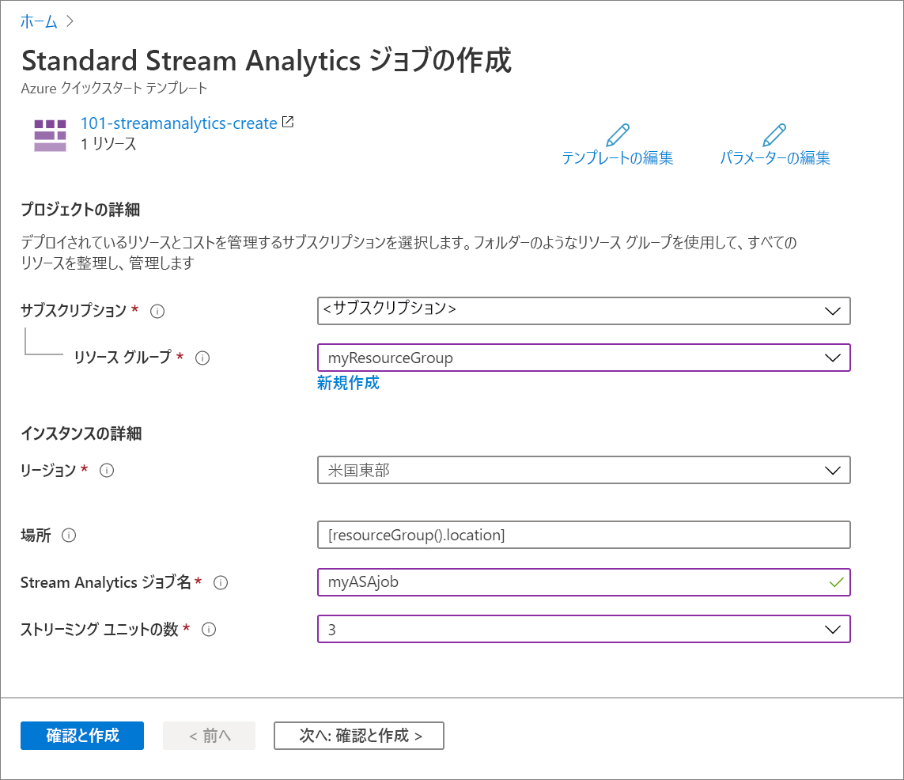

# <a name="quickstart-create-an-azure-stream-analytics-job-by-using-the-azure-resource-manager-template"></a>クイック スタート:Azure Resource Manager テンプレートで Azure Stream Analytics ジョブを作成する

このクイックスタートでは、Azure Resource Manager テンプレートを使用して、Azure Stream Analytics ジョブを作成します。 ジョブの作成後、デプロイを検証します。

[!INCLUDE [About Azure Resource Manager](../../includes/resource-manager-quickstart-introduction.md)]

## <a name="prerequisites"></a>前提条件

この記事を完了するには、以下が必要です。

* Azure サブスクリプションがあること - [無料アカウントを作成します](https://azure.microsoft.com/free/)。

## <a name="create-an-azure-stream-analytics-job"></a>Azure Stream Analytics ジョブの作成

### <a name="review-the-template"></a>テンプレートを確認する

このクイックスタートで使用されるテンプレートは [Azure クイックスタート テンプレート](https://azure.microsoft.com/resources/templates/101-streamanalytics-create/)からのものです。

:::code language="json" source="~/quickstart-templates/101-streamanalytics-create/azuredeploy.json" range="1-66" highlight="41-60":::

テンプレートで定義されている Azure リソースは [Microsoft.StreamAnalytics/StreamingJobs](/azure/templates/microsoft.streamanalytics/streamingjobs) です。つまり Azure Stream Analytics ジョブを作成します。

### <a name="deploy-the-template"></a>テンプレートのデプロイ

このセクションでは、Azure Resource Manager テンプレートを使って Azure Stream Analytics ジョブを作成します。

1. Azure にサインインし、テンプレートを開くには次のイメージを選択します。 テンプレートによって Azure Stream Analytics ジョブが作成されます。

   [](https://portal.azure.com/#create/Microsoft.Template/uri/https%3A%2F%2Fraw.githubusercontent.com%2FAzure%2Fazure-quickstart-templates%2Fmaster%2F101-streamanalytics-create%2Fazuredeploy.json)

2. Azure Stream Analytics ジョブを作成するために必要な値を入力します。

   

   次の値を指定します。

   |プロパティ  |説明  |
   |---------|---------|
   |**サブスクリプション**     | ドロップダウンから Azure サブスクリプションを選択します。        |
   |**リソース グループ**     | 新しいリソース グループを作成するか、既存のリソース グループを使用するかを指定します。 リソース グループは、Azure ソリューションの関連するリソースを保持するコンテナーです。 詳しくは、[Azure リソース グループの概要](../azure-resource-manager/management/overview.md)に関するページをご覧ください。 |
   |**リージョン**     | **[米国東部]** を選択します。 使用可能な他のリージョンについては、「[リージョン別の利用可能な製品](https://azure.microsoft.com/regions/services/)」をご覧ください。        |
   |**Stream Analytics ジョブ名**     | Stream Analytics ジョブの名前を指定します。      |
   |**ストリーミング ユニットの数**     |  必要なストリーミング ユニット数を選択します。 詳細については、「[ストリーミング ユニットの理解と調整](stream-analytics-streaming-unit-consumption.md)」をご覧ください。       |

3. **[確認および作成]** 、 **[作成]** の順に選択します。

## <a name="review-deployed-resources"></a>デプロイされているリソースを確認する

Azure portal を使用して Azure Stream Analytics ジョブを確認するか、次の Azure CLI または Azure PowerShell スクリプトを使用してリソースを一覧表示できます。

### <a name="azure-cli"></a>Azure CLI

```azurecli-interactive
echo "Enter your Azure Stream Analytics job name:" &&
read streamAnalyticsJobName &&
echo "Enter the resource group where the Azure Stream Analytics job exists:" &&
read resourcegroupName &&
az stream-analytics job show -g $resourcegroupName -n $streamAnalyticsJobName
```

### <a name="azure-powershell"></a>Azure PowerShell

```azurepowershell-interactive
$resourceGroupName = Read-Host -Prompt "Enter the resource group name where your Azure Stream Analytics job exists"
(Get-AzResource -ResourceType "Microsoft.StreamAnalytics/StreamingJobs" -ResourceGroupName $resourceGroupName).Name
 Write-Host "Press [ENTER] to continue..."
```

## <a name="clean-up-resources"></a>リソースをクリーンアップする

引き続き後続のチュートリアルに進む場合は、これらのリソースをそのまま残しておくことをお勧めします。 不要になったら、リソース グループを削除してください。リソース グループを削除すれば、Azure Stream Analytics ジョブが削除されます。 Azure CLI または Azure PowerShell を使用してリソース グループを削除するには、次を実行します。

### <a name="azure-cli"></a>Azure CLI

```azurecli-interactive
echo "Enter the Resource Group name:" &&
read resourceGroupName &&
az group delete --name $resourceGroupName &&
echo "Press [ENTER] to continue ..."
```

### <a name="azure-powershell"></a>Azure PowerShell

```azurepowershell-interactive
$resourceGroupName = Read-Host -Prompt "Enter the Resource Group name"
Remove-AzResourceGroup -Name $resourceGroupName
Write-Host "Press [ENTER] to continue..."
```

## <a name="next-steps"></a>次のステップ

このクイックスタートでは、Azure Resource Manager テンプレートを使用して Azure Stream Analytics ジョブを作成し、デプロイを検証しました。 次の記事に進み、VS Code を使用して、既存のジョブの Azure Resource Manager テンプレートをエクスポートする方法について学習してください。

> [!div class="nextstepaction"]
> [Azure Stream Analytics ジョブの Azure Resource Manager テンプレートをエクスポートする](resource-manager-export.md)
