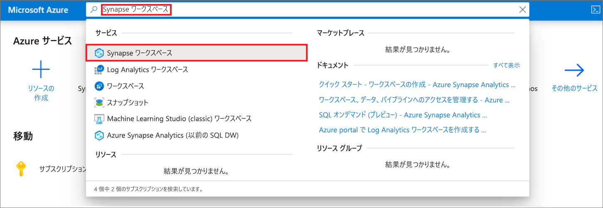
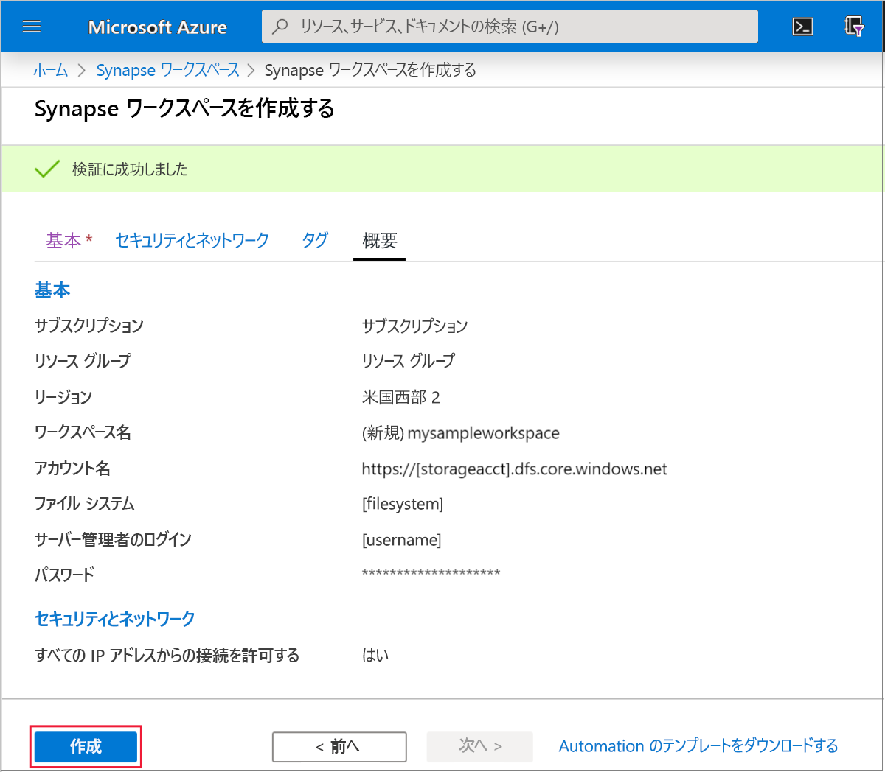
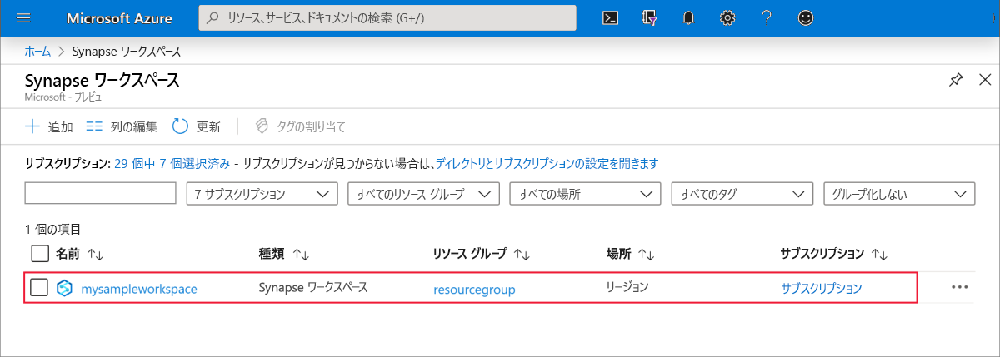
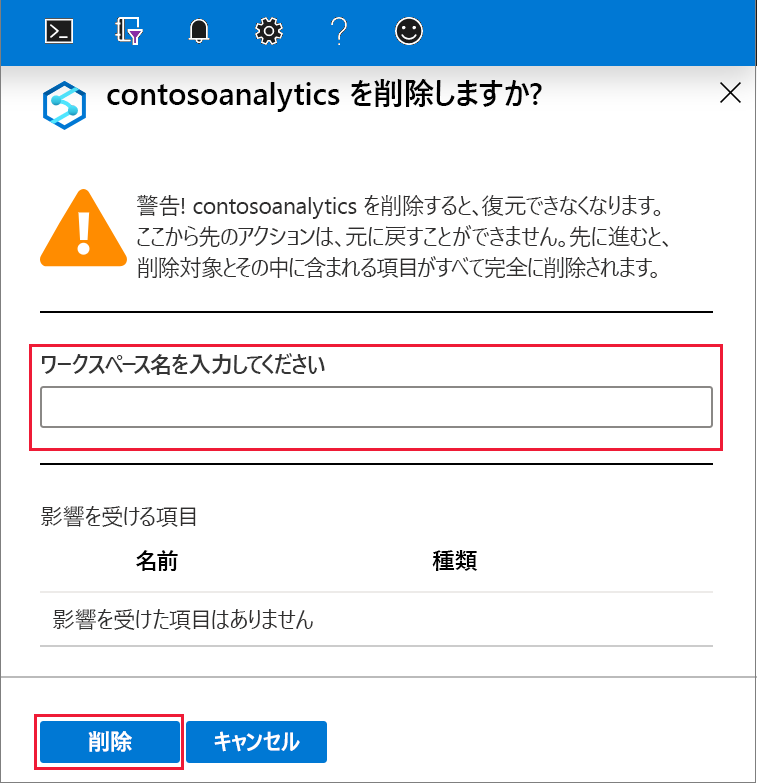

# クイック スタート:Azure Synapse Analytics ワークスペースを作成する (プレビュー)

このクイックスタートでは、Azure portal を使用して Azure Synapse ワークスペースを作成する手順について説明します。

Azure サブスクリプションをお持ちでない場合は、[開始する前に無料アカウントを作成](https://azure.microsoft.com/free/)してください。

## 前提条件

- [Azure Data Lake Storage Gen2 ストレージ アカウント](../storage/common/storage-account-create.md?toc=/azure/synapse-analytics/toc.json&bc=/azure/synapse-analytics/breadcrumb/toc.json)

## Azure Synapse リソース プロバイダーを登録する
まだ登録していない場合、Azure Synapse リソース プロバイダーを登録します。 リソース プロバイダーの登録によって、サブスクリプションがリソース プロバイダーと連携するように構成されます。 Azure Synapse リソース プロバイダーを登録するには、[Azure リソース プロバイダーと種類](https://docs.microsoft.com/azure/azure-resource-manager/management/resource-providers-and-types)に関するページを参照してください。 登録時にリソース プロバイダーの一覧から *Microsoft.Synapse* を選択します。

## Azure portal にサインインする

[Azure ポータル](https://portal.azure.com/)

## Azure portal を使用して Azure Synapse ワークスペースを作成する

1. Microsoft Azure の検索ペインで「**Synapse ワークスペース**」と入力し、このサービスを選択します。

2. **[Synapse ワークスペース]** ページで、 **[+ 追加]** をクリックします。

3. **Azure Synapse ワークスペース**のフォームに次の情報を入力します。

    | 設定 | 推奨値 | 説明 |
    | :------ | :-------------- | :---------- |
    | **サブスクリプション** | *該当するサブスクリプション* | サブスクリプションの詳細については、[サブスクリプション](https://account.windowsazure.com/Subscriptions)に関するページを参照してください。 |
    | **リソース グループ** | "*任意のリソース グループ*" | 有効なリソース グループ名については、[名前付け規則と制限](/azure/architecture/best-practices/resource-naming?toc=/azure/synapse-analytics/toc.json&bc=/azure/synapse-analytics/breadcrumb/toc.json&view=azure-sqldw-latest)に関するページを参照してください。 |
    | **ワークスペース名** | mysampleworkspace | ワークスペースの名前を指定します。これは、接続エンドポイントにも使用されます。|
    | **リージョン** | 米国東部 2 | ワークスペースの場所を指定します。|
    | **Data Lake Storage Gen2** | アカウント: `storage account name`   ファイルシステム: `root file system to use` | プライマリ ストレージとして使用する ADLS Gen2 ストレージ アカウント名と、使用するファイルシステムを指定します。|
    ||||

    ![ワークスペースのプロビジョニング フロー - [基本] タブ。](media/quickstart-create-synapse-workspace/create-workspace-03.png)

    ストレージ アカウントは以下から選択できます。
    - お使いのサブスクリプションで使用可能な ADLS Gen2 アカウントの一覧
    - アカウント名を使用して手動で入力

    > [!IMPORTANT]
    > Azure Synapse ワークスペースは、選択した ADLS Gen2 アカウントの読み取りと書き込みを行うことができる必要があります。 加えて、プライマリ ストレージ アカウントとしてリンクするストレージ アカウントについては、その作成時に**階層型名前空間**を有効にする必要があります。
    >
    > ADLS Gen2 選択フィールドの下に、選択した Data Lake Storage Gen2 ファイル システムに対する**ストレージ BLOB データ共同作成者**ロールがワークスペースのマネージド ID に割り当てられ、完全なアクセスが許可される旨が表示されます。

4. (オプション) **[Security + networking]\(セキュリティとネットワーク\)** タブで、任意の変更を行います。
5. (オプション) **[タグ]** タブで、任意のタグを追加します。
6. **[Summary]\(概要\)** タブで必要な検証を実行して、ワークスペースを正常に作成できることを確認します。 検証が正常に完了したら、 **[作成]** を押します 
7. リソースのプロビジョニング プロセスが正常に完了すると、Synapse ワークスペースの一覧に、作成されたワークスペースのエントリが表示されます。 

## リソースをクリーンアップする

次の手順に従って、Azure Synapse ワークスペースを削除します。
> [!WARNING]
> Azure Synapse ワークスペースを削除すると、分析エンジンと、含まれている SQL プールとワークスペース メタデータのデータベースに格納されているデータが削除されます。 SQL エンドポイント、Apache Spark エンドポイントに接続できなくなります。 すべてのコード成果物が削除されます (クエリ、ノートブック、ジョブ定義、およびパイプライン)。
>
> ワークスペースを削除しても、そのワークスペースにリンクされている Data Lake Store Gen2 のデータには影響**しません**。

Azure Synapse ワークスペースを削除する場合は、次の手順を実行します。

1. 削除する Azure Synapse ワークスペースに移動します。
1. コマンド バーの **[削除]** を押します。
 ![Azure Synapse ワークスペースの概要 - [削除] コマンドが強調表示されています。](media/quickstart-create-synapse-workspace/create-workspace-10.png)
1. 削除を確認し、 **[削除]** ボタンを押します。
 
1. プロセスが正常に完了すると、Azure Synapse ワークスペースはワークスペースの一覧に表示されなくなります。

## 次のステップ

次に、データの分析と探索を開始するために、[SQL プールを作成](quickstart-create-sql-pool-studio.md)するか、[Apache Spark プールを作成](quickstart-create-apache-spark-pool-studio.md)することができます。
