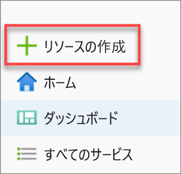
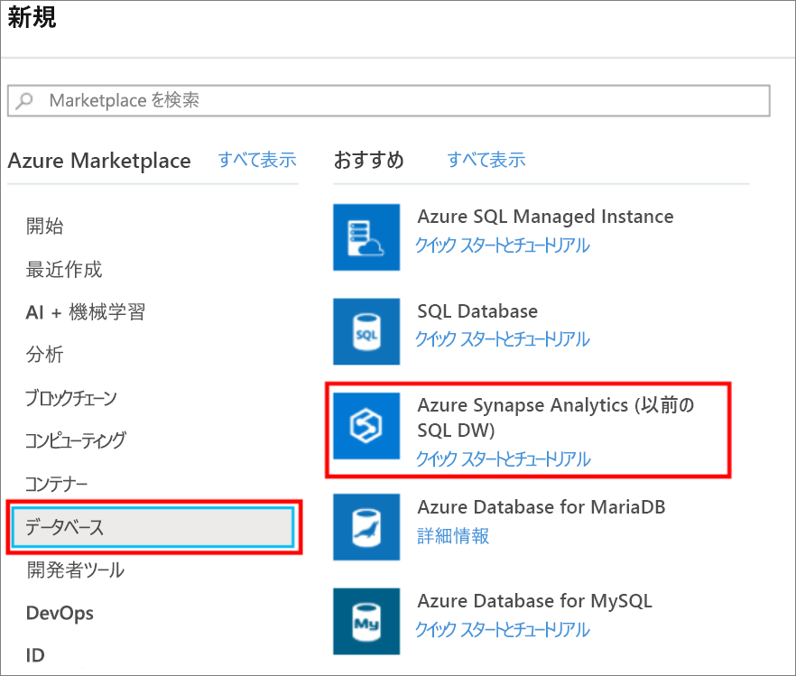
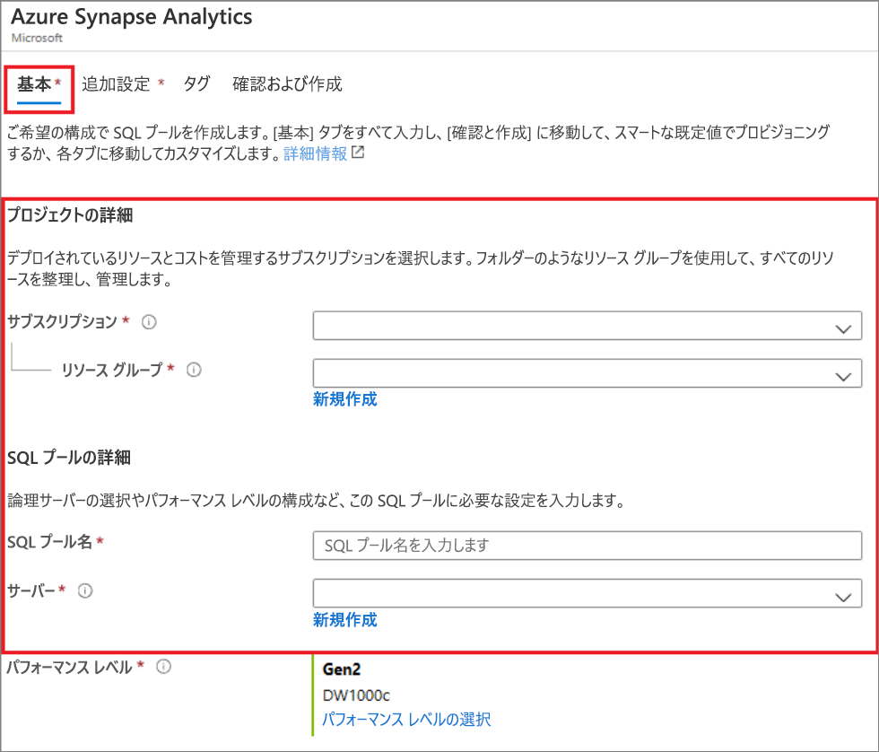
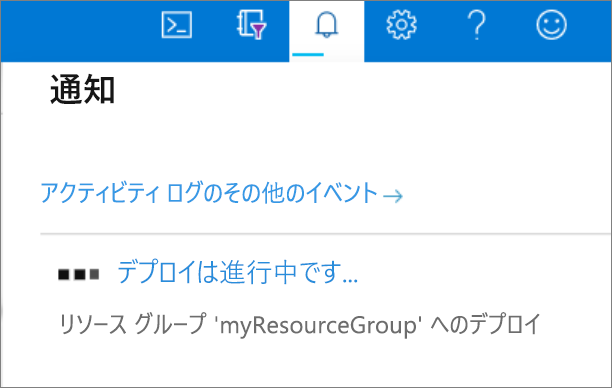
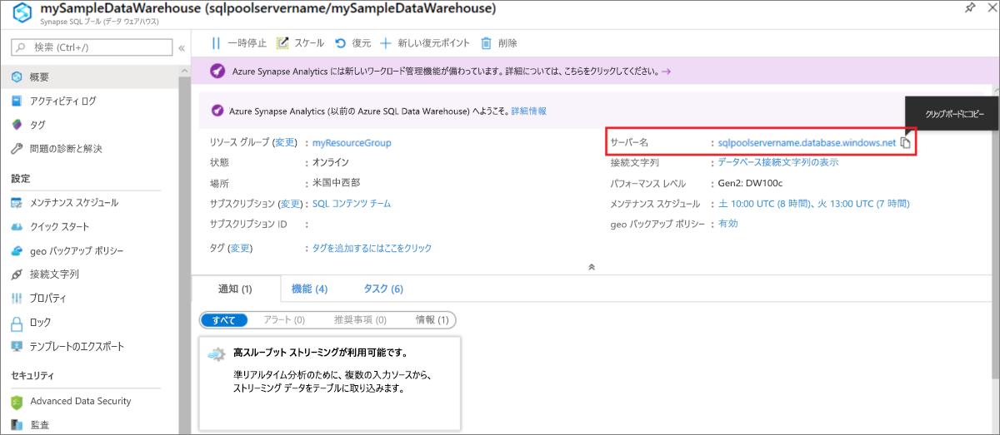
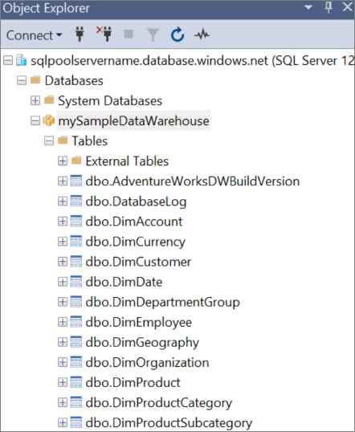

# <a name="quickstart-create-and-query-a-synapse-sql-pool-using-the-azure-portal"></a>クイック スタート:Azure portal を使用して Synapse SQL プールを作成し、クエリを実行する

Azure portal を使用して Azure Synapse Analytics (旧称 SQL DW) の Synapse SQL プール (データ ウェアハウス) をすばやく作成し、クエリを実行します。

## <a name="prerequisites"></a>前提条件

1. Azure サブスクリプションをお持ちでない場合は、開始する前に[無料](https://azure.microsoft.com/free/)アカウントを作成してください。

   > [!NOTE]
   > Azure Synapse の SQL プールを作成すると、新しい課金対象サービスを使用することになる場合があります。 詳細については、「[Azure Synapse Analytics の価格](https://azure.microsoft.com/pricing/details/synapse-analytics/)」を参照してください。

2. 最新バージョンの [SQL Server Management Studio](/sql/ssms/download-sql-server-management-studio-ssms) (SSMS) をダウンロードしてインストールします。

## <a name="sign-in-to-the-azure-portal"></a>Azure portal にサインインする

[Azure portal](https://portal.azure.com/) にサインインします。

## <a name="create-a-sql-pool"></a>SQL プールを作成する

データ ウェアハウスは、Azure Synapse Analytics の SQL プールを使用して作成されます。 SQL プールは、定義された一連の[コンピューティング リソース](memory-concurrency-limits.md)を使用して作成されます。 データベースは、[Azure リソース グループ](../../azure-resource-manager/management/overview.md)内と [Azure SQL 論理サーバー](../../sql-database/sql-database-servers.md)内に作成されます。

以下の手順で **AdventureWorksDW** サンプル データを含む SQL プールを作成します。

1. Azure portal の左上隅にある **[リソースの作成]** を選択します。

   

2. **[新規]** ページで **[データベース]** を選択し、 **[おすすめ]** 一覧から **[Azure Synapse Analytics (以前の SQL DW)]** を選択します。

   

3. **[基本]** で、ご利用のサブスクリプション、リソース グループ、SQL プール名、サーバー名を指定します。

   | 設定 | 推奨値 | 説明 |
   | :------ | :-------------- | :---------- |
   | **サブスクリプション** | 該当するサブスクリプション | サブスクリプションの詳細については、[サブスクリプション](https://account.windowsazure.com/Subscriptions)に関するページを参照してください。 |
   | **リソース グループ** | myResourceGroup | 有効なリソース グループ名については、[名前付け規則と制限](/azure/architecture/best-practices/resource-naming)に関するページを参照してください。 |
   | **SQL プール名** | グローバルに一意の名前 (例: *mySampleDataWarehouse*) | 有効なデータベース名については、「[Database Identifiers (データベース識別子)](/sql/relational-databases/databases/database-identifiers)」を参照してください。 SQL プールは、データベースの一種であることに注意してください。 |
   | **[サーバー]** | グローバルに一意の名前 | 既存のサーバーを選択するか、新しいサーバー名を付けて **[新規作成]** を選択します。 有効なサーバー名については、[名前付け規則と制限](/azure/architecture/best-practices/resource-naming)に関するページを参照してください。 |

   

4. **[パフォーマンス レベル]** で **[パフォーマンス レベルの選択]** を選択し、スライダーを使いながら必要に応じて構成を変更します。

     

   パフォーマンス レベルの詳細については、[Azure SQL Data Warehouse でのコンピューティングの管理](sql-data-warehouse-manage-compute-overview.md)に関するページを参照してください。

5. Azure Synapse Analytics フォームの [基本] タブの入力が完了したら、 **[確認および作成]** 、 **[作成]** の順に選択して、SQL プールを作成します。 プロビジョニングには数分かかります。

   ![[確認と作成] を選択する](./media/create-data-warehouse-portal/create-sql-pool-review-create.png)

   ![[作成] の選択](./media/create-data-warehouse-portal/create-sql-pool-create.png)

6. デプロイ プロセスを監視するために、ツール バーの **[通知]** を選択します。

   

## <a name="create-a-server-level-firewall-rule"></a>サーバーレベルのファイアウォール規則を作成する

Azure Synapse サービスでは、サーバーレベルでファイアウォールが作成されます。 このファイアウォールにより、外部のアプリケーションとツールはサーバーやサーバー上のすべてのデータベースに接続できなくなります。 接続できるようにするには、特定の IP アドレスに接続を許可するファイアウォール規則を追加します。 次の手順に従って、クライアントの IP アドレスに対する[サーバーレベルのファイアウォール規則](../../sql-database/sql-database-firewall-configure.md)を作成します。

> [!NOTE]
> Azure Synapse の通信は、ポート 1433 で行われます。 企業ネットワーク内から接続しようとしても、ポート 1433 での送信トラフィックがネットワークのファイアウォールで禁止されている場合があります。 その場合、会社の IT 部門によってポート 1433 が開放されない限り、Azure SQL Database サーバーに接続することはできません。

1. デプロイが完了したら、左側のメニューから **[すべてのサービス]** を選択します。 **[データベース]** を選択し、 **[Azure Synapse Analytics]** の横にある星印を選択して、Azure Synapse Analytics をお気に入りに追加します。

2. 左側のメニューから **[Azure Synapse Analytics]** を選択し、 **[Azure Synapse Analytics]** ページの **[mySampleDataWarehouse]** を選択します。 データベースの概要ページが開き、完全修飾サーバー名 (**sqlpoolservername.database.windows.net** など) と、さらに構成するためのオプションが表示されます。

3. この完全修飾サーバー名は、このクイック スタートや他のクイック スタートでお使いのサーバーとそのデータベースへの接続に使用する場合にコピーします。 サーバー設定を開くには、サーバー名を選択します。

   

4. **[ファイアウォール設定の表示]** を選択します。

   

5. SQL Database サーバーの **[ファイアウォール設定]** ページが開きます。

   

6. 現在の IP アドレスを新しいファイアウォール規則に追加するために、ツール バーの **[クライアント IP の追加]** を選択します。 ファイアウォール規則は、単一の IP アドレスまたは IP アドレスの範囲に対して、ポート 1433 を開くことができます。

7. **[保存]** を選択します。 論理サーバーでポート 1433 を開いている現在の IP アドレスに対して、サーバーレベルのファイアウォール規則が作成されます。

8. **[OK]** を選択し、 **[ファイアウォール設定]** ページを閉じます。

この IP アドレスを使って、SQL Server とその SQL プールに接続できるようになります。 接続するには、SQL Server Management Studio または他の適当なツールを使います。 接続するときは、前に作成した ServerAdmin アカウントを使います。

> [!IMPORTANT]
> 既定では、すべての Azure サービスで、SQL Database ファイアウォール経由のアクセスが有効になります。 このページの **[オフ]** を選択し、 **[保存]** を選択して、すべての Azure サービスに対してファイアウォールを無効にします。

## <a name="get-the-fully-qualified-server-name"></a>完全修飾サーバー名を取得する

Azure Portal で、SQL サーバーの完全修飾サーバー名を取得します。 後でサーバーに接続するときに、完全修飾名を使います。

1. [Azure portal](https://portal.azure.com/) にサインインします。

2. 左側のメニューから **[Azure Synapse Analytics]** を選択し、 **[Azure Synapse Analytics]** ページで目的のものを選択します。

3. そのデータベースの Azure Portal ページの **[基本]** ウィンドウで、**サーバー名**を見つけてコピーします。 この例の完全修飾名は sqlpoolservername.database.windows.net です。

    

## <a name="connect-to-the-server-as-server-admin"></a>サーバー管理者としてサーバーに接続する

このセクションでは、[SQL Server Management Studio](/sql/ssms/download-sql-server-management-studio-ssms) (SSMS) を使って、Azure SQL Server に対する接続を確立します。

1. SQL Server Management Studio を開きます。

2. **[サーバーへの接続]** ダイアログ ボックスで、次の情報を入力します。

   | 設定 | 推奨値 | 説明 |
   | :------ | :-------------- | :---------- |
   | サーバーの種類 | データベース エンジン | この値は必須です |
   | サーバー名 | 完全修飾サーバー名 | 例: **sqlpoolservername.database.windows.net** |
   | 認証 | SQL Server 認証 | このチュートリアルで構成した認証の種類は "SQL 認証" のみです。 |
   | ログイン | サーバー管理者アカウント | サーバーの作成時に指定したアカウントです。 |
   | Password | サーバー管理者アカウントのパスワード | サーバーの作成時に指定したパスワードです。 |
   ||||

   ![[サーバーに接続]](./media/create-data-warehouse-portal/connect-to-server-ssms.png)

3. **[接続]** を選択します。 SSMS で [オブジェクト エクスプローラー] ウィンドウが開きます。 

4. オブジェクト エクスプローラーで、 **[データベース]** を展開します。 **mySampleDatabase** を展開して、新しいデータベースのオブジェクトを表示します。

    

## <a name="run-some-queries"></a>クエリを実行する

SQL Data Warehouse はクエリ言語として T-SQL を使用しています。 クエリ ウィンドウを開いて T-SQL クエリを実行するには、次の手順を実行します。

1. **mySampleDataWarehouse** を右クリックして、 **[新しいクエリ]** を選びます。 新しいクエリ ウィンドウが開きます。

2. クエリ ウィンドウで、次のコマンドを入力してデータベースの一覧を表示します。

    ```sql
    SELECT * FROM sys.databases
    ```

3. **[Execute]\(実行\)** を選択します。 クエリ結果には、**master** と **mySampleDataWarehouse** という 2 つのデータベースが表示されます。

   

4. 何かのデータを確認する場合、次のコマンドを使用すると、家庭に 3 人の子供がいる Adams という名前のユーザー数が表示されます。 結果として 6 人のユーザーが一覧表示されます。 

    ```sql
    SELECT LastName, FirstName FROM dbo.dimCustomer
    WHERE LastName = 'Adams' AND NumberChildrenAtHome = 3;
    ```

   

## <a name="clean-up-resources"></a>リソースをクリーンアップする

データ ウェアハウス ユニットと SQL プールに格納されているデータに対して課金されます。 これらのコンピューティングとストレージのリソースは別々に請求されます。

- データをストレージに保持しておく場合は、SQL プールを使わない間、コンピューティング リソースを一時停止できます。 コンピューティングを一時停止すると、データ ストレージに対してのみ課金されます。 データを使用する準備ができたら、コンピューティングを再開できます。

- それ以上課金されないようにする場合は、SQL プールを削除できます。

不要になったリソースをクリーンアップするには、次の手順に従います。

1. [Azure portal](https://portal.azure.com) にサインインし、SQL プールを選択します。

   

2. コンピューティング リソースを一時停止するには、 **[一時停止]** ボタンを選択します。 SQL プールを一時停止すると、ボタンの表示が **[再開]** になります。 コンピューティングを再開するには、 **[再開]** をクリックします。

3. コンピューティングやストレージに課金されないように SQL プールを削除するには、 **[削除]** を選択します。

4. 作成した SQL Server を削除するには、前の画像の **sqlpoolservername.database.windows.net** を選択して、 **[削除]** を選択します。 サーバーを削除すると、サーバーに割り当てられているすべてのデータベースが削除されるので、削除には注意してください。

5. リソース グループを削除するには、**myResourceGroup** を選択して、 **[リソース グループの削除]** を選択します。

## <a name="next-steps"></a>次のステップ

SQL プールへのデータの読み込みの詳細については、[SQL プールへのデータの読み込み](load-data-from-azure-blob-storage-using-polybase.md)に関する記事に進んでください。 
