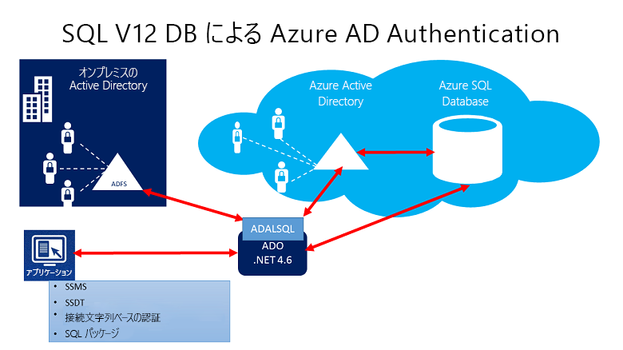
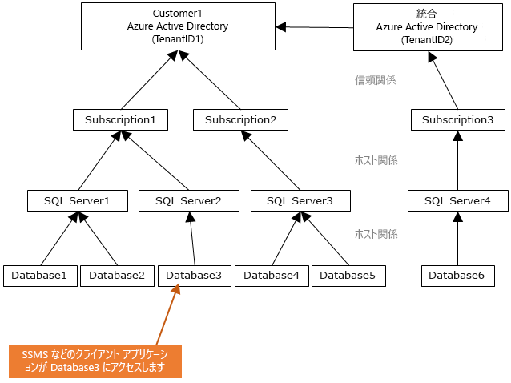
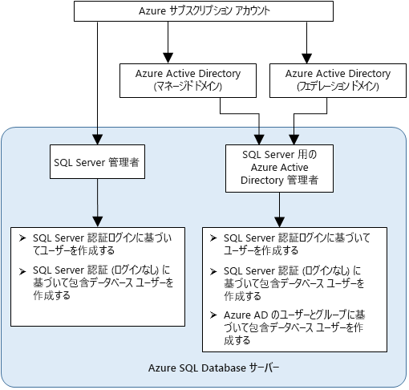

# Azure Active Directory 認証を使用して Synapse SQL での認証を行う

Azure Active Directory 認証は、Azure Active Directory (Azure AD) の ID を使用して [Azure Synapse Analytics](../overview-faq.md) に接続するメカニズムです。

Azure AD 認証を使用すると、Azure Synapse にアクセスできるユーザーの ID を一元的に管理して、アクセス許可の管理を簡略化できます。 次のような利点があります。

- 通常のユーザー名とパスワードによる認証の代わりに使用できます。
- サーバー全体でユーザー ID が急増するのを防ぎます
- 1 か所でのパスワードのローテーションを許可します。
- 顧客は、外部の (Azure AD) グループを使用してアクセス許可を管理できます。
- 統合 Windows 認証や、Azure Active Directory でサポートされる他の認証形式を有効にすることで、パスワードが保存されないようにすることができます。
- Azure AD は、Azure Synapse に接続するアプリケーション向けにトークンベースの認証をサポートしています。
- Azure AD 認証は、ADFS (ドメイン フェデレーション) またはドメインを同期しないローカル Azure Active Directory のネイティブ ユーザー/パスワード認証をサポートします。
- Azure AD 認証は、Multi-Factor Authentication (MFA) を含む Active Directory ユニバーサル認証を使用する SQL Server Management Studio からの接続をサポートします。  MFA には、電話、テキスト メッセージ、スマート カードと暗証番号 (PIN)、モバイル アプリ通知など、簡単な各種確認オプションによる強力な認証が含まれます。 詳細については、[Synapse SQL を使用した Azure AD MFA のための SSMS のサポート](mfa-authentication.md)に関するページを参照してください。
- Azure AD は、Active Directory 対話型認証を使用する SQL Server Data Tools (SSDT) からの同様の接続をサポートしています。 詳細については、「[SQL Server Data Tools (SSDT) での Azure Active Directory のサポート](/sql/ssdt/azure-active-directory?toc=/azure/synapse-analytics/toc.json&bc=/azure/synapse-analytics/breadcrumb/toc.json&view=azure-sqldw-latest)」をご覧ください。

構成の手順には、Azure Active Directory 認証を構成して使用する次の手順が含まれます。

1. Azure AD を作成して設定します。
2. Azure Active Directory ID を作成します
3. Synapse ワークスペース (プレビュー) で作成された Azure Active Directory ID にロールを割り当てます
4. Azure AD ID を使用して Synapse Studio に接続します。

## Azure Synapse Analytics での AAD パススルー

Azure Synapse Analytics では、Azure Active Directory ID を使用してデータ レイク内のデータにアクセスできます。

さまざまなデータ エンジンで考慮されるファイルおよびデータに対するアクセス権を定義することは、アクセス許可を定義する作業を複数の場所で行う代わりに 1 か所で済ますことができるため、データ レイク ソリューションを簡素化できます。

## 信頼のアーキテクチャ

次の図は、Synapse SQL で Azure AD 認証を使用するソリューション アーキテクチャの概要を示しています。 Azure AD のネイティブ ユーザー パスワードをサポートする場合は、クラウドの部分と Azure AD または Synapse SQL のみを考慮します。 フェデレーション認証 (または Windows 資格情報のユーザー/パスワード) をサポートするには、ADFS ブロックとの通信が必要です。 矢印は通信経路を示します。

次の図は、クライアントがトークンの送信によってデータベースへの接続を許可される、フェデレーション、信頼、およびホスティングの関係を示しています。 トークンは、Azure AD によって認証され、データベースによって信頼されます。 

顧客 1 は、Azure Active Directory とネイティブ ユーザーまたは Azure AD とフェデレーション ユーザーを表します。 顧客 2 は、インポートされたユーザーなどの可能性のあるソリューションを表します。この例では、Azure Active Directory および Azure Active Directory と同期された ADFS です。 

重要なのは、Azure AD 認証を使用してデータベースにアクセスするには、ホストしているサブスクリプションを Azure AD に関連付ける必要があることを理解することです。 同じサブスクリプションを使用して、Azure SQL Database または SQL プールをホストする SQL Server を作成する必要があります。

## 管理者の構造

Azure AD 認証を使用すると、Synapse SQL の管理者アカウントは、元の SQL Server 管理者と Azure AD 管理者の 2 つになります。 ユーザー データベースに最初の Azure AD 包含データベース ユーザーを作成できるのは、Azure AD アカウントに基づく管理者のみです。 

Azure AD の管理者ログインには、Azure AD ユーザーまたは Azure AD グループを使用できます。 管理者がグループ アカウントである場合、グループの任意のメンバーがこれを使用できるため、その Synapse SQL インスタンスに対して複数の Azure AD 管理者を配置できます。 

グループ アカウントを管理者として使用すると、Synapse Analytics ワークスペースでユーザーまたはアクセス許可を変更することなく Azure AD でグループ メンバーを一元的に追加および削除できるため、より管理しやすくなります。 いつでも構成できる Azure AD 管理者 (ユーザーまたはグループ) は 1 つだけです。

## アクセス許可

新しいユーザーを作成するには、データベースにおける `ALTER ANY USER` アクセス許可が必要です。 `ALTER ANY USER` アクセス許可は、任意のデータベース ユーザーに付与できます。 `ALTER ANY USER` アクセス許可は、サーバーの管理者アカウント、そのデータベースの `CONTROL ON DATABASE`または `ALTER ON DATABASE` アクセス許可を持つデータベース ユーザー、`db_owner` データベース ロールのメンバーも保持しています。

Synapse SQL に包含データベース ユーザーを作成するには、Azure AD の ID を使用してデータベースに接続する必要があります。 最初の包含データベース ユーザーを作成するには、(データベースの所有者である) Azure AD 管理者を使用してデータベースに接続する必要があります。 

Synapse SQL に対して Azure AD 管理者が作成された場合にのみ、任意の Azure AD 認証が可能です。 Azure Active Directory 管理者がサーバーから削除された場合、Synapse SQL 内に以前に作成された既存の Azure Active Directory ユーザーは、Azure Active Directory 資格情報を使用してデータベースにアクセスできなくなります。
 
## Azure AD の機能と制限事項

- Azure AD の次のメンバーを Synapse SQL にプロビジョニングできます。

  - ネイティブ メンバー:マネージド ドメインまたは顧客のドメインの Azure AD で作成したメンバー。 詳細については、 [Azure AD への独自のドメイン名の追加](../../active-directory/fundamentals/add-custom-domain.md?toc=/azure/synapse-analytics/toc.json&bc=/azure/synapse-analytics/breadcrumb/toc.json)に関する記事をご覧ください。
  - フェデレーション ドメインのメンバー:フェデレーション ドメインを使用して Azure AD で作成されたメンバー。 詳細については、「 [Microsoft Azure now supports federation with Windows Server Active Directory (Microsoft Azure による Windows Server Active Directory とのフェデレーションのサポートの実現)](https://azure.microsoft.com/blog/20../../windows-azure-now-supports-federation-with-windows-server-active-directory/)」をご覧ください。
  - ネイティブ メンバーまたはフェデレーション ドメインのメンバーである別の Azure AD からインポートされたメンバー。
  - セキュリティ グループとして作成された Active Directory グループ。

- `db_owner` サーバー ロールを持つグループに含まれている Azure AD ユーザーは、Synapse SQL に対して **[CREATE DATABASE SCOPED CREDENTIAL](/sql/t-sql/statements/create-database-scoped-credential-transact-sql?toc=/azure/synapse-analytics/toc.json&bc=/azure/synapse-analytics/breadcrumb/toc.json&view=azure-sqldw-latest)** 構文を使用できません。 次のエラーが表示されます。

    `SQL Error [2760] [S0001]: The specified schema name 'user@mydomain.com' either does not exist or you do not have permission to use it.`

    **CREATE DATABASE SCOPED CREDENTIAL** の問題を軽減するには、`db_owner` ロールを個々の Azure AD ユーザーに直接付与します。

- Azure AD プリンシパル下で実行された場合、以下のシステム関数は NULL 値を返します。

  - `SUSER_ID()`
  - `SUSER_NAME(<admin ID>)`
  - `SUSER_SNAME(<admin SID>)`
  - `SUSER_ID(<admin name>)`
  - `SUSER_SID(<admin name>)`

## Azure AD の ID を使用した接続

Azure Active Directory 認証では、Azure AD の ID を使用してデータベースに接続する次の方法がサポートされています。

- Azure Active Directory パスワード
- Azure Active Directory 統合
- MFA による Azure Active Directory ユニバーサル
- アプリケーション トークン認証を使用する

Azure AD サーバー プリンシパル (ログイン) では、次の認証方法がサポートされています (**パブリック プレビュー**)。

- Azure Active Directory パスワード
- Azure Active Directory 統合
- MFA による Azure Active Directory ユニバーサル

### その他の注意点

- さらに管理しやすくするには、管理者として専用の Azure AD グループをプロビジョニングすることをお勧めします。
- Synapse SQL プール用に構成できる Azure AD 管理者 (ユーザーまたはグループ) は常に 1 つだけです。
  - SQL オンデマンド (プレビュー) 用の Azure AD サーバー プリンシパル (ログイン) の追加により、`sysadmin` ロールに追加できる複数の Azure AD サーバー プリンシパル (ログイン) を作成できる可能性があります。
- Azure Active Directory アカウントを使用して Synapse SQL に最初に接続できるのは、Synapse SQL の Azure AD 管理者だけです。 Active Directory 管理者は、それ以降の Azure AD のデータベース ユーザーを構成できます。
- 接続のタイムアウトを 30 秒に設定することをお勧めします。
- SQL Server 2016 Management Studio と SQL Server Data Tools for Visual Studio 2015 (バージョン 14.0.60311.1April 2016 以降) では、Azure Active Directory 認証がサポートされています (Azure AD 認証は、 **.NET Framework Data Provider for SqlServer** (.NET Framework 4.6 以降のバージョン) でサポートされています)。 したがって、これらのツールとデータ層アプリケーション (DAC および .BACPAC) の最新のバージョンでは、Azure AD 認証を使用できます。
- バージョン 15.0.1 以降では、[sqlcmd ユーティリティ](/sql/tools/sqlcmd-utility?toc=/azure/synapse-analytics/toc.json&bc=/azure/synapse-analytics/breadcrumb/toc.json&view=azure-sqldw-latest)と [bcp ユーティリティ](/sql/tools/bcp-utility?toc=/azure/synapse-analytics/toc.json&bc=/azure/synapse-analytics/breadcrumb/toc.json&view=azure-sqldw-latest)は MFA を使用した Active Directory 対話型認証をサポートしています。
- SQL Server Data Tools for Visual Studio 2015 には、April 2016 バージョン以降の Data Tools (バージョン 14.0.60311.1) が必要です。 現在、Azure AD ユーザーは SSDT のオブジェクト エクスプローラーに表示されません。 回避策として、ユーザーを [sys.database_principals](/sql/relational-databases/system-catalog-views/sys-database-principals-transact-sql?toc=/azure/synapse-analytics/toc.json&bc=/azure/synapse-analytics/breadcrumb/toc.json&view=azure-sqldw-latest) で表示してください。
- [Microsoft JDBC Driver 6.0 for SQL Server](https://www.microsoft.com/download/details.aspx?id=11774) は、Azure AD 認証をサポートしています。 「 [接続プロパティの設定](/sql/connect/jdbc/setting-the-connection-properties?toc=/azure/synapse-analytics/toc.json&bc=/azure/synapse-analytics/breadcrumb/toc.json&view=azure-sqldw-latest)」もご覧ください。

## 次のステップ

- Synapse SQL でのアクセスおよび制御の概要については、[Synapse SQL のアクセス制御](../sql/access-control.md)に関するページを参照してください。
- データベース プリンシパルの詳細については、「[プリンシパル](/sql/relational-databases/security/authentication-access/principals-database-engine?toc=/azure/synapse-analytics/toc.json&bc=/azure/synapse-analytics/breadcrumb/toc.json&view=azure-sqldw-latest)」を参照してください。
- データベース ロールの詳細については、[データベース ロール](/sql/relational-databases/security/authentication-access/database-level-roles?toc=/azure/synapse-analytics/toc.json&bc=/azure/synapse-analytics/breadcrumb/toc.json&view=azure-sqldw-latest)に関するページを参照してください。

 