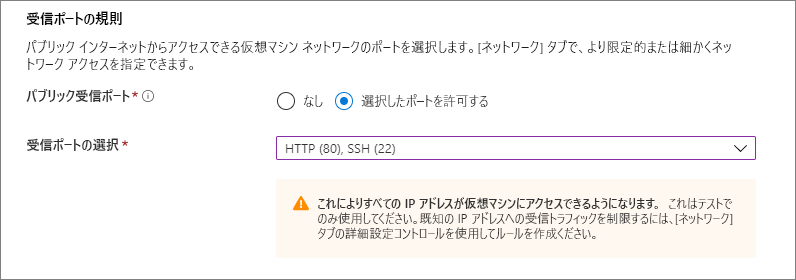

# <a name="quickstart-create-a-linux-virtual-machine-in-the-azure-portal"></a>クイック スタート: Azure portal で Linux 仮想マシンを作成する

Azure 仮想マシン (VM) は、Azure portal で作成できます。 Azure portal は、Azure リソースを作成するためのブラウザーベースのユーザー インターフェイスです。 このクイックスタートでは、Azure portal を使用して、Ubuntu 18.04 LTS を実行する Linux 仮想マシン (VM) をデプロイする方法を示します。 また、VM の動作を確認するために、VM に SSH 接続し、NGINX Web サーバーをインストールします。

Azure サブスクリプションをお持ちでない場合は、開始する前に [無料アカウント](https://azure.microsoft.com/free/?WT.mc_id=A261C142F) を作成してください。

## <a name="create-ssh-key-pair"></a>SSH キー ペアの作成

このクイック スタートを完了するには、SSH キー ペアが必要です。 既存の SSH キーの組がある場合は、この手順をスキップできます。

Bash シェルを開き、[ssh-keygen](https://www.ssh.com/ssh/keygen/) を使用して SSH キー ペアを作成します。 Bash シェルがローカル コンピューターにない場合は、[Azure Cloud Shell](https://shell.azure.com/bash) を使用してください。


1. [Azure portal](https://portal.azure.com) にサインインする
1. ページの上部にあるメニューで、`>_` アイコンを選択して Cloud Shell を開きます。
1. CloudShell の左上に "**Bash**" と表示されていることを確認します。 PowerShell と表示されている場合は、ドロップダウンを使用して **[Bash]** を選択し、 **[確認]** を選択して Bash シェルに変更します。
1. 「`ssh-keygen -t rsa -b 2048`」と入力して ssh キーを作成します。 
1. キー ペアを保存するファイルを入力するように求められます。 そのまま **Enter** キーを押すと、角かっこで囲まれて表示されている既定の場所に保存されます。 
1. パスフレーズを入力するように求められます。 SSH キーのパスフレーズを入力するか、**Enter** キーを押してパスフレーズなしで続行することができます。
1. `ssh-keygen` コマンドによって、公開キーと秘密キーが `id_rsa` の既定の名前で `~/.ssh directory` に生成されます。 このコマンドからは、公開キーの完全パスが返されます。 「`cat`」と入力して `cat ~/.ssh/id_rsa.pub` に公開キーのパスを指定すれば、その内容が表示されます。
1. この記事の後半で使用するために、このコマンドの出力をコピーし、どこかに保存してください。 これは公開キーです。VM にログインするために管理者アカウントを構成するときに必要になります。

## <a name="sign-in-to-azure"></a>Azure へのサインイン

まだの場合は [Azure portal](https://portal.azure.com) にサインインします。

## <a name="create-virtual-machine"></a>仮想マシンの作成

1. 検索に「**virtual machines**」と入力します。
1. **[サービス]** で、 **[仮想マシン]** を選択します。
1. **[仮想マシン]** ページで、 **[追加]** を選択します。 **[仮想マシンの作成]** ページが開きます。
1. **[基本]** タブの **[Project details] (プロジェクトの詳細)** で、正しいサブスクリプションが選択されていることを確認し、リソース グループの **[新規作成]** を選択します。 名前 * として「*myResourceGroup*」と入力します。 

    

1. **[インスタンスの詳細]** で、 *[仮想マシン名]* として「**myVM**」と入力し、 *[リージョン]* として **[米国東部]** を選択し、 *[イメージ]* として **[Ubuntu 18.04 LTS]** を選択します。 他の既定値はそのままにします。

    ![[Instance details] (インスタンスの詳細) セクション](./media/quick-create-portal/instance-details.png)

1. **[管理者アカウント]** で、 **[SSH 公開キー]** を選択し、ユーザー名を入力して、公開キーを貼り付けます。 公開キーの先頭または末尾の空白はすべて削除します。

    ![[Administrator account] (管理者アカウント)](./media/quick-create-portal/administrator-account.png)

1. **[受信ポートの規則]**  >  **[Public inbound ports] (パブリック受信ポート)** で、 **[Allow selected ports] (選択されたポートを許可する)** を選択してから、ドロップダウンから **[SSH (22)]** と **[HTTP (80)]** を選択します。 

    

1. 残りの既定値はそのままにして、ページの一番下にある **[Review + create] (確認および作成)** ボタンを選択します。

1. **[仮想マシンの作成]** ページで、これから作成しようとしている VM の詳細を確認できます。 準備ができたら **[作成]** を選択します。

VM がデプロイされるまでに数分かかります。 デプロイが完了したら、次のセクションに移動してください。

    
## <a name="connect-to-virtual-machine"></a>仮想マシンへの接続

VM との SSH 接続を作成します。

1. VM の概要ページの **[接続]** ボタンを選択します。 

    

2. **[Connect to virtual machine]\(仮想マシンへの接続\)** ページで、ポート 22 を介して IP アドレスで接続する既定のオプションをそのまま使用します。 **[VM ローカル アカウントを使用してログインする]** に、接続コマンドが表示されます。 ボタンをクリックして、このコマンドをコピーします。 SSH 接続コマンドの例を次に示します。

    ```bash
    ssh azureuser@10.111.12.123
    ```

3. SSH キー ペアの作成に使用したものと同じ bash シェルを使用します (Cloud Shell をもう一度開くには、`>_` をもう一度選択するか、 https://shell.azure.com/bash) に移動して、SSH 接続コマンドをシェルに貼り付け、SSH セッションを作成します。

## <a name="install-web-server"></a>Web サーバーのインストール

VM の動作を確認するために、NGINX Web サーバーをインストールします。 SSH セッションからパッケージ ソースを更新し、最新の NGINX パッケージをインストールします。

```bash
sudo apt-get -y update
sudo apt-get -y install nginx
```

完了したら、`exit` と入力して SSH セッションを終了します。


## <a name="view-the-web-server-in-action"></a>動作中の Web サーバーを表示する

任意の Web ブラウザーを使用して、NGINX の既定のウェルカム ページを表示します。 Web アドレスとして、VM のパブリック IP アドレスを入力します。 パブリック IP アドレスは、VM の概要ページで確認できるほか、先ほど使用した SSH 接続文字列にも含まれています。


## <a name="clean-up-resources"></a>リソースをクリーンアップする

必要がなくなったら、リソース グループ、仮想マシン、およびすべての関連リソースを削除できます。 これを行うには、仮想マシンのリソース グループを選択し、 **[削除]** を選択して、削除するリソース グループの名前を確認します。

## <a name="next-steps"></a>次のステップ

このクイック スタートでは、単純な仮想マシンをデプロイし、ネットワーク セキュリティ グループと規則を作成し、基本的な Web サーバーをインストールしました。 Azure 仮想マシンの詳細については、Linux VM のチュートリアルを参照してください。

> [!div class="nextstepaction"]
> [Azure Linux 仮想マシンのチュートリアル](./tutorial-manage-vm.md)
