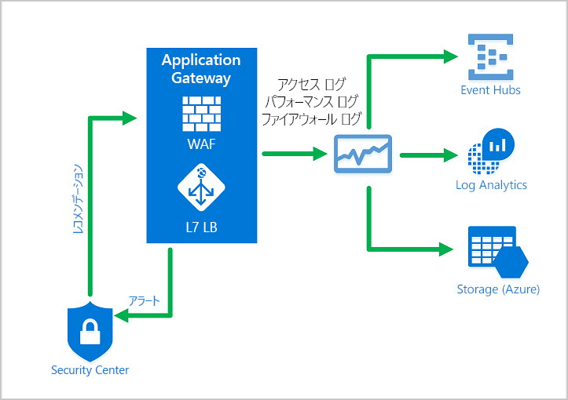
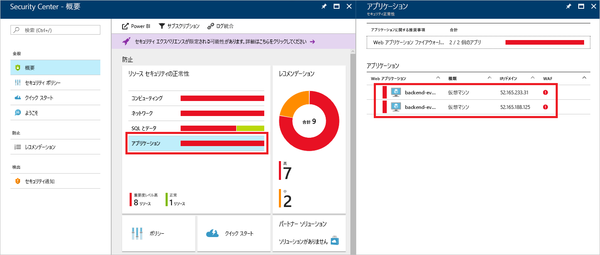

# <a name="azure-web-application-firewall-on-azure-application-gateway"></a>Azure Application Gateway 上の Azure Web アプリケーション ファイアウォール

Azure Application Gateway 上の Azure Web アプリケーション ファイアウォール (WAF) は、一般的な脆弱性やその悪用から Web アプリケーションを一元的に保護します。 Web アプリケーションが、一般的な既知の脆弱性を悪用した悪意のある攻撃の標的になるケースが増えています。 よくある攻撃の例として、SQL インジェクションやクロスサイト スクリプティングが挙げられます。

Application Gateway 上の WAF は、OWASP (Open Web Application Security Project) の[コア ルール セット (CRS)](https://owasp.org/www-project-modsecurity-core-rule-set/) 3.1、3.0 または 2.2.9 に基づいています。 WAF は、追加構成を必要とすることなく、新たな脆弱性に対する保護を含めるために自動的に更新します。 

次に示す WAF の機能はすべて WAF ポリシー内に存在します。 複数のポリシーを作成して、Application Gateway、個々のリスナー、または Application Gateway のパスベースのルーティング規則に関連付けることができます。 これにより、必要に応じて、Application Gateway の後ろにあるサイトごとに個別のポリシーを設定できます。 WAF ポリシーの詳細については、「[WAF ポリシーの作成](create-waf-policy-ag.md)」を参照してください。

   > [!NOTE]
   > URI ごとの WAF ポリシーはパブリック プレビュー段階です。 つまり、この機能には、Microsoft の追加使用条件が適用されます。 詳しくは、[Microsoft Azure プレビューの追加使用条件](https://azure.microsoft.com/support/legal/preview-supplemental-terms/)に関するページをご覧ください。


Application Gateway は、アプリケーション配信コントローラー (ADC) として機能します。 これにより、トランスポート層セキュリティ (TLS) (以前は Secure Sockets Layer (SSL) と呼ばれていました) 終端、Cookie ベースのセッション アフィニティ、ラウンドロビンの負荷分散、コンテンツベースのルーティング、複数の Web サイトをホストする機能、セキュリティ強化機能が提供されます。

Application Gateway によるセキュリティの強化には、TLS ポリシーの管理、エンド ツー エンド TLS のサポートが含まれます。 アプリケーション セキュリティは、WAF を Application Gateway に統合することによって強化されています。 この組み合わせにより、Web アプリケーションが一般的な脆弱性から保護されます。 また、管理するための構成を、1 か所で簡単に設定できます。

## <a name="benefits"></a>メリット

このセクションでは、Application Gateway 上の WAF によって得られる主なメリットについて説明します。

### <a name="protection"></a>保護

* バックエンド コードを変更しなくても、Web アプリケーションを Web の脆弱性および攻撃から保護できます。

* 同時に複数の Web アプリケーションを保護できます。 Application Gateway のインスタンスは、Web アプリケーション ファイアウォールによって保護されている最大 40 個の Web サイトをホストできます。

* 同じ WAF の内側にある各種サイト用にカスタム WAF ポリシーを作成できます。 

* IP 評判のルールセットを使用して、悪意のあるボットから Web アプリケーションを保護できます (プレビュー)。

### <a name="monitoring"></a>監視

* リアルタイムの WAF ログを使用して、Web アプリケーションに対する攻撃を監視できます。 このログは [Azure Monitor](../../azure-monitor/overview.md) と統合されているため、WAF のアラートを追跡し、傾向を簡単に監視できます。

* Application Gateway の WAF は Azure Security Center と統合されています。 Security Center は、すべての Azure リソースのセキュリティ状態を一元的に表示します。

### <a name="customization"></a>カスタマイズ

* ご使用のアプリケーションの要件に合わせて WAF の規則と規則グループをカスタマイズし、誤検出を排除できます。

* WAF の内側にある各サイトに WAF ポリシーを関連付けて、サイト固有の構成を許可することができます。

* アプリケーションのニーズに合わせてカスタム ルールを作成することができます。

## <a name="features"></a>特徴

- SQL インジェクションからの保護。
- クロスサイト スクリプティングからの保護。
- その他の一般的な Web 攻撃からの保護 (コマンド インジェクション、HTTP 要求スマグリング、HTTP レスポンス スプリッティング、リモート ファイル インクルードなど)。
- HTTP プロトコル違反に対する保護。
- HTTP プロトコル異常に対する保護 (ホスト ユーザー エージェントと承認ヘッダーが見つからない場合など)。
- クローラーおよびスキャナーに対する保護。
- 一般的なアプリケーション構成ミスの検出 (Apache や IIS など)。
- 下限と上限を指定した、構成可能な要求サイズ制限。
- 除外リストを使用すると、WAF の評価から特定の要求属性を省略できます。 一般的な例として、認証フィールドまたはパスワード フィールドにおいて使用される、Active Directory で挿入されたトークンが挙げられます。
- 特定のアプリケーションのニーズに合わせてカスタム ルールを作成することができます。
- トラフィックを geo フィルタリングすることで、特定の国/地域を対象に、アプリケーションへのアクセスを許可したりブロックしたりできます。 (プレビュー)
- ボット軽減策ルールセットを使用してアプリケーションをボットから保護できます。 (プレビュー)

## <a name="waf-policy"></a>WAF ポリシー

Application Gateway 上で Web アプリケーション ファイアウォールを有効にするには、WAF ポリシーを作成する必要があります。 このポリシーには、すべてのマネージド ルール、カスタム ルール、除外、ファイル アップロード制限などのその他のカスタマイズが含まれます。 

### <a name="core-rule-sets"></a>コア ルール セット

Application Gateway でサポートされている 3 つのルール セット:CRS 3.1、CRS 3.0、および CRS 2.2.9。 これらの規則は、悪意のあるアクティビティから Web アプリケーションを保護します。

詳細については、「[Web アプリケーション ファイアウォール CRS の規則グループと規則](application-gateway-crs-rulegroups-rules.md)」を参照してください。

### <a name="custom-rules"></a>カスタム規則

Application Gateway はカスタム ルールもサポートしています。 カスタム規則を使用すると、WAF を通過する要求ごとに評価される独自の規則を作成できます。 これらの規則は、マネージド規則セット内の他の規則よりも高い優先度を持ちます。 一連の条件が満たされた場合、許可またはブロックするためのアクションが実行されます。 

カスタム規則のパブリック プレビューで Geomatch 演算子が利用できるようになりました。 詳細については、[Geomatch カスタム規則](custom-waf-rules-overview.md#geomatch-custom-rules-preview)に関する記事を参照してください。

> [!NOTE]
> カスタム規則用の Geomatch 演算子は、現在パブリック プレビュー段階であり、プレビュー サービス レベル アグリーメントで提供されています。 特定の機能はサポート対象ではなく、機能が制限されることがあります。 詳しくは、「[Microsoft Azure プレビューの追加使用条件](https://azure.microsoft.com/support/legal/preview-supplemental-terms/)」をご覧ください。

カスタム規則の詳細については、[Application Gateway のカスタム規則](custom-waf-rules-overview.md)に関する記事を参照してください。

### <a name="bot-mitigation-preview"></a>ボット軽減策 (プレビュー)

マネージド ボット保護ルール セットを WAF に対して有効にして、マネージド ルール セットと共に、既知の悪意のある IP アドレスからの要求をブロックしたり、ログに記録したりすることができます。 この IP アドレスのソースは、Microsoft の脅威インテリジェンス フィードです。 インテリジェント セキュリティ グラフは、Microsoft の脅威インテリジェンスを動作させる機能です。Azure Security Center を含む複数のサービスによって使用されます。

> [!NOTE]
> ボット保護規則セットは、現在パブリック プレビュー段階であり、プレビュー サービス レベル アグリーメントで提供されます。 特定の機能はサポート対象ではなく、機能が制限されることがあります。 詳しくは、「[Microsoft Azure プレビューの追加使用条件](https://azure.microsoft.com/support/legal/preview-supplemental-terms/)」をご覧ください。

ボット保護が有効になっている場合、悪意のあるボットのクライアント IP に一致する着信要求はファイアウォール ログに記録されます。詳細については、以下を参照してください。 WAF ログにはストレージ アカウント、イベント ハブ、またはログ分析からアクセスできます。 

### <a name="waf-modes"></a>WAF のモード

Application Gateway の WAF は、次の 2 つのモードで実行するように構成できます。

* **検出モード**:すべての脅威アラートを監視してログに記録します。 **[診断]** セクションで Application Gateway の診断ログの記録をオンにしてください。 また、必ず WAF のログを選択してオンにしてください。 Web アプリケーション ファイアウォールは、検出モードで動作しているときに受信要求をブロックしません。
* **防止モード**:規則で検出された侵入や攻撃をブロックします。 攻撃者に "403 不正アクセス" の例外が送信され、接続が終了します。 防止モードでは、このような攻撃を WAF ログに記録します。

> [!NOTE]
> 新しくデプロイされる WAF は、運用環境で短期間、検出モードで実行することをお勧めします。 こうすると、防止モードに移行する前に、[ファイアウォール ログ](../../application-gateway/application-gateway-diagnostics.md#firewall-log)を取得し、例外や [カスタム ルール](./custom-waf-rules-overview.md)を更新することができます。 これは、予期しないブロックされたトラフィックの発生を減らすのに役立ちます。

### <a name="anomaly-scoring-mode"></a>異常スコアリング モード

OWASP には、トラフィックをブロックするかどうかを決定するための 2 つのモードがあります。従来モードと異常スコアリング モードです。

従来モードでは、いずれかの規則に一致するトラフィックが、他の規則の一致とは無関係に考慮されます。 このモードは簡単に理解できます。 しかし、特定の要求に一致する規則の数に関する情報が不足することが制限事項です。 そのため、異常スコアリング モードが導入されました。 OWASP 3.*x* ではこれが既定です。

異常スコアリング モードでは、ファイアウォールが防止モードの場合、いずれかの規則に一致するトラフィックがすぐにブロックされることはありません。 規則には特定の重大度があります。 *[重大]* 、 *[エラー]* 、 *[警告]* 、または *[通知]* です。 その重大度は、異常スコアと呼ばれる要求の数値に影響します。 たとえば、１つの *[警告]* 規則の一致によって、スコアに 3 が与えられます。 １つの *[重大]* 規則の一致では 5 が与えられます。

|重大度  |値  |
|---------|---------|
|Critical     |5|
|エラー        |4|
|警告      |3|
|注意事項       |2|

異常スコアでトラフィックがブロックされるしきい値は 5 です。 そのため、防止モードであっても、Application Gateway の WAF が要求をブロックするには、 *[重大]* 規則の一致が 1 つあるだけで十分です。 しかし、1 つの *[警告]* 規則の一致では、異常スコアは 3 増加するだけで、その一致だけではトラフィックをブロックするには不十分です。

> [!NOTE]
> WAF の規則がトラフィックと一致したときにログに記録されるメッセージには、アクション値 "ブロック" が含まれます。 ただし、トラフィックは、実際には 5 以上の異常スコアに対してのみブロックされます。  

### <a name="waf-monitoring"></a>WAF の監視

Application Gateway の正常性を監視することは重要です。 WAF と、それが保護するアプリケーションの正常性の監視は、Azure Security Center、Azure Monitor、および Azure Monitor ログとの統合によってサポートされます。



#### <a name="azure-monitor"></a>Azure Monitor

Application Gateway のログは、[Azure Monitor](../../azure-monitor/overview.md) と統合されます。 そのため、WAF のアラートやログなどの診断情報を追跡できます。 この機能には、ポータルの Application Gateway リソースの **[診断]** タブからアクセスするか、またはAzure Monitor から直接アクセスできます。 ログの有効化の詳細については、[Application Gateway の診断](../../application-gateway/application-gateway-diagnostics.md)に関する記事を参照してください。

#### <a name="azure-security-center"></a>Azure Security Center

[Security Center](../../security-center/security-center-intro.md) は、脅威の防御、検出、対応を可能にする機能です。 Azure リソースのセキュリティに対する可視性と制御を強化します。 Application Gateway は [Security Center と統合されています](../../application-gateway/application-gateway-integration-security-center.md)。 Security Center では、環境をスキャンして、保護されていない Web アプリケーションを検出します。 これらの脆弱なリソースを保護するために、Application Gateway の WAF が推奨されます。 Security Center から直接ファイアウォールを作成します。 これらの WAF インスタンスは Security Center と統合されます。 それらによって、アラートおよび正常性情報がレポートとして Security Center に送信されます。



#### <a name="azure-sentinel"></a>Azure Sentinel

Microsoft Azure Sentinel は、スケーラブルでクラウドネイティブ型のセキュリティ情報イベント管理 (SIEM) およびセキュリティ オーケストレーション自動応答 (SOAR) ソリューションです。 Azure Sentinel は、高度なセキュリティ分析と脅威インテリジェンスを企業全体で実現し、アラートの検出、脅威の可視性、予防的な捜索、および脅威への対応のための 1 つのソリューションを提供します。

組み込みの Azure WAF ファイアウォール イベント ブックを使用すると、WAF 上のセキュリティ イベントの概要を把握できます。 これにはイベントや一致したルール、ブロックされたルールなど、ファイアウォールのログに記録されるあらゆる情報が含まれます。 以下のログを参照してください。 


#### <a name="logging"></a>ログ記録

Application Gateway の WAF は、検出した各脅威について詳細なレポートを提供します。 ログ記録は Azure 診断ログに統合されています。 アラートは json 形式で記録されます。 これらのログは、[Azure Monitor ログ](../../azure-monitor/insights/azure-networking-analytics.md)と統合できます。


```json
{
  "resourceId": "/SUBSCRIPTIONS/{subscriptionId}/RESOURCEGROUPS/{resourceGroupId}/PROVIDERS/MICROSOFT.NETWORK/APPLICATIONGATEWAYS/{appGatewayName}",
  "operationName": "ApplicationGatewayFirewall",
  "time": "2017-03-20T15:52:09.1494499Z",
  "category": "ApplicationGatewayFirewallLog",
  "properties": {
    {
      "instanceId": "ApplicationGatewayRole_IN_0",
      "clientIp": "52.161.109.145",
      "clientPort": "0",
      "requestUri": "/",
      "ruleSetType": "OWASP",
      "ruleSetVersion": "3.0",
      "ruleId": "920350",
      "ruleGroup": "920-PROTOCOL-ENFORCEMENT",
      "message": "Host header is a numeric IP address",
      "action": "Matched",
      "site": "Global",
      "details": {
        "message": "Warning. Pattern match \"^[\\\\d.:]+$\" at REQUEST_HEADERS:Host ....",
        "data": "127.0.0.1",
        "file": "rules/REQUEST-920-PROTOCOL-ENFORCEMENT.conf",
        "line": "791"
      },
      "hostname": "127.0.0.1",
      "transactionId": "16861477007022634343"
      "policyId": "/subscriptions/1496a758-b2ff-43ef-b738-8e9eb5161a86/resourceGroups/drewRG/providers/Microsoft.Network/ApplicationGatewayWebApplicationFirewallPolicies/globalWafPolicy",
      "policyScope": "Global",
      "policyScopeName": " Global "
    }
  }
} 

```

## <a name="application-gateway-waf-sku-pricing"></a>Application Gateway の WAF SKU の価格

価格モデルは、WAF_v1 SKU と WAF_v2 SKU で異なります。 詳細については、[Application Gateway の価格](https://azure.microsoft.com/pricing/details/application-gateway/)に関するページを参照してください。 

## <a name="next-steps"></a>次のステップ

- [WAF ポリシーを作成](create-waf-policy-ag.md)してみましょう
- [WAF のマネージド ルール](application-gateway-crs-rulegroups-rules.md)について理解を深めます
- [カスタム ルール](custom-waf-rules-overview.md)について理解を深めます
- 「[Azure Front Door 上の Web アプリケーション ファイアウォール](../afds/afds-overview.md)」を参照してください

