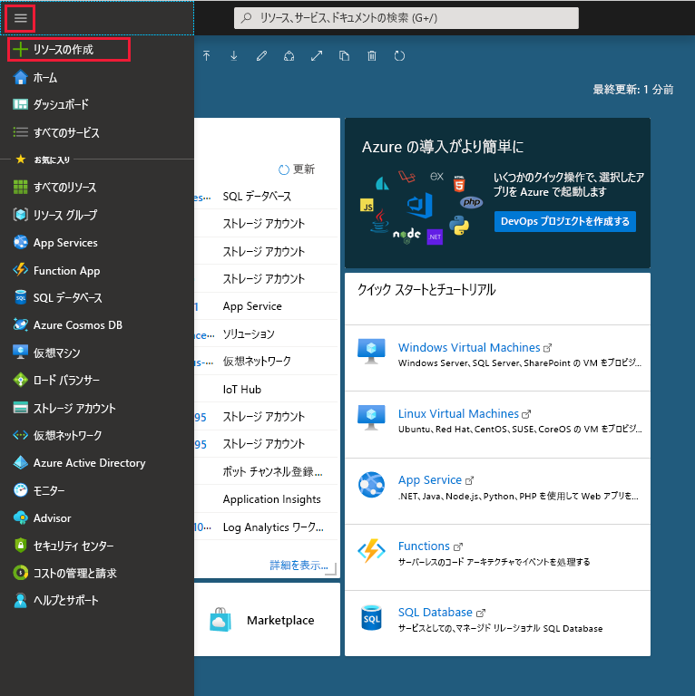
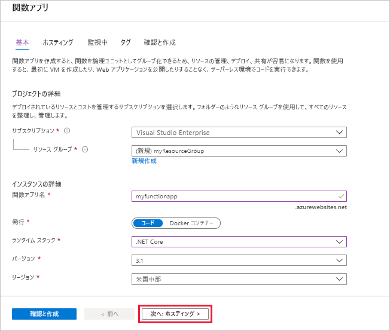
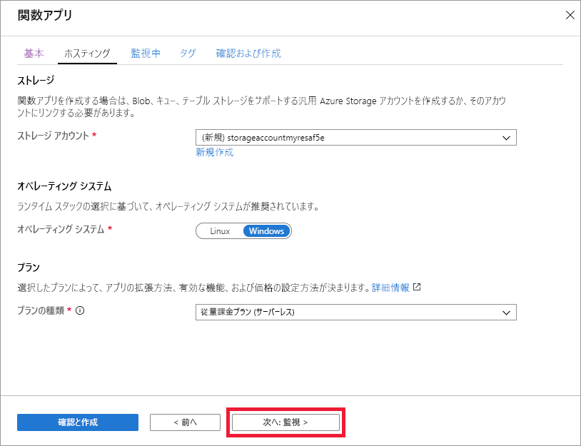
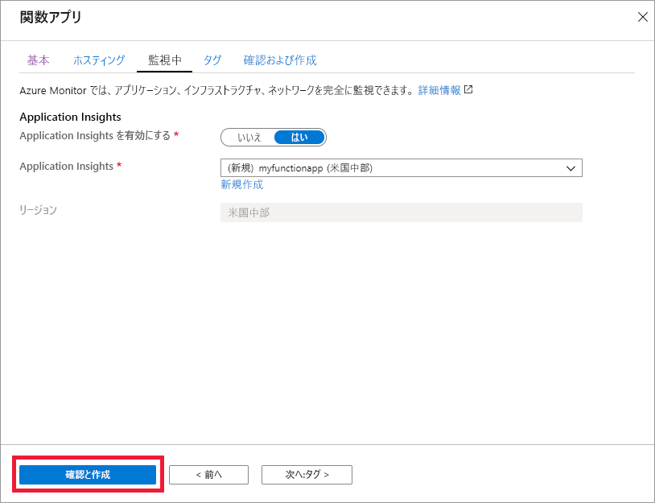
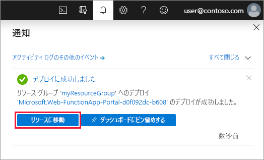

1. Azure portal メニューから **[リソースの作成]** を選択します。

    

1. **[新規]** ページで、 **[計算]** 、 **[関数アプリ]** の順に選択します。

1. 図の下にある表に指定されている関数アプリの設定を使用します。

    

    | 設定      | 推奨値  | 説明 |
    | ------------ | ---------------- | ----------- |
    | **サブスクリプション** | 該当するサブスクリプション | この新しい Function App が作成されるサブスクリプション。 |
    | **[リソース グループ](../articles/azure-resource-manager/management/overview.md)** |  *myResourceGroup* | Function App を作成するための新しいリソース グループの名前。 |
    | **関数アプリ名** | グローバルに一意の名前 | 新しい Function App を識別する名前。 有効な文字は、`a-z` (大文字と小文字の区別をしない)、`0-9`、および `-`です。  |
    |**発行**| コード | コード ファイルまたは Docker コンテナーの公開オプション。 |
    | **ランタイム スタック** | 優先言語 | お気に入りの関数プログラミング言語をサポートするランタイムを選択します。 C# および F# 関数用の **[.NET]** を選択します。 |
    |**リージョン**| 優先リージョン | ユーザーに近い[リージョン](https://azure.microsoft.com/regions/)、または関数がアクセスする他のサービスの近くのリージョンを選択します。 |

    **[Next : Hosting >]\(次へ: ホスティング>\)** ボタンを選択します。

1. ホスティングに関する次の設定を入力します。

    

    | 設定      | 推奨値  | 説明 |
    | ------------ | ---------------- | ----------- |
    | **[ストレージ アカウント](../articles/storage/common/storage-account-create.md)** |  グローバルに一意の名前 |  関数アプリで使用されるストレージ アカウントを作成します。 ストレージ アカウント名の長さは 3 ～ 24 文字で、数字と小文字のみを使用できます。 既存のアカウントを使用することもできますが、[ストレージ アカウントの要件](../articles/azure-functions/functions-scale.md#storage-account-requirements)を満たしている必要があります。 |
    |**オペレーティング システム**| 優先オペレーティング システム | オペレーティング システムは、ランタイム スタックの選択に基づいてあらかじめ選択されますが、必要に応じて設定を変更できます。 |
    | **[プラン](../articles/azure-functions/functions-scale.md)** | 従量課金プラン | Function App にどのようにリソースが割り当てられるかを定義するホスティング プラン。 既定の **[従量課金プラン]** では、リソースは関数の必要に応じて動的に追加されます。 この[サーバーなしの](https://azure.microsoft.com/overview/serverless-computing/) ホスティングでは、関数が実行された時間にのみ課金されます。 App Service プランで実行する場合は、[関数アプリのスケーリング](../articles/azure-functions/functions-scale.md)を管理する必要があります。  |

    **[Next : Monitoring >]\(次へ: 監視>\)** ボタンを選択します。

1. 監視に関する次の設定を入力します。

    

    | 設定      | 推奨値  | 説明 |
    | ------------ | ---------------- | ----------- |
    | **[Application Insights](../articles/azure-functions/functions-monitoring.md)** | Default | 最も近いサポートされているリージョン内に同じ*アプリ名*の Application Insights リソースを作成します。 この設定を展開することによって、 **[新しいリソース名]** を変更するか、またはデータを格納する [Azure 地理的環境](https://azure.microsoft.com/global-infrastructure/geographies/)内の別の **[場所]** を選択することができます。 |

    **[確認および作成]** を選択して、アプリ構成の選択内容を確認します。

1. **[作成]** を選択して、Function App をプロビジョニングし、デプロイします。

1. ポータルの右上隅の通知アイコンを選択し、"**デプロイメントに成功しました**" というメッセージが表示されるまで待ちます。

    

1. **[リソースに移動]** を選択して、新しい関数アプリを確認します。 また、 **[ダッシュボードにピン留めする]** を選択することもできます。 ピン留めすると、ダッシュボードからこの関数アプリ リソースに戻るのが容易になります。
