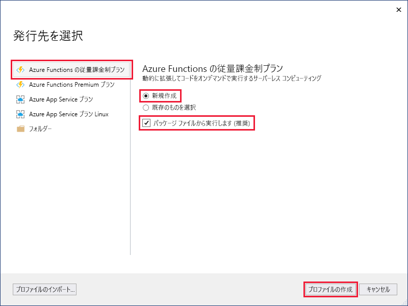
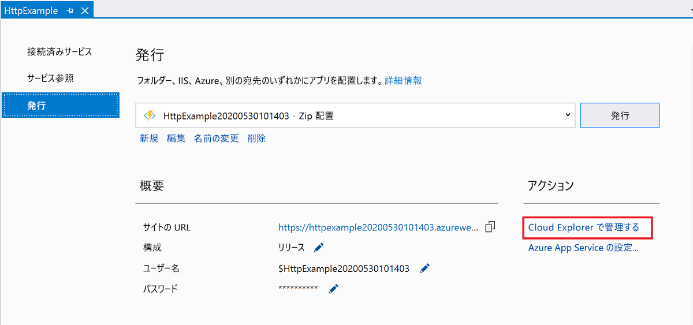

1. **ソリューション エクスプローラー**で、プロジェクトを右クリックし、 **[発行]** を選択します。

2. **[発行先を選択]** で、次の表で指定されている発行オプションを使用します。 

    | オプション      | 説明                                |
    | ------------ |  -------------------------------------------------- |
    | **Azure 関数アプリ** | Azure クラウド環境で関数アプリを作成します。 | 
    | **新規作成** | 新しい関数アプリと関連リソースが、Azure に作成されます。  **[既存のものを選択]** を選択すると、Azure の既存の関数アプリ内のすべてのファイルがローカル プロジェクトのファイルによって上書きされます。 このオプションは、既存の関数アプリへの更新を再発行する場合にのみ使用します。 |
    | **パッケージ ファイルから実行します** | 関数アプリは、[Zip Deploy](../articles/azure-functions/functions-deployment-technologies.md#zip-deploy) を使用して、[Run-From-Package](../articles/azure-functions/run-functions-from-deployment-package.md) モードが有効な状態でデプロイされます。 パフォーマンスを向上させるこのデプロイは、関数を実行するために推奨される方法です。  このオプションを使用しない場合は、関数アプリ プロジェクトがローカルで実行されないようにしたうえで、Azure に発行する必要があります。 |

    

3. **[発行]** を選択します。 まだ Visual Studio から Azure アカウントにサインインしていない場合は、 **[サインイン]** を選択します。 無料の Azure アカウントを作成することもできます。

4. **[Azure App Service] の[新規作成]** で、次の表で指定されている値を使用します。

    | 設定      | 値  | 説明                                |
    | ------------ |  ------- | -------------------------------------------------- |
    | **名前** | グローバルに一意の名前 | 新しい関数アプリを一意に識別する名前。 この名前をそのまま使用するか、新しい名前を入力します。 有効な文字は、`a-z`、`0-9`、`-` です。 |
    | **サブスクリプション** | 該当するサブスクリプション | 使用する Azure サブスクリプション。 このサブスクリプションを承諾するか、ドロップダウン リストから新しいものを選択します。 |
    | **[リソース グループ](../articles/azure-resource-manager/management/overview.md)** | リソース グループの名前 |  関数アプリを作成するリソース グループ。 ドロップダウン リストから既存のリソース グループを選択するか、または **[新規]** を選択して新しいリソース グループを作成します。|
    | **[ホスティング プラン](../articles/azure-functions/functions-scale.md)** | ホスティング プランの名前 | **[新規]** を選択して、サーバーレス プランを構成します。 必ず **[サイズ]** の下の **[従量課金プラン]** を選択してください。 [従量課金プラン](../articles/azure-functions/functions-scale.md#consumption-plan)で実行される関数アプリにプロジェクトを発行する場合は、関数アプリの実行に対してのみお支払いください。 他のホスティング プランでは、コストが高くなります。 **[従量課金プラン]** 以外のプランで実行する場合は、[関数アプリのスケーリング](../articles/azure-functions/functions-scale.md)を管理する必要があります。 最寄りの[リージョン](https://azure.microsoft.com/regions/)または関数がアクセスする他のサービスの近くのリージョン内の **[場所]** を選択します。  |
    | **[Azure Storage](../articles/storage/common/storage-account-create.md)** | 汎用ストレージ アカウント | Functions Runtime には Azure Storage アカウントが必須です。 **[新規]** を選択して汎用ストレージ アカウントを構成します。 または、[ストレージ アカウントの要件](../articles/azure-functions/functions-scale.md#storage-account-requirements)を満たす既存のアカウントを選択することもできます。  |

    ![[App Service の作成] ダイアログ](./media/functions-vstools-publish/functions-visual-studio-publish.png)

5. **[作成]** を選択して、これらの設定で Azure に関数アプリとその関連リソースを作成し、関数プロジェクト コードをデプロイします。 

6. [発行] を選択し、デプロイが完了したら、 **[サイトの URL]** の値を書き留めておきます。これが Azure における関数アプリのアドレスになります。

    
